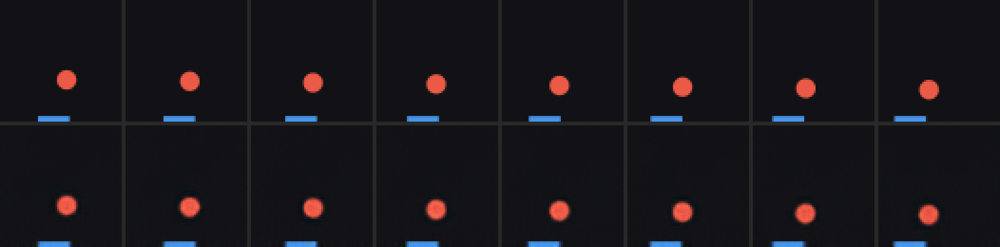
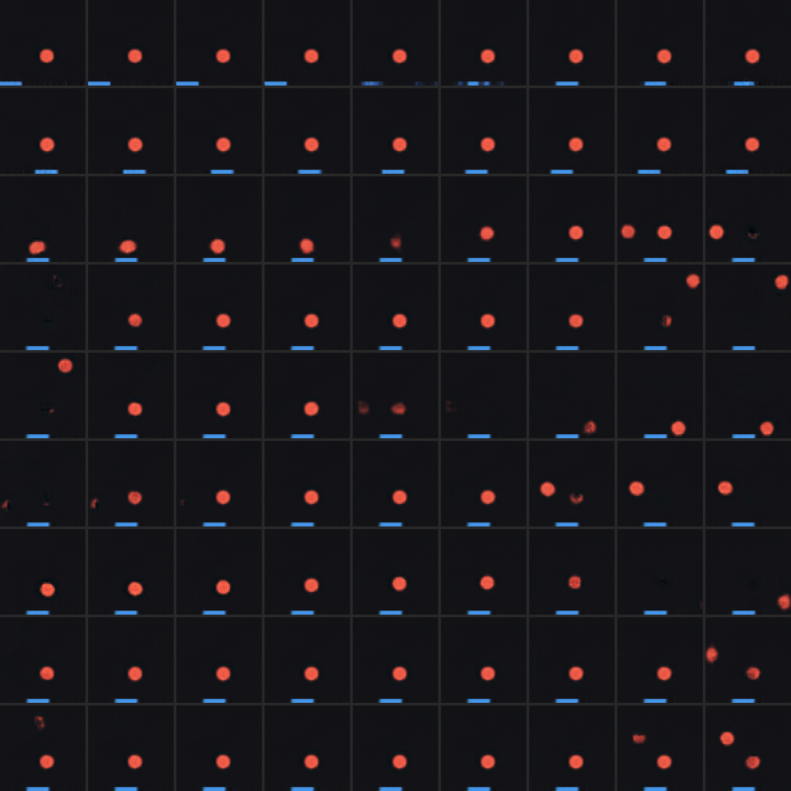
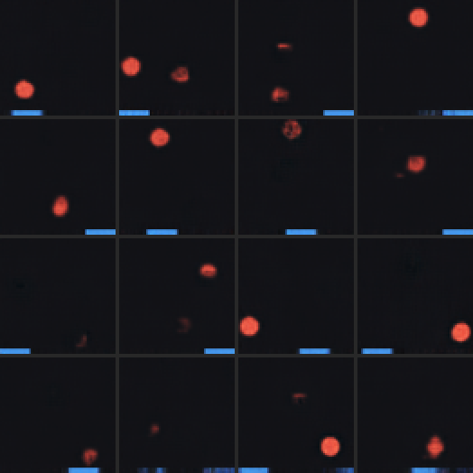

# 02 — V: the vision model (a convolutional VAE)

*What it is for, how it was trained, what it actually learned, and what that
means for everything downstream.*

---

## 1. The job of V in one sentence

V turns a 64×64×3 image (12,288 numbers) into a short vector `z` (16 numbers)
from which the image can be redrawn. Everything after V — the dynamics model,
the controller — never sees pixels again. They live entirely in `z`.

So the question V has to answer is: **which 16 numbers summarise this frame?**
For our game the honest answer has three parts: where is the ball (x, y) and
where is the paddle (x). Three numbers. We give the model 16 on purpose and
watch how many it chooses to use.

Ha & Schmidhuber's paper uses exactly this split. V is trained alone, on
shuffled single frames, with no idea that time exists. That is a *design
decision*, not a limitation: it means anything V learns is about the
*appearance* of a frame, and anything about *motion* must be learned later by M.
Keeping the two separate is what lets us ask, later, "where does velocity
live?" and get a clean answer.

## 2. What a VAE is (the two-minute version)

A plain autoencoder is `encoder(x) -> z -> decoder(z) -> x̂`, trained to make
`x̂ ≈ x`. A **variational** autoencoder changes two things:

1. The encoder outputs a *distribution* over `z`, not a point: a mean `μ` and a
   log-variance `log σ²` per dimension. During training we *sample*
   `z = μ + σ·ε` with `ε ~ N(0, I)`. (Writing it this way — the
   "reparameterisation trick" — keeps the randomness in `ε`, which has no
   parameters, so gradients still flow into `μ` and `σ`.)
2. The loss adds a **KL term** pulling each `N(μ, σ²)` toward the prior
   `N(0, 1)`:

   ```
   loss = reconstruction_error(x̂, x)  +  β · KL( N(μ,σ²) || N(0,1) )
   ```

Why bother? Two reasons that matter for a *world model* specifically:

- **Smoothness.** Because the decoder is trained on noisy samples around `μ`,
  nearby `z`s decode to similar images. Later, M will predict `z`s that are
  only *approximately* right. A smooth decoder forgives small errors; a plain
  autoencoder's decoder can turn a tiny latent error into garbage.
- **A known prior.** If the aggregate of all encoded frames looks like
  `N(0, I)`, then anything M dreams up that stays in that region decodes to a
  plausible frame. The "prior samples" picture below tests exactly this.

The KL term also acts as an *information budget*: every nat of KL is
information the encoder chose to transmit. Dimensions that carry nothing get
pushed to exactly `μ=0, σ=1` and become "inactive". Counting the active ones is
how we ask the model how many variables it thinks the world has.

## 3. The model we trained

File: [`wm/vae.py`](../wm/vae.py). Roughly 570k parameters.

```
encoder:   3×64×64 → conv(4,s2) ×4 → 128×4×4 → flatten → Linear → (μ, logσ²) ∈ ℝ¹⁶ each
decoder:   z ∈ ℝ¹⁶ → Linear → 128×4×4 → convT(4,s2) ×4 → sigmoid → 3×64×64
```

Decisions worth knowing about (each is annotated in the source too):

| decision | why |
|---|---|
| kernel 4, stride 2, pad 1 everywhere | halves resolution exactly, and kernel divisible by stride avoids checkerboard artefacts |
| flatten + Linear, **not** global average pooling | pooling averages over space and destroys *position*, the one variable we need |
| no skip connections | they would let information bypass `z`; the bottleneck *is* the point |
| sigmoid output + summed squared error | a fixed-variance Gaussian likelihood on pixels in [0,1] |
| **sum** squared error over pixels, mean over batch | `F.mse_loss` averages over 12,288 pixels and silently makes the effective β ≈ 12,000 → grey blob. The single most common VAE bug |
| `free_bits = 0.5` nats per dimension | see §4 |
| linear KL warm-up over 5 epochs | gives the decoder time to learn to draw a ball before KL pressure kicks in |
| `z_dim = 16` although the world has 3 factors | deliberately over-complete so the model can *tell us* the dimensionality |

Command that produced the checkpoint in `runs/vae_b1/`:

```bash
python -m wm.train_vae --data data/v1/train --val data/v1/val --out runs/vae_b1 \
    --epochs 80 --z-dim 16 --free-bits 0.5 --warmup-epochs 5 --device mps
```

## 4. The failure mode we had to design around: posterior collapse

This is the thing most worth understanding about this stage, because it is
*specific to small objects on a big background* — i.e. specific to physics-toy
worlds like ours.

The ball covers about 2% of the frame. At initialisation the decoder cannot draw
a ball anyway, so encoding the ball's position buys **no** reconstruction
improvement yet. Meanwhile the KL gradient pulling `μ → 0` is immediate and
strong. So the encoder gives up, `μ → 0`, the decoder learns to ignore `z` and
output the mean image (background + a paddle smear), and now `∂loss/∂z ≈ 0`
forever. Nothing can revive the latent. The loss looks fine. The pictures are
mush.

This is an *optimisation* failure, not the true optimum: encoding position costs
about 9 nats of KL and saves far more than that in reconstruction. The model
simply cannot find its way there unaided.

The fix used here is **free bits** (Kingma et al. 2016): each latent dimension
gets 0.5 nats of KL "for free" — `KL_i` is replaced by `max(KL_i, 0.5)` in the
objective, so below the budget there is no gradient crushing that dimension.
Combined with a KL warm-up this reliably avoided collapse. Plain β=1 without
free bits collapsed to the mean image every time on this data.

**Lesson to carry forward:** on physics toys, global pixel loss is nearly
uninformative. A model that draws background and paddle perfectly and omits the
ball entirely gets a *tiny* loss. That is why the training script tracks a
`ball_mse` computed only inside a box around the true ball, and why the real
success metrics are the probes in §6, not the loss curve.

## 5. Training curve (what the numbers did)

From `runs/vae_b1/history.json` (80 epochs, ~54 minutes on the M1 GPU):

| epoch | β | loss | KL (nats) | global pixel MSE | ball-region MSE | active units |
|---|---|---|---|---|---|---|
| 0 | 0.20 | 194.7 | 244.7 | 0.0153 | 0.085 | — |
| 4 | 1.00 | 26.8 | 17.3 | 0.0009 | 0.010 | — |
| 9 | 1.00 | 23.8 | 15.5 | 0.0007 | 0.0076 | 9 |
| 29 | 1.00 | 20.2 | 14.6 | 0.00045 | 0.0053 | 9 |
| 79 | 1.00 | 18.8 | 14.4 | 0.00036 | 0.0042 | 9 |

Things to read off that table:

- The KL settles at **~14.4 nats total**. Encoding two continuous positions to
  pixel precision in a 64-wide box is roughly `2·log(64) ≈ 8.3` nats plus the
  paddle at ~4 nats, so 14 is the right order of magnitude. The model is
  spending its information budget on approximately the right things.
- **Ball-region MSE is ~12× the global MSE** throughout. That gap is the whole
  argument for masked metrics: the ball is where the error is, and the global
  number hides it.
- **9 of 16 dimensions stay active**, not 3. Section 6 explains why that is not
  a bug.

## 6. What did it actually learn? Four diagnostics

All from `python -m wm.analyze --ckpt runs/vae_b1/vae.pt --data data/v1/probe`,
run on a probe set of 120 short episodes (short episodes because consecutive
frames are nearly identical; 120×25 frames carries far more independent
information than 15×200).

### 6.1 Reconstructions — did it keep the ball?



Top row: real frames. Bottom: decode(μ). The ball is present, correctly placed,
slightly softer-edged. The paddle is essentially perfect. This is the
prerequisite for everything: if this row were mush, no downstream result would
be interpretable.

### 6.2 Probes — is the true state recoverable from `z`?

We fit regressors from `μ` to each true state variable, on a held-out
*episode-level* split (so no test frame has a near-twin in the train set).
`R²` = 1 means perfectly recoverable, 0 means no better than predicting the mean.

| variable | linear | poly-2 | poly-3 | kNN | MLP |
|---|---|---|---|---|---|
| ball_x | 0.04 | 0.98 | **0.99** | 0.99 | 0.98 |
| ball_y | 0.22 | 0.97 | **0.99** | 0.98 | 0.98 |
| paddle_x | 0.70 | 0.98 | **0.99** | 0.59 | 0.98 |
| ball_vx | < 0 | < 0 | < 0 | < 0 | < 0 |
| ball_vy | < 0 | < 0 | < 0 | < 0 | < 0 |
| paddle_vx | < 0 | < 0 | < 0 | < 0 | < 0 |

Three conclusions, in decreasing order of obviousness:

1. **Positions are in `z`, almost perfectly (R² ≈ 0.99).** The information
   survived the bottleneck.
2. **Velocities are not in `z` at all**, and *this is correct*. A single frame
   is pixel-identical whether the ball is moving up or down. Velocity is not a
   property of a frame; it is a property of a *pair* of frames. If we had seen
   a high velocity R² here it would have meant a leak, not a success. This is
   the cleanest possible demonstration of *why* the world-model recipe has an
   M stage: something has to integrate over time, and V by construction cannot.
3. **The code is nonlinear.** Linear R² for ball position is ~0.04–0.2 while
   kNN and polynomial probes hit 0.99. The information is there, but not as
   "dimension 3 = x-coordinate". The next two pictures show what it is instead.

### 6.3 Latent traversals — what does each dimension do?



Each row sweeps one active dimension from −3σ to +3σ with the others held
fixed. In a textbook "disentangled" VAE one row would slide the ball
horizontally and another vertically. Here, instead, sweeping a dimension makes
the ball **fade out at one location and fade in at another**, sometimes
briefly showing two balls. Some rows barely change the image within the
central range and only act at the extremes.

That is the signature of a **localised, place-cell-like code**: individual
dimensions behave like "is the ball near region R?" detectors rather than
coordinates.

### 6.4 Tuning maps — the decisive plot


Each panel is one latent dimension; the colour at (x, y) is the *average value
of that dimension when the true ball is at (x, y)*. A coordinate-like code would
be a smooth left-to-right (or bottom-to-top) ramp. What we see:

- `z[10]`, `z[7]`, `z[14]`, `z[3]`: **blobs** — the dimension fires when the
  ball is in one or two specific regions. Place fields.
- `z[11]`, `z[1]`, `z[8]`: **stripes** — periodic in y or x, i.e. the dimension
  encodes something like `cos(k·π·y)`.
- `z[2]`, `z[6]`: **speckle**, no ball-position structure. These dimensions are
  about the paddle (linear paddle_x R² = 0.70 confirms at least one is).

Position is therefore encoded *jointly* across ~7 dimensions as a set of
overlapping bumps and stripes — which is why any single-dimension or linear
readout fails and any smooth nonlinear one succeeds. `wm/calibrate_probes.py`
confirms this reading by running the same probes on synthetic codes of known
form: narrow place fields and k ≥ 2 Fourier codes produce exactly this
"linear low / kNN high" pattern.

**Is this bad?** Not for reconstruction, and not for a kNN reader. It is *less
convenient* for the dynamics model: physics is linear-ish in (x, y) — `x_{t+1}
= x_t + v_x` — but in a place-field code the same motion is a complicated
rotation among many dimensions. M will have to learn that. We keep this
checkpoint on purpose: seeing how well M copes with a realistic, non-ideal
latent space is more instructive than engineering an ideal one first.

**Why did it happen?** Convolutional features are inherently local detectors
("something red *here*"), and the flatten→Linear layer has no incentive to
convert them into coordinates when a mixture of local detectors reconstructs
just as well. Getting axis-aligned coordinates out of a VAE generally needs
extra pressure (β-VAE / higher β, TC penalties, or supervision), each of which
trades off reconstruction sharpness. That is the disentanglement literature in
one sentence, and a clear candidate for a v1.1 experiment.

### 6.5 Prior samples — will the decoder tolerate imperfect `z`?



Decode 16 draws of `z ~ N(0, I)`. Most produce a plausible frame: one ball,
one paddle, dark background. A few produce a faint or doubled ball, or a paddle
fragment. This matters for M: dreamed latents will wander off the data manifold
a little, and this picture says the decoder degrades *gracefully* rather than
catastrophically. If these were noise, no dream rollout could survive more than
a few steps regardless of how good M was.

### 6.6 MCC — recovery up to permutation?

Mean Correlation Coefficient (the identifiability-literature metric) is 0.33
Pearson, 0.31 Spearman. Low, and *expected* given the above: MCC asks whether
each true factor maps to *one* latent dimension by a monotone function. A
place-field code fails that test by construction even though the information is
fully present. Read MCC alongside the probes, never alone.

## 7. What was achieved, and what to remember

**Achieved.** A frozen encoder that maps frames to a 16-d code from which ball
and paddle positions are recoverable to ~1% of the box width, whose decoder
draws sharp, correctly placed objects, and whose latent space is smooth enough
that random prior samples look like game frames. That is a sufficient V for the
Ha & Schmidhuber recipe.

**Remember.**

- Velocity R² ≈ 0 from a single frame is the *correct* answer and is the
  motivation for M.
- Global pixel loss lies on small-object worlds. Track masked error and probes.
- Posterior collapse is the default outcome here; free bits + warm-up is the
  fix.
- The VAE learned a distributed place-field code, not coordinates. Nonlinear
  probes recover the state; linear ones do not. This is the latent space M has
  to do physics in.
- Latents are cached once (`wm/cache_latents.py`) — 425 MB of frames become
  ~4 MB of `(μ, log σ²)` — and V is **never** fine-tuned jointly with M, so
  every later result is attributable to M alone.

Next: [03 — M: the dynamics model](03_dynamics_model.md).
