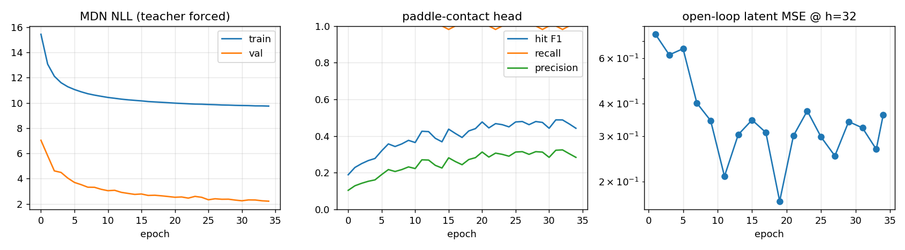
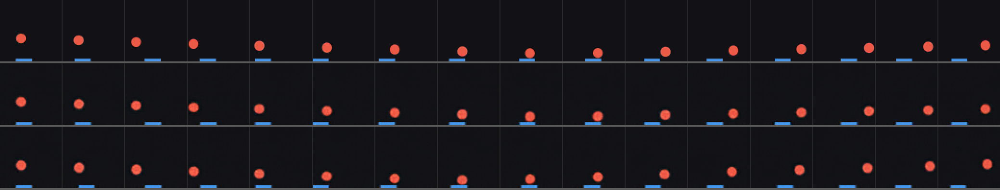
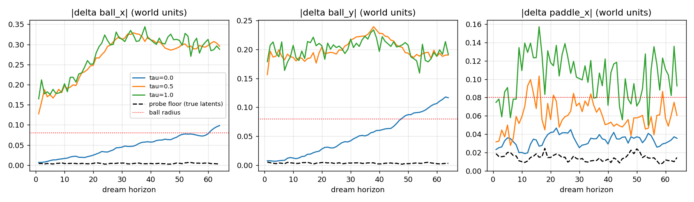
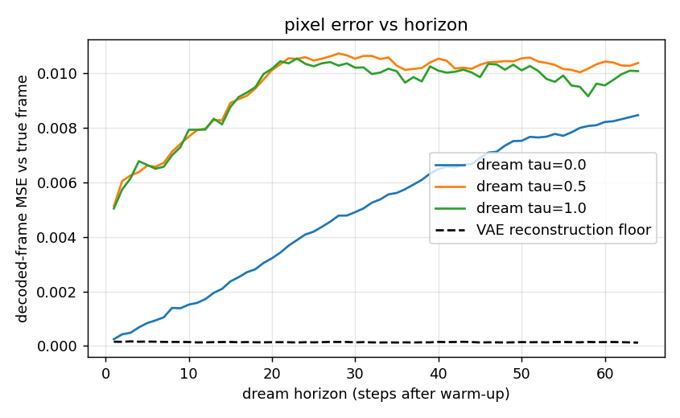
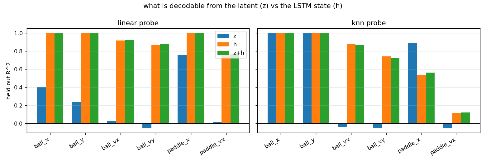
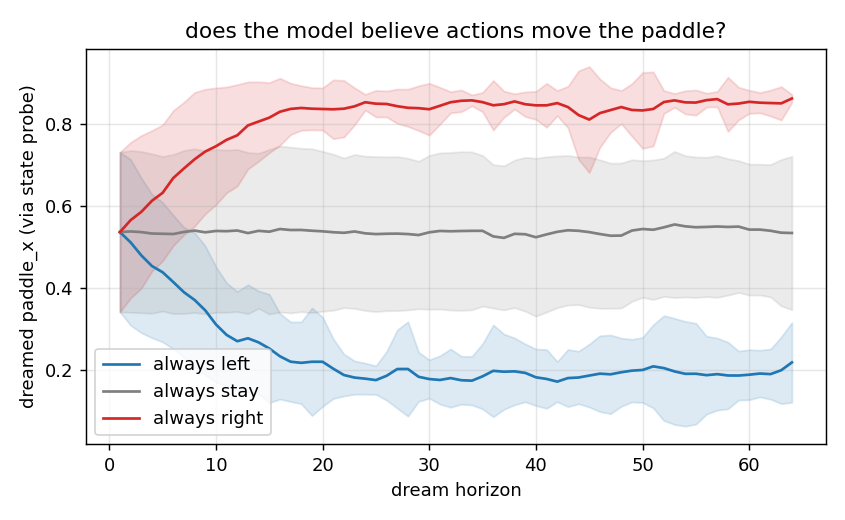
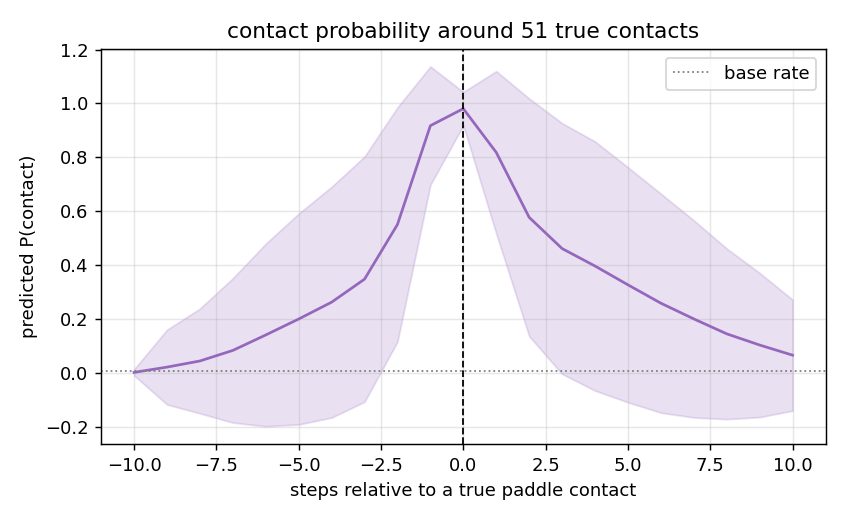

# 03 — M: the dynamics model (an MDN-RNN that dreams)

*How the world model learns physics from a stream of latent codes, how we check
that it did, and what it got right and wrong.*

---

## 1. The job of M in one sentence

Given what the frame looks like now (`z_t`), what the agent does now (`a_t`),
and what M remembers about the recent past (`h_t`), predict what the *next*
frame will look like (`z_{t+1}`).

That is the whole of "learning physics" in this recipe. Nothing is told to the
model about balls, walls, velocity or collisions. It sees 16-number codes
arriving one per frame and has to find the rule that generates the next one.

Once it can do that for one step, it can do it for many: feed its own
prediction back in as the next input, and it produces a whole imagined future —
a **dream**. Decoding each dreamed code with V's decoder turns that into a video
we can watch and grade.

## 2. Three design decisions, and the reason for each

The model is in [`wm/rnn.py`](../wm/rnn.py) (about 330k parameters). Every
non-obvious choice is also annotated inline in the source.

### 2.1 Why recurrent — where velocity has to live

Doc 02 established that a single code `z_t` contains position but **no
velocity** (probe R² ≈ 0). So `z_{t+1}` is *not* a function of `(z_t, a_t)`
alone: the same frame can be followed by the ball going up or down. The
transition is not Markov in `z`.

A recurrent network fixes that by carrying a hidden state `h_t` from step to
step. If it wants to predict well, it *must* learn to store in `h_t` whatever
the current frame lacks — above all, which way the ball is moving. Section 5.3
tests that claim directly.

We use a single-layer LSTM with 256 units, as in the paper. Depth is not the
hard part here; carrying information through time is.

### 2.2 Why a mixture density output — the averaging failure

The obvious output layer predicts one `z_{t+1}` and is trained with squared
error. That is a single Gaussian with fixed variance, and it has a specific,
fatal weakness: when the future is genuinely uncertain — two frames before the
ball reaches the floor, will it hit the paddle or miss? — the squared-error
optimum is the **average** of the possible futures. A ball "in between" the
bounce and the miss, a place the ball can never be. In a one-step metric this
looks fine. In a rollout it is fatal, because the averaged state is off the
data manifold and the next prediction is garbage.

A **Mixture Density Network** (MDN) head instead outputs `K = 5` Gaussians —
weights, means, standard deviations — so the model can put mass on "bounces"
*and* on "misses" and, when sampled, commit to one. The loss is the negative
log-likelihood of the true `z_{t+1}` under the mixture, computed entirely in the
log domain with `logsumexp` (the naive product of densities underflows to zero
in 16 dimensions and the run dies).

Setting `K = 1` recovers a plain Gaussian regression, so the comparison is a
one-flag change. We ran it (§5.1).

### 2.3 Why predict the *change* — residual dynamics

Consecutive codes are very similar: the ball moves 0.022 of the box per frame.
Predicting `z_{t+1}` directly means the network must first learn to copy its
input to high precision before any capacity goes to physics. So the MDN models
the **residual** `z_{t+1} − z_t`, and the input is added back. The network
starts life as the identity map (a decent predictor already) and only has to
learn the *change*.

### 2.4 Two extra heads

Off the same hidden state we attach two tiny linear heads:

- **hit**: the probability that this transition is a paddle contact
  (trained with a class-weighted cross-entropy, because contacts are <1% of
  transitions and an unweighted loss is minimised by "never").
- **reward**: a dense shaping reward `1 − |ball_x − paddle_x|` of the next
  state.

These cost nothing and are what turn M into a usable *environment* for the
controller in doc 04: a policy can dream forward *and* be told how well it is
doing, without touching the real simulator. The reward target is computed from
the simulator's true state — exactly as a real environment computes reward —
and is never an input to the model.

## 3. Training

Code: [`wm/seq_data.py`](../wm/seq_data.py), [`wm/train_rnn.py`](../wm/train_rnn.py).

```bash
python -m wm.train_rnn --data data/v1/train data/v1/train_mix \
    --val data/v1/val data/v1/val_mix --out runs/rnn_v1 --epochs 35 --eval-every 2
```

- **Data**: the cached VAE posteriors for `train` (150 episodes, random
  policy) plus `train_mix` (300 episodes, half tracking / half random — see
  doc 01 §5), cut into windows of 32 transitions that never cross an episode
  boundary. About 90k transitions per epoch.
- **Inputs are sampled, not means.** Every time a window is fetched we draw
  `z = μ + σ·ε` fresh from the cached posterior. Two reasons: it is free data
  augmentation, and — more importantly — at dream time the model is fed its
  *own* samples, which are noisy. Training on clean means would give a model
  that has never seen the input distribution it faces in a rollout.
- **Teacher forcing**: during training the model always receives the *true*
  `z_t` and predicts one step ahead. This is fast and stable, but note what it
  hides: errors never compound, because every step is corrected by the truth.
  Open-loop rollout error — the thing we actually care about — has to be
  measured separately, so the trainer runs a 32-step open-loop rollout on
  validation data every two epochs and logs it alongside the loss.
- Adam, learning rate 1e-3, gradient clipping at 1.0, 35 epochs, ~20 s per
  epoch on the M1's **CPU** (the GPU was 4× slower: a 256-unit LSTM stepped
  32 times is a chain of tiny matrix multiplies, bound by dispatch latency
  rather than arithmetic).



Two things in that figure are worth internalising.

**Train and validation NLL are not comparable (9.7 vs 2.2).** Training
targets are posterior *samples*, validation targets are posterior *means*.
The sampled target carries the VAE's own posterior noise and is genuinely
harder to predict. This looked alarming until it was traced.

**Teacher-forced loss kept improving after dream quality stopped.** The
validation NLL falls steadily from epoch 12 to 35 (2.9 → 2.2). The open-loop
rollout error (right panel) bottoms out around epoch 12 and then just
fluctuates. The last twenty epochs bought better one-step predictions and
essentially no better dreams. This is *the* classic gap in dynamics-model
training, and it is why the rollout metric lives inside the training loop
rather than only in a post-hoc evaluation.

### 3.1 Controls

Two additional models were trained with identical data and budget:

| run | change | best val NLL | open-loop latent MSE @ 32 steps |
|---|---|---|---|
| `runs/rnn_v1` | **main**: K=5 mixture, residual | **2.21** | 0.36 |
| `runs/rnn_g1` | K=1 (plain Gaussian) | 2.25 | **0.19** |
| `runs/rnn_noact` | action input zeroed | 3.23 | 0.64 |

- **Zeroing the action costs a full nat of NLL.** The model demonstrably uses
  the action. (§5.4 shows *what* it uses it for.)
- **The mixture barely beats the Gaussian on likelihood, and the Gaussian
  rolls out more accurately in latent space.** This was not expected and is
  reported as-is. Two plausible, undisentangled reasons: validation targets are
  posterior *means*, which strips out much of the multimodality the mixture
  exists to model; and at temperature 0 the mixture rollout commits to its
  highest-weight component each step, and component-switching between steps
  makes the trajectory less smooth than a unimodal model's. This is a good
  first follow-up experiment. It also illustrates a general lesson: the
  textbook argument for a design choice (§2.2) can be correct *and* not matter
  on a given problem.

## 4. How a dream is made and graded

Code: [`wm/eval_rnn.py`](../wm/eval_rnn.py). Everything below is written to
`runs/rnn_v1/eval/`.

```bash
python -m wm.eval_rnn --ckpt runs/rnn_v1/rnn.pt --vae runs/vae_b1/vae.pt \
    --val data/v1/val data/v1/val_mix --out runs/rnn_v1/eval
```

**Procedure.** Take a real validation episode. Feed the model the first 8 true
codes with the true actions — a *warm-up* so `h` acquires velocity. Then cut
the model off from the truth: for the next 64 steps it receives the true
*action* (so we grade physics, not the agent) but its **own** predicted code,
sampled from the mixture at a chosen **temperature** τ. Decode every dreamed
code with V's decoder.

**Temperature.** τ multiplies the predicted standard deviations and sharpens
the mixture weights. τ = 0 means "always take the mean of the most likely
component" — a deterministic, reproducible dream. τ = 1 samples from the
model's honest predictive distribution. Both are reported below; they answer
different questions.

**Grading in world coordinates.** Pixel error is a poor yardstick (doc 02 §4),
so we also *read the dreamed code back into world coordinates*: a k-nearest-
neighbour regressor from VAE codes to true state, fit on separate data and
frozen, is applied to the dreamed codes. That gives "where the model thinks the
ball is" as an (x, y) pair, to be compared against where the ball really was.
The probe's own error on *true* codes (about 0.004 of the box for the ball) is
the floor.

*An honest footnote.* The first version of this evaluation compared dream step
k with the true state at step k+1 — an off-by-one that charged the model one
frame of ball motion at every horizon. It was caught in review because the
one-step pixel error was implausibly 12× the VAE floor. Corrected, it is 1.8×.
Alignment bugs in sequence evaluation are common and quiet; the fix and the
original numbers are recorded in `wm/README_M.md`.

## 5. Results — what M learned

### 5.1 Dreams vs reality



Top row: the real episode. Middle: V's reconstruction of the true codes (the
best the decoder could possibly show). Bottom: the τ = 0 dream. The dreamed
ball descends, reaches the floor, and comes back up in step with the real one;
the paddle follows the real actions. Animated versions:
`dream_vs_true_tau0.0.gif`, `…tau0.5.gif`, `…tau1.0.gif`.



| horizon (steps after warm-up) | 1 | 16 | 35 | 64 |
|---|---|---|---|---|
| dreamed ball position error, τ = 0 (box widths) | 0.012 | 0.019 | 0.08 | 0.16 |
| probe floor on true codes | 0.004 | 0.004 | 0.004 | 0.004 |

We call the horizon at which the dreamed ball has drifted more than one ball
radius (0.08) from the real one the **useful dream horizon**: **35 steps**, or
about one and a half seconds of game time at 20 fps, or roughly one full wall-
to-wall traverse of the box. Error grows roughly linearly, which is what a
small velocity error integrated over time looks like — not the exponential
blow-up of a model that has lost the plot.

**The τ > 0 curves score zero on this metric, and that is mostly the metric's
fault.** A sampled dream is a *different plausible future*, not a failed copy
of this one. Look at the τ = 1 contact sheet: the ball is still round, moves
smoothly and bounces — it is just not doing what this particular real ball
did. The large one-step error at τ = 1 (0.17) has a specific cause: the model
was trained on posterior *samples*, so its predictive spread correctly includes
the VAE's own posterior noise, which in 16 dimensions is large. For grading
physics, use τ = 0. For training a controller, the paper's argument is the
opposite — a *wider* dream is harder to exploit — and doc 04 takes that up.



The pixel view tells the same story: the τ = 0 dream starts within 2× of the
VAE's own reconstruction floor and drifts away roughly linearly.

### 5.2 Does it know about walls?

The weakest of our tests. We find validation moments just before a wall bounce,
dream through them, and ask whether the dreamed ball *sustainedly reverses*
within ±2 steps of the real bounce. It does in **36.5%** of 200 cases; applying
the same detector at a random time in the same dream scores 15.5%. Better than
chance, clearly not mastery. Two caveats: the detector is crude (any reversal on
either axis), and the τ = 0 dream in the contact sheet visibly *does* bounce off
the floor. A per-wall, per-axis version of this test is an obvious improvement.

### 5.3 Where does velocity live? — the central result

We run the model teacher-forced over validation episodes, collect the hidden
state `h_t` at every step, and ask the same probe question as in doc 02, three
times: from `z_t` alone, from `h_t` alone, and from both.



Held-out R², linear probe:

| from | ball_x | ball_y | **ball_vx** | **ball_vy** | paddle_x | paddle_vx |
|---|---|---|---|---|---|---|
| `z` (the frame code) | 0.40 | 0.23 | **0.02** | **−0.11** | 0.76 | 0.02 |
| `h` (the LSTM state) | 0.995 | 0.994 | **0.92** | **0.87** | 0.994 | 0.76 |

This is the cleanest single picture of what the world model has done:

1. **Velocity is absent from the frame code and present in the memory.**
   Nobody told the LSTM about velocity. It discovered that storing the ball's
   direction of travel is what it takes to predict the next frame, and it
   stores it in a form a *linear* readout can recover.
2. **The LSTM also re-coded position linearly.** From `z`, ball position was
   recoverable only by a nonlinear probe (the place-field code of doc 02, kNN
   R² 0.99 but linear 0.04). From `h`, a *linear* probe gets 0.995. The
   recurrent network has effectively unfolded V's curved code into something
   coordinate-like — presumably because linear dynamics are easiest to
   implement on a linear representation. That is a small, unplanned
   demonstration of a big idea: representations get shaped by what they are
   used *for*.
3. `paddle_vx` (0.76) is lower than ball velocity because the paddle is
   stationary in a large fraction of frames and clamps at the walls; it is a
   noisier target.

### 5.4 Does it know actions matter? — counterfactual dreams

From the same warm-up, dream three futures: always-left, always-stay,
always-right. Nothing else differs.



The dreamed paddle slides left or right and **saturates at 0.13 and 0.87** —
which are exactly the simulator's clamp limits (half a paddle width from each
wall). The model learned not just that actions move the paddle but *where the
paddle stops*. Mean separation between the left and right dreams after 30
steps: **0.66** of the box. The action-ablated control model: **0.00**, by
construction. The animated version, `action_counterfactual.gif`, shows three
side-by-side dreams diverging from an identical start — the closest thing in
this project to watching a model reason about "what if".

Note what this test does *not* show: whether the model knows the paddle
deflects the *ball*. That effect is contact-mediated and rare (doc 01 §3), and
the next diagnostic is the closest we get to it.

### 5.5 Anticipating contact



Average predicted contact probability, aligned on the 51 real paddle contacts in
the validation set. The base rate is 0.7%. Three steps *before* a contact the
model already says 35%; one step before, 92%. It is not merely recognising a
collision after the fact (that would be a spike at lag 0 and nothing before):
it is extrapolating the ball's trajectory to the paddle's position, which
requires exactly the velocity information in `h`. Threshold-free quality:
PR-AUC 0.73 against a chance level of 0.007. (The wide band is 51 events; more
validation episodes would tighten it.)

## 6. What was achieved, and what to remember

**Achieved.** A dynamics model that, from 16-number frame codes alone, learned
to carry velocity in its memory, predicts the paddle's response to actions
including its limits, anticipates paddle contacts several frames early, and
produces deterministic dreams that track reality for ~35 frames. Together with
V, it is a complete, inspectable simulator of the game learned from pixels —
the thing doc 04 trains an agent inside.

**Remember.**

- Velocity is not in a frame. A recurrent state is *where it must go*, and
  probing `h` is how you check it went there.
- Teacher-forced loss can keep falling while dream quality does not. Always
  measure open-loop rollouts, preferably in *world* coordinates, not pixels.
- Deterministic (τ = 0) dreams are for grading physics. Sampled dreams are
  different futures and should not be graded by agreement with one real one.
- Counterfactual dreams are the most direct test of a learned causal channel:
  same start, different action, compare outcomes.
- A textbook-justified choice (the mixture head) did not measurably help here.
  Run the ablation; do not assume.
- Alignment bugs in sequence evaluation are silent. Sanity-check the one-step
  error against a floor you trust.

**Open threads.** Why the Gaussian rolls out better than the mixture; a proper
per-wall bounce test; whether training on posterior means (`--use-mean`)
narrows the τ = 1 dream without hurting robustness; and a transformer in place
of the LSTM for the long-range dependencies planned in v4.

Next: [04 — C: the controller, trained in a dream](04_controller.md).
