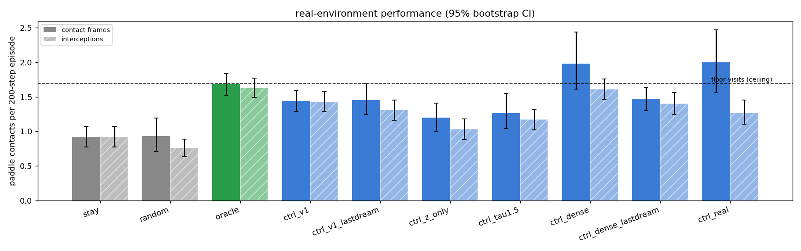
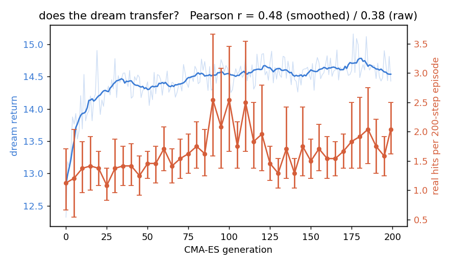
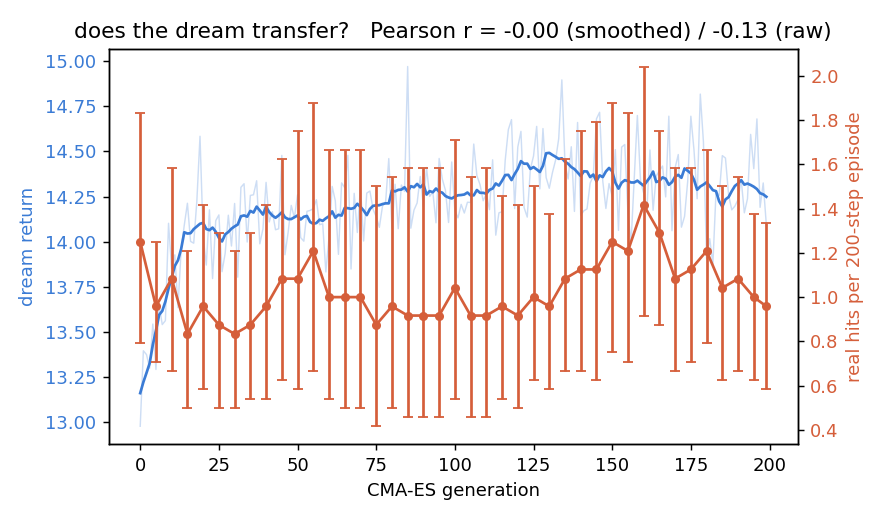

# 04 — C: the controller, trained inside a dream

*How a policy was learned without ever touching the real game during training,
how well it plays the real game, and what that tells us about the world model.*

---

## 1. The idea in one sentence

If M is a good enough simulator of the game, we can train an agent *inside M* —
millions of imagined frames, no renderer, no physics — and then drop the agent
into the real game and see whether what it learned transfers.

That transfer is the acid test of the whole world model. A dream that looks
plausible but is wrong in the ways that matter for the task will produce an
agent that is confident and useless. A dream that captures the task-relevant
physics will produce an agent that works on the first real try.

## 2. The task and the yardsticks

**Objective**: maximise paddle contacts in a 200-step episode. The ball never
"dies" in this environment, so this is purely a tracking task: be under the ball
when it arrives.

Before any learning, three reference points from
[`wm/eval_controller.py`](../wm/eval_controller.py), each on 100 identical
episodes:

| policy | what it is | contacts / episode |
|---|---|---|
| **stay** | never move | 0.92 |
| **random** | sticky random actions (the data-collection policy) | 0.93 |
| **oracle** | moves toward the true `ball_x` using privileged state | 1.68 |

Two things to absorb before reading any result. First, the ball only comes down
about **1.7 times per episode**, so 1.7 is the ceiling; the oracle is
essentially at it. Second, the paddle is 26% of the box wide, so "do nothing"
already catches half the balls. *Beating random is a very low bar here*; the
oracle is the number to compare against.

We also count **interceptions**: runs of consecutive contact frames collapsed to
one. Contact is a per-frame flag, and a policy that pins the ball against the
paddle can register several "hits" per approach. This turned out to matter
(§6.3).

## 3. The controller

Code: [`wm/controller.py`](../wm/controller.py).

Following the paper, C is as small as it can be: one linear layer,

```
action = argmax( W · [z_t, h_t] + b )        W: 3 × 272,  b: 3      → 819 parameters
```

`z_t` is V's code for the current frame (16 numbers) and `h_t` is M's hidden
state (256 numbers), both standardised with statistics computed once on
training data. No hidden layer, no nonlinearity.

Why so small? Two reasons that reinforce each other. A tiny policy can be
trained by a **black-box evolutionary optimiser** that needs no gradients — so
it does not matter that the dream is sampled, or that the real environment is
not differentiable. And a tiny policy cannot memorise much, so whatever
"intelligence" it displays must already be present in its inputs: in `z` and
above all in `h`. The controller is a probe of the world model as much as it is
an agent.

**Which inputs?** We trained variants on `[z, h]` (the paper's choice) and on
`z` alone. Doc 03 showed `z` has no velocity; a controller that only sees `z`
knows where the ball *is* but not where it is *going*. The paper's claim is
that C needs `h`. We test it.

**Timing.** There is a subtlety that is easy to get wrong and that would
silently break transfer. M was trained to consume `(z_t, a_t)` and produce the
state that predicts `z_{t+1}` — but the controller has to choose `a_t` *before*
that state exists. So C acts on `[z_t, h_t^{pre}]`, where `h^{pre}` is the
hidden state left over after processing `(z_{t-1}, a_{t-1})`: current
observation plus carried-in history. Then `(z_t, a_t)` goes into M and the
cycle repeats. The dream loop and the real-environment loop implement this
identically, and a unit test drives both with the same latent sequence and
asserts the controller sees the same inputs to 1e-6. If they disagreed, C would
be reading a differently-shifted signal at test time than it trained on.

## 4. The dream as an environment

Code: [`wm/dream_env.py`](../wm/dream_env.py).

`DreamEnv` wraps M as a batched gym-like environment: `reset()` returns
`[z, h]`, `step(actions)` returns the next `[z, h]`, a reward, and the predicted
contact probability. It runs 512 episodes in parallel on the CPU faster than the
real simulator runs one.

Three decisions worth knowing:

- **Warm starts.** A dream starts at a real `(episode, time)` drawn from the
  training data, with M warm-started on the 8 true frames before it. Starting
  from `h = 0` would mean M does not know the ball's velocity and the first
  dozen dreamed frames are wrong.
- **The reward is predicted, not measured.** There is no simulator inside the
  dream. "Reward" means M's reward head (`1 − |ball_x − paddle_x|`, dense) or
  M's contact head (sparse), evaluated on M's own dreamed latents. This is the
  gamble of the method: if a head is wrong in some exploitable direction, the
  optimiser will find it — finding exploitable directions is what optimisers do.
- **Temperature.** The paper raises the sampling temperature above 1 so the
  dream is *too uncertain to exploit*. We trained at τ = 1.0 (default) and 1.5.

## 5. Training with CMA-ES

Code: [`wm/train_controller.py`](../wm/train_controller.py).

CMA-ES maintains a Gaussian over the 819 parameters; each generation it samples
a population of 32 candidates, scores each by its mean return over 16 dreams of
150 steps, and moves the Gaussian toward the better ones. All candidates in a
generation see the same 16 start states (common random numbers), so the
ranking is paired and much less noisy. 200 generations take about 11 minutes.

```bash
python -m wm.train_controller --out runs/ctrl_v1 --inputs zh --reward mix \
    --temperature 1.0 --popsize 32 --rollouts 16 --dream-steps 150 --generations 200 \
    --real-eval-every 5 --real-eval-episodes 24
```

Every 5 generations, the current best candidate is also dropped into the
**real** game for 24 episodes and its contact count logged. These real episodes
are *not* used for training the parameters — CMA-ES never sees them — but they
are used in one of two ways to pick which parameters to keep, and we report
both:

- `params_last_dream`: the final CMA-ES mean. What the **dream alone** would
  have chosen. Zero real episodes consulted.
- `params_best_real`: the candidate that scored best on the periodic real check.
  A light form of model selection on real data.

Variants trained (all identical except the flag named):

| run | inputs | reward | τ | trained in |
|---|---|---|---|---|
| `ctrl_v1` | z + h | mix (contact + 0.1·dense) | 1.0 | dream |
| `ctrl_dense` | z + h | dense only | 1.0 | dream |
| `ctrl_z_only` | **z only** | mix | 1.0 | dream |
| `ctrl_tau1.5` | z + h | mix | **1.5** | dream |
| `ctrl_real` | z + h | **true contacts** | — | **the real game** (same CMA-ES) |

## 6. Results

### 6.1 The headline table

Real game, 200-step episodes. Two independent evaluations are shown: the
agent's own on 100 episodes (seeds 5000+), and a re-check I ran afterwards on
60 fresh episodes (seeds 9000+) to see how much was seed luck. Contacts per
episode, with interceptions in parentheses.

| controller | seeds 5000+ (100 eps) | seeds 9000+ (60 eps) |
|---|---|---|
| stay | 0.92 (0.92) | 0.93 (0.93) |
| random | 0.93 (0.76) | 0.73 (0.67) |
| **oracle** (true state) | **1.68 (1.63)** | **1.60 (1.55)** |
| `ctrl_v1`, selected on real check | 1.44 (1.43) | 1.55 (1.47) |
| `ctrl_v1`, dream-only selection | 1.45 (1.31) | 1.68 (1.38) |
| `ctrl_dense`, selected on real check | 1.98 (1.61) | 2.12 (1.48) |
| `ctrl_dense`, dream-only selection | 1.47 (1.40) | 1.25 (1.20) |
| `ctrl_z_only` | 1.20 (1.03) | 0.97 (0.93) |
| `ctrl_tau1.5` | 1.26 (1.17) | — |
| `ctrl_real` (no world model) | 2.00 (1.27) | 1.40 (1.12) |



Confidence intervals are wide (±0.15 to ±0.4), so read the pattern, not the
second decimal. The pattern is stable across both evaluations:

1. **A controller trained on zero real frames plays the real game at
   85–90% of the oracle.** `ctrl_v1` intercepts the ball 1.4–1.5 times per
   episode against the oracle's 1.55–1.63 and stay's 0.93. Its mean paddle-ball
   gap at the moment the ball reaches the floor is 0.11 of the box, versus 0.06
   for the oracle and 0.24–0.29 for the trivial policies. It is tracking, not
   getting lucky.
2. **Remove `h` and the controller collapses to the do-nothing baseline.**
   `ctrl_z_only` scores 0.93–1.03 interceptions — indistinguishable from
   `stay`. This is the paper's central claim reproduced: a policy on the frame
   code alone cannot anticipate, because the frame code has no velocity.
3. **Training in the real game with the same optimiser was not better.**
   `ctrl_real` used 1,024,000 real environment steps; the dream-trained
   controllers used 0. On fresh seeds it scored 1.40 (1.12 interceptions) —
   below `ctrl_v1`. Its 2.00 on the first evaluation was a combination of seed
   luck and a metric loophole (§6.3). It was also given a smaller population to
   fit a time budget, so this is not a perfectly fair race; but the direction
   is clear and the cost gap is enormous (§6.5).

### 6.2 Does the controller actually move the right way?

Contact counts are noisy, so the agent added a sharper, decision-level
diagnostic: at each frame where the ball is *descending in the lower half of
the box*, does C's preferred direction agree with the direction to the ball?
Chance is 0.50.

| controller | agreement (seeds 5000+) | agreement (seeds 9000+) |
|---|---|---|
| `ctrl_dense` | **0.70** | **0.70** |
| `ctrl_v1` | 0.60 | 0.59 |
| `ctrl_z_only` | 0.53 | 0.51 |
| `ctrl_real` | 0.49 | 0.47 |

This is the most robust table in stage three — it barely moves between seed
sets — and it says three things plainly. The dense-reward controller moves the
right way 70% of the time on the frames that matter. The `z`-only controller is
at chance, as predicted. And the real-trained controller is at chance too: its
high contact count on the first evaluation came from something other than
tracking.

A regression of `ctrl_v1`'s decisions on true state variables finds the
largest coefficient on the *paddle's own velocity*: the controller commits to a
sweep rather than re-deciding every frame — sensible for a bang-bang actuator
that needs ~30 frames to cross the box. We found **no** evidence that any
controller leads the ball (agreement with the ballistic landing point is never
higher than with the ball's current position). With a paddle that crosses the
box in 30 frames and a ball whose remaining fall is usually shorter, following
and leading rarely prescribe different actions, so this is unsurprising.

### 6.3 A metric loophole, found by optimisation

`ctrl_real` beat the oracle on raw contacts in the first evaluation
(2.00 vs 1.68). A learned policy exceeding a privileged-state oracle is a red
flag, and chasing it produced the *interceptions* column: `ctrl_real` registers
1.27 interceptions per episode — fewer than `ctrl_v1` — but several contact
*frames* per interception. It learned to catch the ball in a way that keeps it
in contact for multiple frames rather than to catch it more often. Optimising
the raw per-frame contact flag in the real environment found the slack in the
*metric*. Optimising M's dense head did not, because `1 − |ball_x − paddle_x|`
has no such slack.

General lesson: when a learned policy outperforms an oracle, suspect the metric
before celebrating.

### 6.4 Does the dream transfer? — watching the two curves

Every training run logs the dream return alongside the periodic real score.
Whether those two curves move together is the direct measurement of "is the
world model good enough to train in".



**`ctrl_v1`: yes.** Both curves rise together (r ≈ 0.5 after smoothing the
dream curve's per-generation jitter). Real contacts climb from 1.1 to about 2.0
per episode on the 24-episode check while the dream return climbs from 12.3 to
14.4.



**`ctrl_z_only`: the textbook failure.** Its dream return rises just as
smoothly as `ctrl_v1`'s — CMA-ES is making steady progress *against M's reward
heads* — while its real score drifts *down* over the first 50 generations
(r = −0.5). Using a representation that cannot support the task, the only
progress available was progress against the model's imperfections. **If you
only had the fitness curve, you would call this run a success.** This single
figure is the best argument in the project for never trusting a dream without a
real-world check.

`ctrl_dense`'s dream return saturates by generation 25 and then barely moves,
so its correlation coefficient is computed on noise and is meaningless (≈ 0);
its real score kept creeping up regardless. `ctrl_tau1.5` had the *highest*
correlation (0.67) and the *lowest* score of the `[z, h]` runs: raising the
temperature did make the dream harder to exploit, but at this budget
exploitation was not the binding constraint, and the noisier dream mostly made
the useful directions harder to find. The paper's τ > 1 prescription is a
trade-off, not a free lunch.

### 6.5 The point of the exercise: sample cost

| | dream steps | real steps used for training | real steps for the diagnostic curve |
|---|---|---|---|
| each dream-trained run | 15,360,000 | **0** | 196,800 |
| `ctrl_real` | 0 | **1,024,000** | 43,200 |

For `ctrl_v1` the diagnostic real steps bought nothing but the plot: the
dream-only parameters score the same as the real-selected ones (1.45 vs 1.44,
and 1.68 vs 1.55 on fresh seeds). Dropping the periodic check makes it a
1,067,200 : 0 comparison in real environment steps, for a controller that plays
at least as well. For `ctrl_dense` the check *did* earn something — the
real-selected parameters beat the dream-only ones by 0.5–0.9 contacts — so
there the honest description is "a paid-for model-selection step".

Wall clock tells the same story: one dream generation (76,800 batched RNN
steps) takes 1.3 s; one real generation (25,600 frames, each rendered, encoded
and stepped) takes 24 s.

### 6.6 Watching it play

- `runs/ctrl_eval/real_play_ctrl_v1.gif` — the dream-trained controller in the
  real game. The paddle visibly sweeps under the descending ball.
- `runs/ctrl_eval/dream_play_ctrl_v1.gif` — the same controller inside M's
  imagination, decoded by V. The dream stays coherent for all 200 steps: a
  crisp ball, a crisp paddle, plausible bounces. The border turns green when
  M's contact head fires, and it fires exactly on the frames where the ball
  sits on the paddle. (Cherry-picked: the most contact-rich of 16 dreams, since
  contacts are <1% of frames and a random dream usually shows none.)
- `runs/ctrl_eval/real_vs_dream_side_by_side.gif` — the same 8 real frames warm
  up both branches, then the real game (left) and the dream (right) run under
  the same controller. They diverge within ~30 frames, and the dream stays
  internally coherent while doing so. That is precisely the regime in which a
  dream-trained controller can still transfer: **it learned a reflex, not a
  trajectory.** The dream does not need to predict *this* episode; it needs
  to get the local rule "ball coming down here → move there" right.

## 7. What was achieved, and what to remember

**Achieved.** An 819-parameter policy trained entirely inside a learned model
of the game, on zero real frames, that plays the real game at 85–90% of a
privileged-state oracle and matches or beats a policy trained on a million real
frames. And a clean negative control: the same procedure without the recurrent
state produces a policy no better than standing still, while its dream score
climbs just as happily.

**Remember.**

- The controller is a *probe of the world model*: with 819 parameters, any
  competence it shows must come from `[z, h]`. That `h` is necessary and
  sufficient for near-oracle play is the practical confirmation of doc 03's
  "velocity lives in h".
- Always plot dream return against real return. A rising dream curve with a
  flat or falling real curve is exploitation, and it looks exactly like
  success from the inside.
- Prefer a dense, un-gameable reward head (`1 − |ball_x − paddle_x|`) over a
  sparse, over-confident one (the class-reweighted contact head). The `mix`
  reward was measurably worse than `dense`.
- When a policy beats an oracle, check the metric. Count interceptions, not
  contact frames.
- Report the selection procedure with the number. "Best of 40 real checks" and
  "final CMA-ES mean" are different claims with different sample costs.
- Confidence intervals of ±0.3 contacts on 100 episodes mean the ranking of
  the top three controllers is not settled. The decision-level agreement
  statistic (§6.2) is far more stable and should be the primary metric next
  time.

**Open threads.** A fair `ctrl_real` with the full population; more real
evaluation episodes (the harness is fast); a controller with one hidden layer to
see whether the linear one is the bottleneck; and — the natural v1.1 — iterate:
collect data with the trained controller, retrain M on it, retrain C, and see
whether the useful dream horizon and the transfer both improve.

Next: [05 — Results, lessons, and what comes next](05_results_and_lessons.md).
