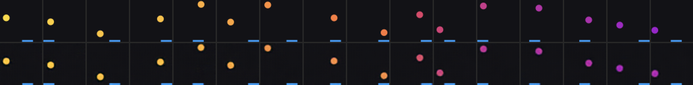
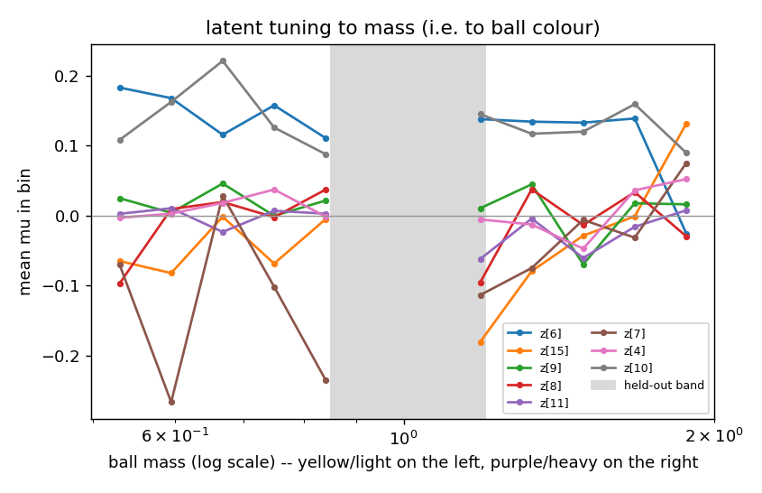

# v2 — 01: The environment, the data, and V

*What changed in the simulator, what the data looks like, and what the v2
vision model learned about colour.*

---

## 1. The environment change

Three additions to `BoxConfig`, all off by default so that the default
environment is v1 byte for byte (a regression test checks 31 frames of the v1
validation set against the current code):

| field | default | meaning |
|---|---|---|
| `mass_from_color` | False | sample a mass at reset and colour the ball by it |
| `mass_min`, `mass_max` | 0.5, 2.0 | log-uniform range; the median ball (m = 1) *is* the v1 ball |
| `mass_holdout` / `mass_only` | None | exclude a band from sampling / sample only inside it |

Mass `m` acts twice, both as "same impulse, different mass":

```
speed   = 0.022 / m            light ball (m=0.5): 0.044 per frame,  heavy (m=2): 0.011
english = 0.35 · paddle_vx / m
```

The colour map runs yellow (light) → red (m = 1, the v1 red) → purple (heavy),
piecewise-linear in `log m`. A straight yellow-to-purple blend was tried first
and its midpoint was a muddy grey-pink, which is exactly where most of the
probability mass sits, so the path was routed through the v1 red instead.


The missing red band in the middle of that ramp is deliberate: masses in
`[0.85, 1.2]` were excluded from every training split and collected separately
as `data/v2/holdout`. That gap **is** the generalisation test for every later
stage.

A physics footnote worth knowing: because both effects carry `1/m`, the
*angle* at which a ball leaves the paddle is mass-independent
(`tan θ = Δvx / vy`, and both scale the same way). A heavy ball leaves at the
same angle, just slower. The sideways velocity itself still scales as `1/m`, so
the dynamics remain mass-dependent where it matters, and this is asserted in
the tests.

The state vector gains a 7th column, `mass`, only when `mass_from_color` is on.
Downstream code reads `meta["state_names"]` rather than assuming six columns.

Code: [`worldsim/bouncing_box.py`](../../worldsim/bouncing_box.py)
(`mass_to_color`, `color_to_mass`), [`worldsim/collect.py`](../../worldsim/collect.py)
(`--mass-from-color`, `--mass-holdout`, `--mass-only`), tests in
[`tests/test_env_v2.py`](../../tests/test_env_v2.py).

## 2. The data

| split | episodes × steps | policy | contact rate | masses |
|---|---|---|---|---|
| `data/v2/train` | 150 × 200 | sticky random | 0.55% | 0.5–2.0, gap 0.85–1.2 |
| `data/v2/train_mix` | 300 × 200 | mix, p_track 0.5 | 0.84% | same |
| `data/v2/val` | 15 × 200 | sticky | 1.07% | same |
| `data/v2/val_mix` | 20 × 200 | mix | 0.68% | same |
| `data/v2/probe` | 120 × 24 | sticky | 0.52% | same |
| `data/v2/holdout` | 30 × 200 | mix | 1.13% | **0.89–1.19 only** |

The collector's sanity check now verifies `speed × mass = 0.022` per episode
(to 4e-9) and prints a log-binned mass histogram; every training split shows a
flat histogram with one empty bin at the hold-out band. `runs/v2_env/light_vs_heavy.gif`
puts a light and a heavy episode side by side so the speed difference is
visible to the eye.

## 3. The v2 VAE

Same architecture and recipe as v1 ([doc 02](../02_vae_the_vision_model.md)),
trained from scratch on v2 frames:

```bash
python -m wm.train_vae --data data/v2/train --val data/v2/val --out runs/vae_v2 \
    --epochs 60 --z-dim 16 --free-bits 0.5 --warmup-epochs 5 --device mps
```

17 minutes. Final KL 15.5 nats (v1: 14.4 — about one extra nat, which is the
right order for one extra continuous factor), ball-region MSE 0.0053.

### 3.1 Does it keep the colour?

The stock reconstruction grid shows eight frames from one episode, which all
share one mass, so it cannot answer this. The agent added a by-mass grid:



Top: real frames spanning the mass range. Bottom: reconstructions. The colour
survives the bottleneck. Quantitatively, reading the mass back out of the
reconstructed ball's colour gives a median error of 6% with a rank correlation
of 0.98 against the true mass.

### 3.2 What is in `z`? — the new result

Held-out probe R² on the probe set (episode-level split), poly-2 / kNN:

| variable | poly-2 | kNN | reading |
|---|---|---|---|
| ball_x, ball_y | 0.88, 0.80 | 0.92, 0.95 | present, nonlinear code (as v1) |
| paddle_x | 0.96 | 0.77 | present |
| ball_vx, ball_vy | < 0 | < 0 | absent (correct: a frame has no direction) |
| **log mass** | **0.97** | 0.08 | present |
| **speed** | **0.975** | 0.07 | **present** |

Two things here are new and worth sitting with.

**Speed is decodable from a single frame; the velocity components are not.**
V cannot see motion. V can see colour. In v2 colour *determines the magnitude*
of motion, so a vision model trained on shuffled single frames with no notion
of time has acquired information about the dynamics. "Decodable from a frame"
and "visible in a frame" have come apart. This is the appearance → dynamics
edge showing up already at stage V, and it changes M's job: in v1 M had to
recover `|v|` from nothing by integrating over time; in v2 it gets `|v|` for
free from `z` and has to learn only the direction, plus the fact that this
latent *multiplies* the per-step displacement.

**kNN, the probe we called an "upper bound" in v1, fails on mass (0.08) while
poly-2 nearly nails it (0.97).** The information is present; the geometry hides
it. kNN measures Euclidean distance in `z`, and `z`'s variance is
overwhelmingly positional, so a frame's nearest neighbours are frames with a
similar ball *position* from episodes with unrelated masses, and their average
mass is the dataset mean. A polynomial probe can find the low-variance
direction along which colour varies and ignore the rest. Lesson: kNN R² is an
upper bound only for factors prominent in the latent metric. For a
low-variance factor entangled with a high-variance one it is a misleading lower
bound. Read it as "is this a dominant axis of the geometry", not "is this
information present".

### 3.3 Is there a colour dimension? No.



Mean value of each informative latent dimension per log-mass bin (grey = the
held-out band). A couple of dimensions slope, but the decisive test is a probe
from *one dimension at a time*: held-out R² for log-mass from any single
dimension is **negative for every dimension**, while all sixteen together give
0.97. Colour is fully distributed across the same dimensions that carry
position; the latent traversals confirm it — sweeping one dimension moves the
ball *and* swings its colour. A VAE with no disentanglement pressure has no
reason to do otherwise. The active-unit count actually fell from 9 to 8: the
budget concentrated into six strongly active dimensions plus a tail, and colour
went *inside* existing dimensions rather than alongside them.

### 3.4 Does the colour code interpolate into the unseen band?

Probes fit on the probe set (which has the gap), scored on the hold-out set
(masses only inside the gap):

| variable | rmse on hold-out | R² against the full-range spread |
|---|---|---|
| ball_x, ball_y | 0.028, 0.029 | 0.99 |
| mass | 0.106 (on a 0.5–2.0 scale) | 0.955 |
| speed | 0.0013 (on a 0.011–0.044 range) | 0.986 |

Positions transfer perfectly: the positional code does not depend on the ball's
colour. The mass code transfers **coarsely**: an unseen-colour ball is placed
within about ±0.1 in mass on the global light–heavy scale, so the latent
colour axis is a genuine continuum rather than a lookup table of seen colours —
but within-band ordering is essentially lost (R² against the band's own tiny
variance is negative). The consequence for M: for a ball of a never-seen shade,
the step size M can infer from colour will be right to roughly ±10%, not ±1%.

(A methodological note baked into the report: R² against the hold-out band's
*own* variance reads as catastrophic failure for any factor whose range was
deliberately narrowed. The `rmse` and the R² against the fit set's spread are
the honest columns there.)

## 4. Summary for stage M

V has done what the design asked: colour is in `z`, nonlinearly and
distributedly; speed is therefore decodable from a single frame; the code
interpolates coarsely to unseen colours. The questions for M are now sharp —
does it *use* colour to predict speed when motion is not yet visible, does
recolouring a dream change its speed, and does that hold in the hold-out band?

Next: [02 — the v2 dynamics model and the causal tests](02_v2_dynamics_and_causal_tests.md).
