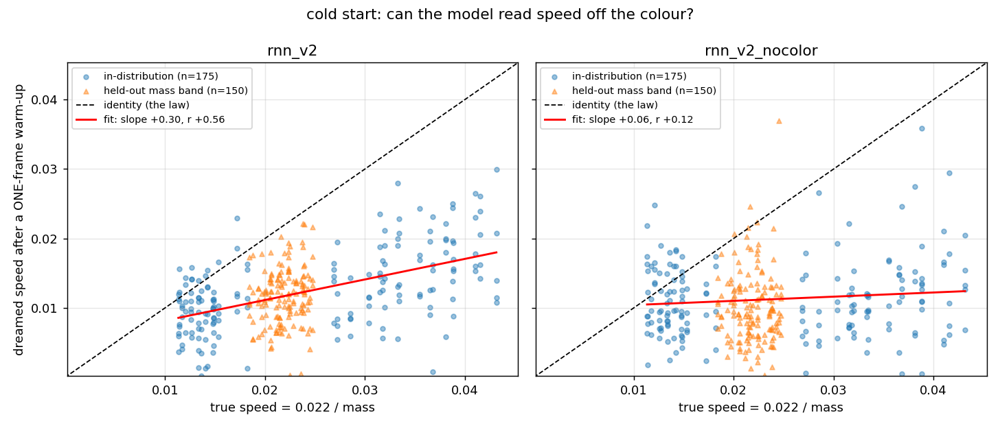
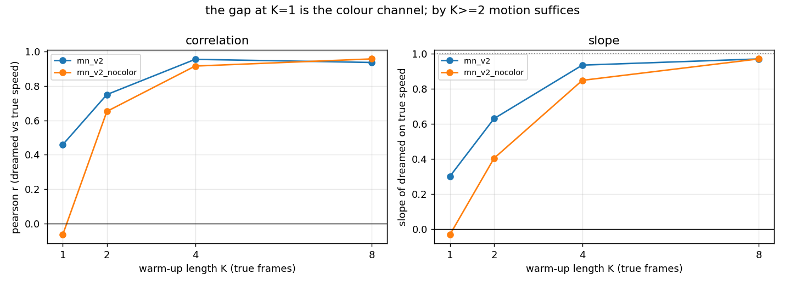
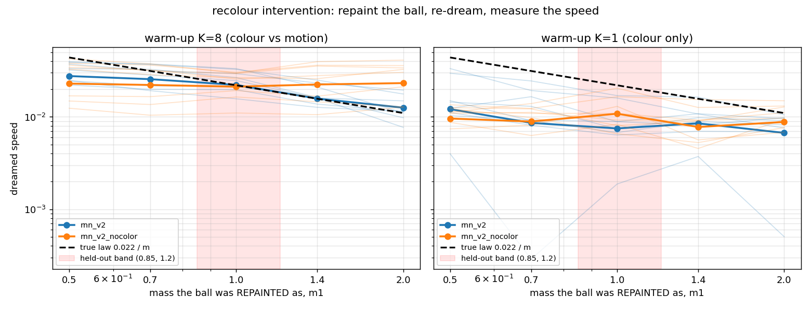
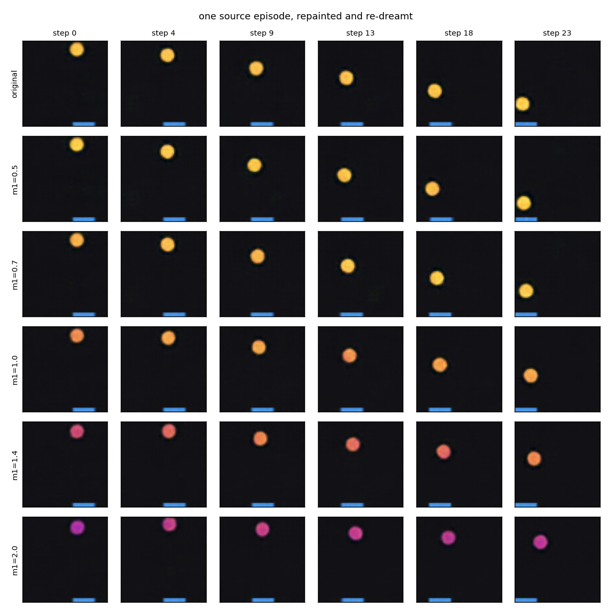

# v2 — 02: M, and the causal tests

*Does the dynamics model learn that colour causes speed? Three ways of asking,
one control that makes the answer mean something, and what came out.*

---

## 1. The setup, and the control that matters

The v2 dynamics model is the v1 MDN-RNN ([doc 03](../03_dynamics_model.md)),
retrained from scratch on the v2 latents:

```bash
python -m wm.train_rnn --data data/v2/train data/v2/train_mix \
    --val data/v2/val data/v2/val_mix --out runs/rnn_v2 --epochs 35
```

Every result below is paired with the same model trained on the same frames
**encoded by the v1 VAE instead** (`runs/rnn_v2_nocolor`). The v1 VAE never saw
a coloured ball, and a probe confirms its codes carry position (kNN R² 0.995)
but no colour or speed (poly-2 R² < 0 for both). So `rnn_v2_nocolor` lives in
exactly the same world, sees exactly the same motion, and simply cannot see the
ball's colour. Whatever `rnn_v2` can do that `rnn_v2_nocolor` cannot is
attributable to *reading colour*. Without this control, every "it learned the
law" claim below would be confounded by "it inferred speed from motion", which
any competent v1-style model does after two frames.

Two comparisons that are **not** valid and are flagged wherever they appear:
the two models' likelihoods (different latent spaces, different targets) and
their dream horizons (different decoders and probes).

## 2. The v1 diagnostics, re-run

| diagnostic | v2 | v1 |
|---|---|---|
| useful dream horizon (τ = 0) | 26 frames | 35 |
| velocity R² from `h` (linear, vx / vy) | 0.89 / 0.83 | 0.92 / 0.87 |
| action counterfactual separation at 30 steps | 0.57 | 0.66 |
| contact anticipation PR-AUC | 0.70 | 0.73 |
| wall bounces predicted (vs chance) | 54% (25%) | 37% (16%) |

Everything is 10–25% worse, and the wall number is a detector artefact (faster
balls clear the reversal threshold more easily; relative to chance the effect
is unchanged). Two causes, and it is worth separating them: the model has to
represent a *family* of speeds rather than one, and the *measuring instrument*
degraded — the kNN position probe's own floor is 1.5–2× worse on v2 codes,
because the v2 latent metric is partly spent on colour. Some of the horizon
drop is therefore instrument, not model.

The new rows of the probe table are the headline of this section:

| features | probe | ball_vx | ball_vy | log mass | **speed** |
|---|---|---|---|---|---|
| `z` | linear | 0.03 | −0.05 | 0.10 | 0.10 |
| `z` | poly-2 | −0.06 | −0.37 | **0.98** | **0.98** |
| `h` | linear | 0.89 | 0.83 | **0.99** | **0.99** |

Speed is decodable from a single latent at R² 0.98 while its components are at
zero (colour determines the magnitude, not the direction), and in `h` the
colour information becomes *linearly* available — the same re-coding v1 saw for
position. The LSTM flattens V's curved code into something a linear readout can
use, for colour just as for position.

## 3. Experiment A — cold start: can it read speed off colour alone?

Give M exactly **one** frame (no motion information; `h` starts at zero), then
dream 24 steps with the true actions. Decode the dreamed positions and measure
the dreamed speed. Plot against the true speed `0.022 / m`.



| | `rnn_v2` (sees colour) | `rnn_v2_nocolor` |
|---|---|---|
| correlation, dreamed vs true speed | **0.56** | 0.12 |
| slope | **0.30** | 0.06 |
| slope of log speed vs log mass (law: −1) | **−0.59** | ≈ 0 |

The colour-seeing model dreams faster balls for lighter colours; the
colour-blind one dreams one average speed for everything. That is the causal
edge, read off a single frame.

Two honest qualifications. **The direction is right and the magnitude is not:**
cold-start dreams under-move by about 2× (mean dreamed speed 0.0125 vs true
0.0246). The model is hesitant when it has no motion evidence, which is not an
unreasonable prior, but it means the slope of 0.30 should be read against a
probe ceiling of 0.94, not 1.0. And the plot is deliberately *not* recalibrated
to hide this.

**How long does the colour advantage last?**



With two frames of warm-up the colour-blind model can infer speed from motion
and closes most of the gap; by eight frames the two are indistinguishable. So
colour is a *prior* that matters when motion evidence is absent or scarce. That
is precisely the situation the design doc was after — predicting how a new
object will move before it has been seen to move — and it is also a reminder
that a redundant cue is used only as far as it is needed.

## 4. Experiment B — the intervention: repaint the ball and re-dream

A correlation between colour and dreamed speed could in principle come from
anything correlated with colour in the data. The interventional test removes
that: take one real episode, **repaint the ball** in its eight warm-up frames as
if it had mass `m1` (re-rendered exactly from the recorded state with a
different `ball_color`), re-encode, dream forward with the same actions, and
measure the dreamed speed. Nothing changes but the colour. There is no "true"
trajectory to compare against — the physics would have changed too — so the
comparison is dream against *law*.



| repainted as m1 | 0.5 | 0.7 | **1.0** (held-out) | 1.4 | 2.0 | slope of log speed vs log m1 |
|---|---|---|---|---|---|---|
| true law `0.022/m1` | 0.044 | 0.031 | 0.022 | 0.016 | 0.011 | −1.00 |
| `rnn_v2` dreams | 0.029 | 0.027 | 0.023 | 0.016 | 0.013 | **−0.60** |
| `rnn_v2_nocolor` dreams | 0.026 | 0.025 | 0.023 | 0.025 | 0.026 | **+0.01** |

Repaint the ball lighter and the colour-seeing model dreams it faster; repaint
it heavier and it dreams it slower; the colour-blind model does not budge. The
recovered slope is 60% of the true law — compressed at the extremes, partly by
the VAE round-trip (a repainted m = 0.5 decodes as m ≈ 0.54, m = 2.0 as ≈ 1.75),
so −0.60 is a lower bound on what M itself does.



One source episode, repainted five ways, dreamed 23 steps. Read down a column:
the ball repainted light (top rows) has travelled visibly further than the ball
repainted heavy (bottom row) by step 23. Also note that the repainted colour
*persists* through the whole dream — the model does not drift back toward the
original colour — which is what lets the counterfactual be clean.

This is the single most important figure in v2. It is a model of a world
answering a "what if this object were different?" question in the right
direction, having been told nothing about mass, speed, or the relationship
between them.

## 5. Experiment C — interpolation into the unseen colours

Both experiments were repeated on the held-out band (masses 0.85–1.2, colours
the model never saw move):

- The recolour point at **m1 = 1.0 sits inside the band** and is the closest to
  the law of all five in the table above (0.023 dreamed vs 0.022 law).
- The useful dream horizon on held-out episodes is 30 frames versus 26 on
  in-distribution validation — no degradation.
- The cold-start correlation *inside* the band is uninformative (±8% speed
  range; even the position probe's own correlation there is 0.39), so a
  scale-free bias was used instead: the model's dreamed speed for held-out
  balls has the same relative bias as for in-distribution ones.

The model learned a monotone law and applies it to colours it has not seen,
rather than a lookup table of seen colours. Consistent with stage one, where
the VAE's colour code interpolated coarsely.

## 6. Two smaller results

**Speed and mass live in `h`, linearly.** R² 0.99 for both from a linear probe
on `h` — a linear controller reading `[z, h]` therefore has the ball's mass
available as a plain feature (the v2 controller stage tests whether it uses it).

**Fast balls are dreamt further.** In frames the useful horizon is roughly flat
across mass terciles (24 / 26 / 29); in *ball diameters travelled* it is
5.5 / 3.6 / 2.3 — the model tracks a fast ball more than twice as far as a slow
one before losing it. The design doc predicted the opposite. The plausible
mechanism: a fast ball's per-frame latent change is large relative to the VAE's
posterior noise, so its dynamics are a higher-signal problem; a slow ball's
motion sits near the noise floor and its dreamed position random-walks. Not
verified; a `--use-mean` re-run would test it.

**English by mass** (the sparse effect) was not decidable: 122 contacts, and the
*true* change in `vx` correlates with `1/m` at only r = 0.14 because paddle
velocity varies far more than mass does. The dream tracks the true change
(r = 0.55) but the mass signal is buried in both.

## 7. What was achieved, and what to remember

**Achieved.** A dynamics model that reads an object's colour and dreams it
moving at a speed that increases with lightness (cold start, r = 0.56 vs 0.12
for a colour-blind control), responds to an intervention on colour alone with
the right sign and 60% of the right magnitude (slope −0.60 vs +0.01), and
applies the law to colours it never saw move. The appearance → dynamics causal
edge the tier was designed to test is present in the learned model.

**Remember.**

- **Build the control first.** Every v2 claim rests on `rnn_v2_nocolor`. A
  redundant cue (colour, when motion is visible) can look "used" or "unused"
  depending on how you measure; only the paired colour-blind model settles it.
- **Correlational and interventional tests answer different questions.** The
  cold-start scatter says colour and dreamed speed co-vary; the repaint test
  says changing colour *causes* the dreamed speed to change. Do both.
- **Redundant cues are used as priors.** The colour advantage is large at one
  frame and gone by eight. That is the behaviour you want, and it means
  evaluation must control the amount of motion evidence available.
- **Decodable ≠ visible.** Speed from a single frame at R² 0.98 with zero
  velocity information is not a leak; it is the causal structure of the world
  showing up in the representation.
- **Instruments degrade too.** Part of every "v2 is worse than v1" number is
  the probe, not the model. Report the probe floor next to the model number.
- **Do not compare likelihoods across latent spaces.**

**Open threads.** Why cold-start dreams under-move by 2×; whether `--use-mean`
latents remove the fast/slow horizon asymmetry; a disentangled V so the colour
factor can be intervened on *in latent space* directly rather than by
re-rendering; and a world where the sparse effect (english) is the *only*
consequence of colour, to test whether a rare causal edge can be learned at all.

Next: [03 — the v2 controller: does the agent use mass?](03_v2_controller.md).
