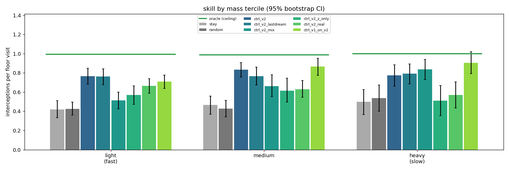

# v2 — 03: C. Does the agent use mass?

*The v1 controller recipe on the v2 world, graded by mass; the v1 controller
dropped into v2 as a baseline; and a finding about dreams that explains more
than the controller numbers do.*

---

## 1. The question

M reads colour and dreams speed from it (doc 02). Mass and speed are linearly
available in `h` (R² 0.99). So the 819-parameter linear controller has the
ball's mass on its input, as a plain feature. Does it *use* it? Two
observable consequences if it does: it should not fall apart on fast balls, and
its decisions should depend on speed × position, not position alone.

## 2. What was run

Same recipe as v1 ([doc 04](../04_controller.md)): CMA-ES, population 32, 16
dreams of 150 steps per candidate, 200 generations, τ = 1, a 24-episode real
check every 5 generations, in the v2 dream (`runs/rnn_v2`). Variants:

| run | inputs | reward | trained in |
|---|---|---|---|
| `ctrl_v2` | z + h | dense (the v1 lesson) | v2 dream |
| `ctrl_v2_mix` | z + h | contact + 0.1·dense | v2 dream |
| `ctrl_v2_z_only` | z only | dense | v2 dream |
| `ctrl_v2_real` | z + h | true interceptions | the real v2 game (reduced budget, as v1's `ctrl_real`) |
| `ctrl_v1_on_v2` | — | — | **not trained**: the v1 controller, v1 VAE and v1 RNN, dropped into the v2 world |

Two metric changes from v1, both about fairness across mass. Light balls reach
the floor ~4× more often than heavy ones, so the mass-fair skill measure is
**interceptions per floor visit** rather than per episode. And the floor-visit
detector's height band now scales with the ball's speed (a fast ball moves
further per frame), otherwise fast balls' chances are under-counted; the oracle
scoring 0.99–1.00 in every tercile is the check that the detector is right.

## 3. Results

150 real episodes, in-distribution masses, interceptions per floor visit:

| controller | overall | light (fast) | medium | heavy (slow) |
|---|---|---|---|---|
| stay | 0.45 | 0.42 | 0.47 | 0.50 |
| random | 0.45 | 0.43 | 0.43 | 0.54 |
| **oracle** | **0.99** | 0.99 | 0.99 | 1.00 |
| **`ctrl_v2`** (dense) | **0.79** | 0.76 | 0.83 | 0.78 |
| `ctrl_v2`, dream-only selection | 0.77 | 0.76 | 0.77 | 0.79 |
| `ctrl_v2_mix` | 0.62 | 0.51 | 0.66 | 0.84 |
| `ctrl_v2_z_only` | 0.57 | 0.57 | 0.62 | 0.51 |
| `ctrl_v2_real` | 0.64 | 0.66 | 0.63 | 0.57 |
| **`ctrl_v1_on_v2`** | **0.79** | 0.71 | **0.87** | **0.90** |

What the table says:

1. **The dream-trained v2 controller is flat across mass**: 77 / 84 / 78% of
   the oracle. It does not collapse on fast balls, which is the first thing a
   speed-blind policy would do. It falls just short of the 85% bar the design
   doc set, uniformly.
2. **The dream-only parameters are as good as the real-selected ones** (0.77 vs
   0.79): zero real frames were needed. Dream-to-real transfer correlation is
   +0.74, the best of either version, mostly because the real-side metric is
   now interceptions rather than contact frames.
3. **The v1 controller, which has never seen a coloured or fast ball, ties it
   overall** — and beats it on medium and heavy balls, losing only on light
   ones (0.71 vs 0.76). The shape is exactly the predicted one: the cost of not
   reading mass sits on the fast balls. The size is much smaller than
   anticipated: a slow ball forgives a wandering paddle, and on heavy balls the
   v1 policy's approach-direction agreement is at *chance* (0.50) while it still
   intercepts 90% of the time.
4. **`z`-only is poor again** (0.57), even though in v2 `z` contains the speed.
   Knowing *how fast* without *which way* is not enough. Clean negative control.
5. **`mix` reward reproduces the v1 pathology**: many contact frames per
   interception, concentrated on heavy balls. `dense` is confirmed as the right
   default.
6. **Real-environment training with the reduced budget** reaches 0.64 on
   1,024,000 real frames; the dream-trained controller reaches 0.79 on 0.

**Held-out colours.** On 60 episodes drawn only from the never-seen mass band,
`ctrl_v2` scores 0.79 (CI 0.72–0.85) against 0.83 (0.76–0.91) on its
in-distribution medium tercile. The intervals overlap almost fully; gap at
floor and approach agreement are within 0.01–0.03. No interpolation failure.

## 4. Does it use mass? — the decision analysis, and why it is inconclusive

Regress each controller's drive (`logit(right) − logit(left)`) on approach
frames against position error, velocities, speed, and the interactions
`speed × x_err`, `speed × vx`. A mass-aware controller should need the
interaction terms.

| controller | R² without interactions | with | gain | coefficient on `speed × x_err` |
|---|---|---|---|---|
| `ctrl_v2` | 0.46 | 0.48 | +0.014 | **+0.34** (vs +0.19 on `x_err`) |
| `ctrl_v2_z_only` | 0.20 | 0.20 | +0.001 | +0.05 |
| `ctrl_v1_on_v2` | 0.31 | 0.33 | **+0.019** | **+0.39** |

The term is present for `ctrl_v2` and absent for the `z`-only control — so far
so good. But it is *stronger* for the v1 controller, which by construction
should not have it. Either speed is confounded with the whole distribution of
approach states (fast balls arrive from different places and angles), or the
v1 VAE fed out-of-distribution colours leaks some colour information into `mu`
after all. Either way, **"interaction term present" is not a sufficient test on
this data**, and the design doc's success criterion has to be downgraded. The
right test is interventional, like doc 02's: repaint the ball, hold everything
else fixed, and see whether the controller's *drive* changes. Not done here.

The behavioural prediction "reacts earlier for light balls" is **not
supported**: the controller gets into position 6.8 frames before contact on
light balls and 21 on heavy — later for fast balls, like every policy including
the oracle (8.1 on light). Fast balls simply leave less time.

## 5. The finding that matters most: dreams do not conserve colour at τ = 1

The agent noticed by eye that in the controller's dream GIF the ball's colour
drifts from yellow through red to purple over 200 frames. I checked it
quantitatively: read the dreamed ball's mass back with a probe, over a 200-step
dream, at the two temperatures that matter.

| correlation of dreamed with true log-mass at step | 0 | 24 | 60 | 120 | 199 |
|---|---|---|---|---|---|
| τ = 0 (deterministic dream) | 0.97 | 0.95 | 0.96 | 0.93 | 0.88 |
| τ = 1 (as the controller was trained) | 0.79 | 0.30 | −0.24 | −0.12 | −0.73 |

So M *has* learned that mass is constant — the deterministic dream holds it for
200 steps — but under sampling, the colour factor **random-walks** and is
unrelated to the true mass within 25 steps. Mass is a latent with no restoring
force: nothing in the data ever pulls it back toward a value, so per-step
sampling noise integrates. Position has walls and the paddle; velocity has the
speed law; colour has nothing.

This reframes the controller results. `ctrl_v2` was trained inside 150-step
τ = 1 dreams in which the ball's speed law drifted under it. A controller cannot
learn to condition on a cue that its training environment does not keep
consistent. That is a plausible reason its mass-interaction term is weak and it
does not beat the mass-blind v1 policy — and it is a general property to expect
of any conserved quantity in a stochastic latent rollout. Remedies to try: train
C at lower τ; pin the colour subspace during the dream; or add a consistency
loss to M for factors that are constant within an episode.

## 6. What was achieved, and what to remember

**Achieved.** A dream-trained controller that handles a 4× range of ball speeds
uniformly at ~79% of a privileged oracle, transfers to never-seen colours, and
needed zero real frames (the dream-only parameters match the real-selected
ones). And two negative results with teeth: a mass-blind v1 controller does
about as well, and the interaction-term test that was supposed to prove
mass-use gives a false positive on it.

**Remember.**

- **Grade per opportunity, not per episode**, when a factor changes how often
  opportunities arise. Interceptions per floor visit made the mass comparison
  fair; per-episode counts would have shown fast balls "winning" by volume.
- **Check the detector against the oracle.** The oracle at 0.99–1.00 in every
  tercile is what licenses every other number in the table.
- **A conserved quantity is not automatically conserved in a dream.** At τ > 0
  any latent without a restoring force diffuses. Test long dreams for the
  constancy of things that should be constant, and do it *before* training a
  controller inside them.
- **Regression-based "does it use X" tests are confounded whenever X shifts
  the state distribution.** Intervene instead.
- **The cost of ignoring a factor can be small even when the factor is real.**
  Slow balls forgive bad tracking. Whether an agent *needs* a causal cue
  depends on the task's tolerance, not just on whether the cue is true.

**Open threads.** Train C at τ = 0.5 or with the colour subspace pinned, and
re-run the tercile table; an interventional (repaint) test of the controller's
drive; a task where speed matters more (a smaller paddle, or a ball that is
lost when missed) so that the value of the causal cue is larger.

Next: [04 — v2 results and lessons](04_v2_results_and_lessons.md).
