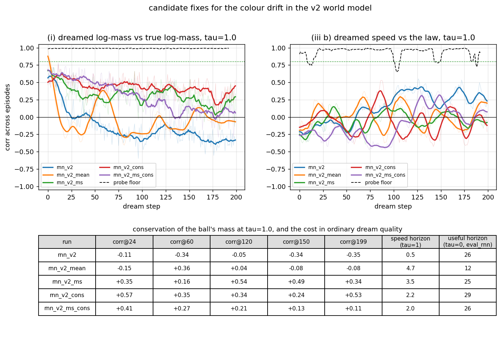

# v2 — 05: Fixing the colour drift

*A conserved quantity was not conserved in the dream. What we measured, three
ways to fix it, which one worked, how far it got, and what it cost.*

---

## 1. The defect, stated precisely

In the v2 world a ball's mass is constant for the whole episode, and it is
shown as colour. The dynamics model `runs/rnn_v2` learned this: in a
deterministic dream (τ = 0) the decoded mass of the dreamed ball stays
correlated with the truth at 0.88 after 200 steps. But the controller was
trained in *sampled* dreams (τ = 1), and there the correlation fell from 0.79 at
the first step to 0.30 by step 24 and to zero or below afterwards. The dreamed
ball slowly changed colour, and with it the speed law the controller was
learning to play against.

Why it happens is worth understanding because it is general. Each sampled step
adds noise to every latent direction the model is uncertain about, and the
model was trained on posterior *samples* of the VAE, which fluctuate in the
colour direction from frame to frame. Position has restoring forces (walls, the
paddle, the speed law); colour has none — nothing in the data ever pulls a
ball's colour back toward a value. Noise with no restoring force integrates
into a random walk. **Any factor that is constant in the world but merely
copied forward by the model will diffuse under sampling.** The same test run on
the v1 model shows its dreamed *speed* (a constant there too) leaving a ±25%
band within a step at τ = 1. This was never a v2-specific problem; v2 just made
it visible by giving the constant a colour.

## 2. The metric that should have existed

[`wm/eval_conservation.py`](../../wm/eval_conservation.py): dream 30 episodes
for 200 steps at τ ∈ {0, 0.5, 1}, decode the dreamed latents with frozen probes,
and plot against dream step: the correlation and error of the dreamed mass
against the truth; the dreamed speed against the law; and the fraction of
frames whose decoded ball is still a well-formed blob. Probe floors on every
panel. It runs on any checkpoint in about 100 s and belongs in every future
stage-M evaluation before a controller is trained.

## 3. Three candidate fixes

All trained from scratch on the same data and budget as the baseline, VAE
frozen. Code in [`wm/conservation.py`](../../wm/conservation.py) and flags in
`wm/train_rnn.py`.

| candidate | mechanism | the bet |
|---|---|---|
| **(a) posterior means** (`--use-mean`) | train on the VAE's `μ` instead of samples | the predicted spread in the colour direction shrinks to what the *means* vary by within an episode, which is ≈ 0, so τ = 1 sampling injects little colour noise |
| **(b) multi-step open-loop loss** (`--rollout-loss-steps 8`) | after the teacher-forced pass, roll the model forward 8 steps on its *own* reparameterised samples and add the likelihood of the true latents at each step | teacher forcing never shows the model its own accumulated noise, so it cannot learn to correct it; an open-loop loss does, and the truth stays put, so drift of anything constant is penalised directly |
| **(c) conservation penalty** (`--cons-loss-weight 1 --mass-head`) | during the same 8-step rollout, penalise the change in a *frozen, differentiable* probe's log-mass estimate between the dreamed latent and the true starting latent; plus a small head on `h` predicting log-mass from privileged state, as the reward head does | tell the model exactly which latent *function* must stay constant, and give `h` a reason to remember it |

Also (b)+(c) together. The differentiable probe is the same degree-2 ridge
probe used everywhere in v2, re-implemented in torch so that gradients flow
into the dreamed latents (tested to 1e-4 against the numpy version).

## 4. What happened

Correlation of dreamed log-mass with the truth at τ = 1:

| model | step 24 | step 60 | step 120 | step 199 | mean, steps 20–199 | well-formed frames |
|---|---|---|---|---|---|---|
| baseline `rnn_v2` | −0.11 | −0.34 | −0.05 | −0.35 | −0.21 | 0.74 |
| (a) means | −0.15 | +0.36 | +0.04 | −0.08 | −0.07 | 0.45 |
| (b) multi-step | +0.35 | +0.16 | +0.54 | +0.34 | +0.28 | 0.93 |
| **(c) conservation** | **+0.57** | +0.35 | +0.34 | **+0.53** | **+0.42** | **0.96** |
| (b)+(c) | +0.41 | +0.27 | +0.21 | +0.11 | +0.26 | 0.80 |

(My own re-measurement with a different probe and seed gives the same picture:
baseline +0.62 → −0.42, conservation +0.66 → +0.40 flat.)

**Read the shape, not one cell.** The baseline's curve decays monotonically
through zero and keeps going: a random walk. The conservation model's curve is
**flat at about 0.45 for the entire 200 steps**, and its mass error is flat
rather than climbing. The drift is gone. What remains is a constant,
non-accumulating error: every dreamed frame has a somewhat wrong colour, but
the same somewhat-wrong colour, so the dream's physics is at least
*consistent*. That is a different and much more benign failure for a controller
than a world whose speed law slides under it.

The other candidates, briefly. **Training on means was a bad idea**: the model
never sees noisy inputs and is brittle in rollouts (useful horizon 12 frames,
half the baseline's; only 45% of dreamed frames still show a well-formed ball).
The bet about the colour spread was right and the collateral damage swamped it.
**The multi-step loss helps** and is the most general of the three (it needs no
knowledge of which factor to conserve), but it costs likelihood (2.53 vs 1.39)
and contact prediction. **Combining (b) and (c) was worse than (c) alone**,
plausibly because the two losses pull the predicted spread in opposite
directions; unverified.

## 5. What the fix cost, and what it did not

| | baseline | **conservation** |
|---|---|---|
| val likelihood (NLL, lower is better) | 1.39 | **1.29** |
| useful dream horizon, τ = 0 | 26 | **29** |
| velocity R² from `h` (vx / vy) | 0.89 / 0.83 | 0.89 / 0.81 |
| action counterfactual separation | 0.57 | **0.59** |
| reward-head error | 0.0038 | **0.0029** |
| contact anticipation PR-AUC | **0.70** | 0.59 |
| cold-start speed-from-colour, r | **0.56** | 0.44 |
| repaint slope (law −1) | −0.60 | **−0.65** |

Better on likelihood, horizon, reward prediction and the interventional
recolour test; worse on contact anticipation and cold-start correlation. The
cold-start regression is the one to keep an eye on: the model that is told to
hold colour constant reads it slightly less eagerly from a single frame.

Note that the conservation model bundles two changes, the penalty and the
`mass_head`, and they were not separated. A run without the head would settle
which does the work.

## 6. The honest limit

The bar set in advance was correlation ≥ 0.8 at step 150. The best model
reaches about 0.45. The remaining error is per-step sampling noise in the
colour direction that the model correctly models (the VAE's posterior really
does fluctuate there) and that no penalty on *drift* can remove. And in every
model, the dreamed *speed* inside a sampled 200-step dream does not track the
true speed law across episodes — the position probe reads the sampling jitter
as motion. A controller dreaming at τ = 1 sees a ball that jitters more than it
travels. Lower temperature helps (at τ = 0.5 the conservation model's
correlation at step 150 is 0.48 and the baseline's is −0.58), which is why the
controller is retrained at both.

## 7. Lessons

- **Test conserved quantities for conservation, in long sampled dreams, before
  training anything inside them.** It is a 100-second check and it should have
  been part of stage M from the start.
- **Restoring forces are the whole story.** Factors with dynamics (position,
  velocity) self-correct in a dream; factors without (colour, mass, any
  episode constant) random-walk. Expect this in every world model that samples.
- **"Train on the means" trades one failure for a worse one.** The model needs
  to have seen noise to survive its own.
- **The general fix and the targeted fix are different tools.** A multi-step
  open-loop loss fixes drift in anything, at a cost in one-step likelihood. A
  conservation penalty fixes drift in a factor you can name, more cheaply and
  with fewer side effects, but you have to know what to name.
- **Partial fixes should be reported as partial.** Bounded error is a real
  improvement over unbounded drift; it is not the same as conservation.

Next: [06 — the controller in the fixed dream, and the interventional test](06_v2_controller_fixed.md).
