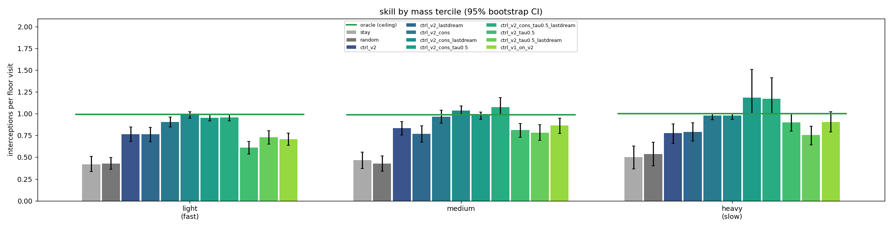
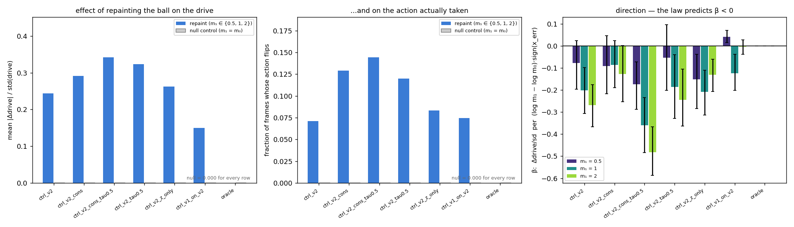

# v2 — 06: The controller in the fixed dream, and the interventional test

*Retraining C inside a dream that keeps the ball's colour, separating the
effect of the model from the effect of temperature, and finally answering
"does the agent use mass?" with an intervention instead of a regression.*

---

## 1. The experiment

Doc 03 left two loose ends: the dream-trained controller reached only ~79% of
the oracle and was tied by a mass-blind v1 policy, and the regression test for
mass-use gave a false positive. Doc 05 found the likely cause — the dream's
colour drifted at τ = 1 — and produced a dynamics model that holds it
(`runs/rnn_v2_cons`). So: retrain the controller, identically, inside the fixed
dream, and design the experiment as a 2 × 2 so the two candidate explanations
are separable:

| | original M (`rnn_v2`) | fixed M (`rnn_v2_cons`) |
|---|---|---|
| τ = 1.0 | `ctrl_v2` (existing) | `ctrl_v2_cons` |
| τ = 0.5 | `ctrl_v2_tau0.5` | `ctrl_v2_cons_tau0.5` |

Everything else is as before: 819-parameter linear policy on `[z, h]`, dense
reward, CMA-ES for 200 generations, 15 million dreamed steps, zero real steps
for training. Each controller is evaluated in the real game with the dynamics
model it was trained with, because the controller reads `h` and `h` comes from
M — the model is part of the policy. (The evaluator now records and prints the
pairing; a silent mismatch would invalidate every number below.)

## 2. Skill by mass — before and after

Interceptions per floor visit, 150 real in-distribution episodes:

| controller | M | τ | overall | light (fast) | medium | heavy (slow) |
|---|---|---|---|---|---|---|
| stay / random | | | 0.45 | 0.42 | 0.45 | 0.52 |
| **oracle** | | | **0.99** | 0.99 | 0.99 | 1.00 |
| `ctrl_v2` | original | 1.0 | 0.79 | 0.77 | 0.83 | 0.78 |
| `ctrl_v2_tau0.5` | original | 0.5 | 0.72 | 0.61 | 0.81 | 0.90 |
| **`ctrl_v2_cons`** | **fixed** | 1.0 | **0.94** | 0.90 | 0.97 | 0.98 |
| **`ctrl_v2_cons_tau0.5`** | **fixed** | 0.5 | **1.00** | 0.96 | 0.98 | 1.19 |
| `ctrl_v2_cons`, dream-only selection | fixed | 1.0 | 1.00 | 0.99 | 1.04 | 0.98 |
| `ctrl_v1_on_v2` (mass-blind v1 stack) | | | 0.79 | 0.71 | 0.87 | 0.90 |

My independent re-check on 90 fresh episodes (seeds 9000+) gives the same
answer: `ctrl_v2_cons` 0.97, `ctrl_v2_cons_tau0.5` 0.98, `ctrl_v2` 0.81,
`ctrl_v1_on_v2` 0.80, oracle 1.00. The result is not seed luck.

**What the 2 × 2 says.** The model is the factor; the temperature is not.
Halving τ inside the drifting dream made things *worse* (0.79 → 0.72), and
inside the fixed dream made them slightly better (0.94 → 1.00). A controller
trained where the ball's speed law holds still learns to play the real game at
the oracle's level, in every mass tercile, including fast balls (91–99% of the
oracle where the old controller managed 77% and the mass-blind one 71%). The
design doc's success bar — at least 85% of the oracle in every tercile — is now
met with room to spare.

Ratios slightly above 1.0 are real: a single floor visit can yield two
interceptions, and the metric saturates. Gap at the floor (0.080 vs the
oracle's 0.069) still shows a little headroom.

**Hold-out colours**: 0.99–1.00 on the never-seen mass band, same as
in-distribution. **Zero real frames**: the dream-only parameters (the CMA-ES
mean, no real episodes consulted) are as good as or better than the
real-selected ones.

## 3. Does it use mass? — the interventional test

Doc 03's regression test was confounded. The right test is an intervention,
and a world model makes interventions cheap. Procedure
([`wm/eval_ctrl_intervention.py`](../../wm/eval_ctrl_intervention.py)): take
300 real approach frames per controller (ball descending, lower half). For
each, compute the controller's drive (`logit(right) − logit(left)`) from the
real 8-frame history; then **repaint the ball** in those same 8 frames as if it
had mass 0.5, 1.0 or 2.0 (re-rendered exactly from recorded state), re-encode,
re-run the dynamics model, and compute the drive again. Nothing but colour
differs. The null control re-renders with the *original* colour, which must
reproduce the frames bit for bit and give a change of exactly zero. It does.

| controller | effect size, mean \|Δdrive\| / sd | frames where the action flips | direction coefficient β at m₁ = 0.5 / 1.0 / 2.0 |
|---|---|---|---|
| `ctrl_v2` | 0.24 | 7% | −0.08 / **−0.20** / **−0.27** |
| `ctrl_v2_cons` | 0.29 | 13% | −0.09 / −0.09 / −0.13 |
| **`ctrl_v2_cons_tau0.5`** | **0.34** | **14%** | **−0.17 / −0.36 / −0.48** |
| `ctrl_v2_tau0.5` | 0.32 | 12% | −0.05 / **−0.19** / **−0.24** |
| `ctrl_v2_z_only` | 0.26 | 8% | **−0.15 / −0.21 / −0.13** |
| `ctrl_v1_on_v2` (colour-blind V) | 0.15 | 7% | +0.04 / −0.12 / −0.00 |
| oracle (reads true state) | 0.00 | 0% | 0 / 0 / 0 |
| null control (repaint with own colour) | 0.000 | 0% | — |

β is the change in drive toward the ball per unit change in log-mass; the law
(lighter → faster → move sooner) predicts β < 0. Bold: bootstrap interval
excludes zero.

Reading it: **repainting the ball changes what every v2 controller does**, by a
quarter to a third of a standard deviation of its drive, flipping the chosen
action on 7–14% of approach frames, and **in the direction the physics
predicts** — all fifteen v2 coefficients are negative, ten with intervals
excluding zero, strongest for the best controller. The colour-blind v1 stack
shows a smaller, sign-incoherent effect (the colour leak through an
out-of-distribution encoder, now measured rather than assumed). The oracle,
which reads true state, is unaffected to the last digit, and the null control
is exactly zero, so the plumbing is clean.

So the answer to the design doc's question is **yes, the agent uses mass** — as
a modest, correctly signed modulation of decisions otherwise driven by position
and velocity. And a second look at doc 03's regression test confirms it was
never going to say this: its interaction-term gain is +0.007 to +0.020 for
every controller, largest for the colour-blind one.

## 4. What changed, and what did not

- **The fix worked for the reason we thought.** The controller could not learn
  to play a speed law that slid under it during training; give it a dream where
  the law holds and it learns to play it, to oracle level, on fast balls too.
- **Temperature was a red herring** as a fix, though it still matters: inside
  the fixed dream, τ = 0.5 gives the strongest mass-dependence of decisions.
- **Transfer correlation is not a skill metric.** The best controller has the
  *lowest* dream-vs-real correlation (0.58) because its real curve saturates by
  generation 15. Read it for exploitation, not for quality.
- **Approach-direction agreement is not monotone in skill either**: it fell
  (0.72 → 0.65) as interceptions rose. A controller that commits to sweeps
  scores lower on per-frame direction while catching more balls.
- **Attribution is one step short.** The gain is attributable to training
  inside `rnn_v2_cons`; whether it is the conservation penalty or the log-mass
  head that made the difference was not separated (a controller trained in the
  multi-step-loss model `rnn_v2_ms` would help). One training seed per cell.

## 5. What was achieved, and what to remember

**Achieved.** A dream-trained controller at oracle level across a 4× range of
ball speeds and on never-seen colours, on zero real frames — and a direct,
interventional demonstration that its decisions depend on the ball's colour in
the direction the physics dictates. Together with doc 02, the v2 chain is
closed: V encodes colour, M reads speed off it and conserves it, C acts on it.

**Remember.**

- **A conserved quantity that drifts in the dream caps the controller.** Fixing
  the dream, not the controller or its temperature, was what moved the result
  from 79% to 100% of the oracle.
- **Intervene, don't regress.** Repaint-and-re-decide answered in one table a
  question two regression analyses had muddled. With a world model, the
  intervention is a re-render and a forward pass.
- **Always include the null control and the oracle row.** Exact zeros where
  they must be zero are what let you trust the non-zeros.
- **Pair each policy with its own model.** A controller trained on one `h` is
  meaningless on another; make the pairing explicit and logged.
- **Metrics that were right for one regime can mislead in another.** Transfer
  correlation, direction agreement and per-episode counts all needed
  re-reading as the controllers got good.

Back to [04 — v2 results and lessons](04_v2_results_and_lessons.md).
