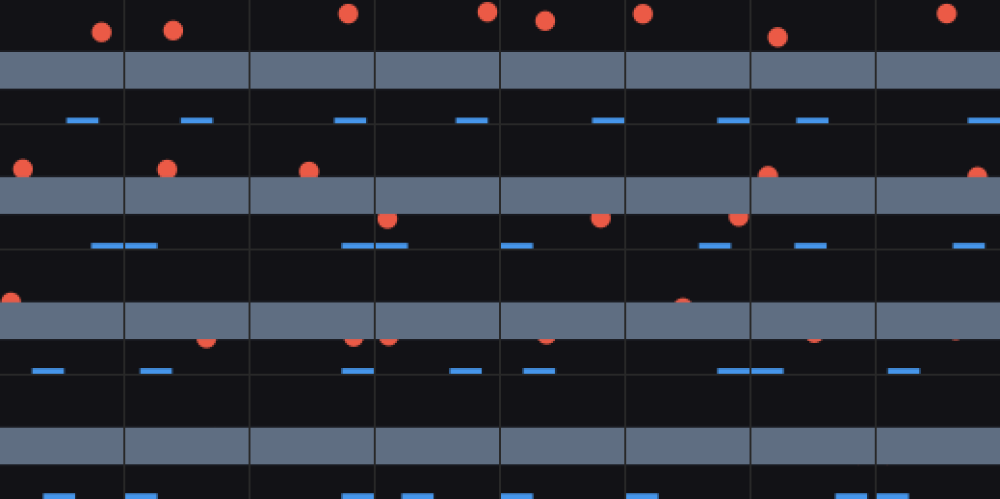
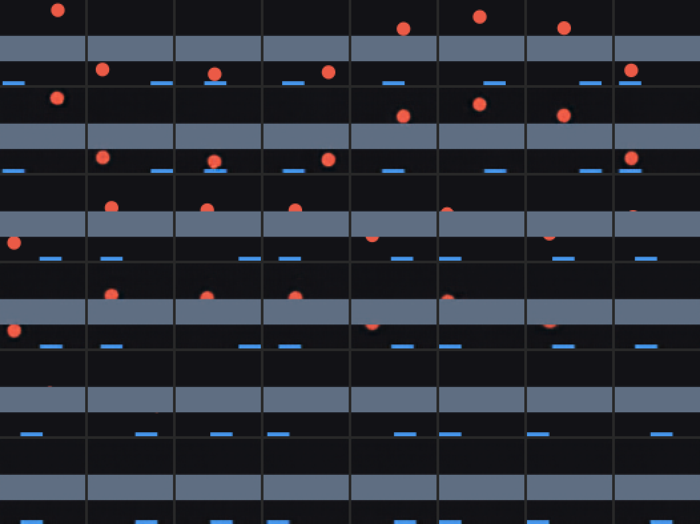

# v3 — 01: The environment, the data, and V

*The band, how often it hides the ball, and what a vision model can and cannot
know about a ball it cannot see.*

---

## 1. The environment change

One switch, `BoxConfig.occluder`, draws an opaque full-width band over the
frame **after** the ball and paddle, using the same antialiased box coverage
the paddle uses. Physics is untouched: with the same seed and actions the
ball's trajectory is identical with and without the band (asserted in the
tests), and both v1 and v2 remain byte-identical under their own switches.

| field | value |
|---|---|
| `occluder_y` | (0.28, 0.58) — bottom and top edge, world coordinates, y up |
| `occluder_color` | (95, 110, 130), a grey-blue distinct from ball, paddle and background |

Two diagnostics were added, for grading only: a state column `ball_visible`
(the fraction of the ball's disc not covered by the band), and an event flag
`EVENT_HIDDEN` for frames where the ball is fully hidden. The model never sees
either.

**Why the band is where it is.** The ball's diameter is 0.16 and the band is
0.30 tall, so the ball is *fully* hidden for about `0.14 / |v_y|` frames — a
design estimate of ~9, measured at 9.5. The band's lower edge at 0.28 means a
descending ball reappears only ~10 frames before it can reach the paddle, and
the paddle needs ~30 frames to cross the box. A controller that waits to see
the ball cannot catch it from far away; it has to move while the ball is
hidden. That is what makes v3 a test of memory for the *agent*, not only for
the dynamics model.

## 2. The data

Same collector, same policies as v1 and v2, `--occluder` on, mass off.

| split | episodes × steps | policy | band |
|---|---|---|---|
| `data/v3/train` | 150 × 200 | sticky | (0.28, 0.58) |
| `data/v3/train_mix` | 300 × 200 | mix, p_track 0.5 | same |
| `data/v3/val`, `val_mix` | 15, 20 × 200 | sticky, mix | same |
| `data/v3/probe` | 120 × 24 | sticky | same |
| `data/v3/tall` | 30 × 200 | mix | **(0.22, 0.64)** — longer occlusions |
| `data/v3/taller` | 30 × 200 | mix | **(0.16, 0.70)** — longer still |

How much of the time is the ball hidden?

| band | fully hidden | partially | visible | mean hidden run (frames) | max | hidden runs containing a wall bounce |
|---|---|---|---|---|---|---|
| (0.28, 0.58) | 17–18% | 38–40% | 42–44% | 9.5 | 27–44 | 14–19% |
| (0.22, 0.64) tall | 32% | 40% | 28% | 16.0 | 47 | 32% |
| (0.16, 0.70) taller | 47% | 36% | 17% | 23.5 | 66 | 42% |

Every vertical traverse crosses the band, so occlusion is a dense event (~11
hidden runs per 200-step episode), and roughly one in six hidden runs contains
a side-wall bounce that happens *out of sight* — the exit position then depends
on a collision no frame ever showed. Those runs are the sharpest test of an
internal simulation, and there are hundreds of them. The two taller bands exist
for one purpose: to ask how *long* the model's memory lasts.

`runs/v3_env/occlusion_episode.gif` shows one episode with a hidden wall
bounce; `hidden_run_lengths.png` the run-length histograms for the three bands.

## 3. The v3 VAE

Same architecture and recipe as v1 and v2, trained from scratch on v3 frames
(60 epochs, 30 minutes on the M1 GPU).

### 3.1 What it must and must not do

Real frames above, reconstructions below, in three blocks: fully visible balls,
partially hidden balls, fully hidden balls. The band is rendered as static
scenery. A partially covered ball is reconstructed as a partial ball in the
right place, with the visible sliver's shape preserved. On fully hidden frames
the reconstruction shows **no ball** — which is what a well-calibrated model
should do, since there is nothing in the frame to say where one is.

That last point was checked quantitatively as a **hallucination rate**: the
ball-coloured pixel mass outside the band on fully hidden frames is 0.024
balls' worth (against 1.02 on visible frames, and 0.001 on real hidden
frames), and the single brightest ball-like pixel across 512 hidden frames is
at 9.5% intensity. There is no hallucinated ball. This matters downstream: a
VAE that painted a ball at its prior location on hidden frames would hand M a
false observation to correct.

### 3.2 The probes, by visibility — the result this stage exists for

Held-out R² for ball position from `μ`, split by how much of the ball is in
view:

| frames | kNN R², ball_x | kNN R², ball_y | rmse x / y (box widths) |
|---|---|---|---|
| fully visible | **0.984** | **0.984** | 0.033 / 0.035 |
| partially hidden | 0.73 | 0.93 | 0.115 / 0.040 |
| **fully hidden** | **−0.51** | **−0.42** | 0.259 / 0.051 |

Visible: as good as v1. Hidden: nothing, and *correctly* nothing — a frame with
the ball behind the band is pixel-identical for every position behind the band,
so no encoder could do better. (The hidden-frame `ball_y` rmse of 0.05 is small
only because a hidden ball's y is confined to the band; the negative R² says the
probe does worse than the band's midpoint.) The partial row is the interesting
one: `ball_y` stays well recovered (a sliver's height tells you where the edge
crossed it) while `ball_x` degrades to 0.73 — a half-disc's horizontal centre is
genuinely harder to read.

**This is the clean statement of v3's problem.** In v1 and v2 the current frame
always pinned down the ball. Here, for a sixth of all frames, it does not, and
for those frames anything the world model knows about the ball's position it
must have *carried* from earlier frames through its own dynamics. Stage M is
graded on exactly that.

### 3.3 Two things that changed in the code, and one that did not

- **Less information, fewer nats.** Total KL fell from v1's 14.4 to **11.9
  nats**, and strongly active dimensions from 9 to 6. Occlusion *removes*
  information from a sixth of frames and degrades it in another third, and the
  encoder's information budget shrank accordingly. Unintuitive at first, then
  obviously right.
- **The position code became more place-field-like.** On visible frames kNN
  recovers position at 0.98 but a degree-2 polynomial only at 0.88 (v1: 0.98).
  The tuning maps show localised blobs with a pale stripe where the band is.
  A plausible reason: the band splits the plane into two regions, and nothing
  pushes the code to stay globally smooth across a gap it never has to
  represent. Untested — and worth watching, since a more localised latent may
  be harder for the MDN-RNN to step through.
- **No visibility dimension.** `ball_visible` is decodable from all of `μ`
  (R² 0.98) but from no single dimension (best 0.09). As with colour in v2,
  the new factor is distributed across the existing code rather than given an
  axis.

## 4. Summary for stage M

V does what it should and nothing it should not: sharp positions when the ball
shows, honest silence when it does not, no hallucinations, and about one in six
frames now carries zero information about the ball. Whether the world model
knows where the ball is on those frames is now purely a question about `h`.

Next: [02 — the v3 dynamics model and the object-permanence tests](02_v3_dynamics_and_permanence.md).
