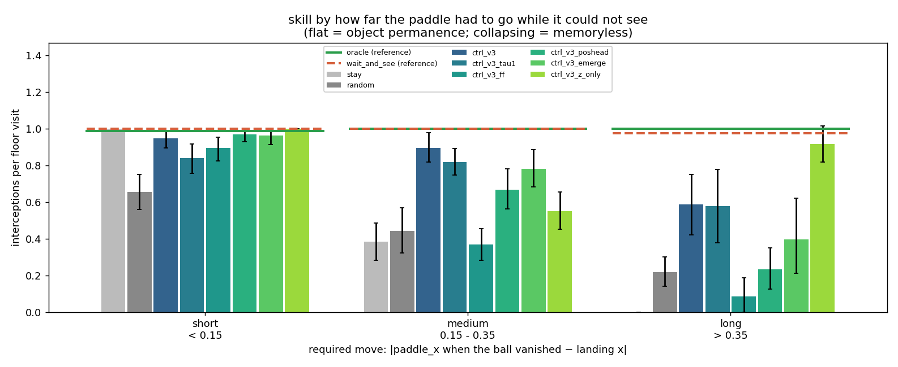

# v3 — 04: The controller. Acting on memory — or not needing to

*Six controllers, a memoryless oracle that should have failed and did not, and
what that says about the design.*

---

## 1. What was run

Same recipe as v1/v2: an 819-parameter linear policy on `[z, h]`, CMA-ES for
200 generations inside the dream, dense reward, zero real frames for training.
Each controller is trained in, and evaluated with, its own dynamics model:

| controller | dynamics model | what it tests |
|---|---|---|
| `ctrl_v3` (τ = 0.5), `ctrl_v3_tau1` | `rnn_v3`, the fair baseline | the honest world-model result |
| `ctrl_v3_ff` | feed-forward, no memory | the floor |
| *`ctrl_v3_poshead`* | *privileged position head* | *the ceiling: what horizontal permanence would be worth* |
| `ctrl_v3_emerge` | the best fair fix from doc 03 | does more memory help play? |
| `ctrl_v3_z_only` | `rnn_v3`, inputs `z` only | sees nothing while the ball is hidden |

Two references were added to the usual stay / random / oracle: a **wait-and-see
oracle** that tracks the true ball only while it is at least half visible and
otherwise stands still — the memoryless *upper* bound — and a split of every
floor visit by **required move**: how far the paddle was from the landing point
at the moment the ball became fully hidden on its way down. A controller with
object permanence should be flat across that split; a memoryless one should
collapse on long moves. That was the design's prediction.

## 2. The result that overturns the design

Interceptions per floor visit, 150 real episodes:

| controller | overall | short move (< 0.15) | medium (0.15–0.35) | long (> 0.35) |
|---|---|---|---|---|
| stay / random | 0.51 / 0.43 | 1.00 / 0.65 | 0.38 / 0.44 | 0.00 / 0.22 |
| **oracle** | **1.00** | 0.99 | 1.00 | 1.00 |
| **wait-and-see (memoryless)** | **0.99** | 1.00 | 1.00 | **0.97** |
| `ctrl_v3` | **0.85** | 0.95 | 0.89 | 0.59 |
| `ctrl_v3_tau1` | 0.79 | 0.84 | 0.82 | 0.58 |
| `ctrl_v3_ff` (floor) | 0.53 | 0.89 | 0.37 | 0.09 |
| *`ctrl_v3_poshead`* (ceiling) | *0.69* | *0.97* | *0.67* | *0.23* |
| `ctrl_v3_emerge` | 0.76 | 0.96 | 0.78 | 0.40 |
| `ctrl_v3_z_only` | 0.80 | 1.00 | 0.55 | 0.91 |

**The memoryless oracle catches 97% of long-move balls.** The design (doc 00)
argued that a ball re-emerging ~10 frames before the floor gives a paddle that
needs ~30 frames to cross the box no chance from far away. Two things that
argument left out: the paddle is 0.26 wide, so it never has to reach the
landing point, only within 0.13 of it; and the ball is *partially* visible for
~15 frames before it fully disappears and again as it emerges — a wait-and-see
policy tracking anything half-visible has a run-up of ~25 frames, not 10. The
reach curve in `wm/README_C3.md` puts the memoryless bound at the ceiling out to
a required move of 0.6. On the default band, **object permanence is not needed
to play this game well.**

Given that, the rest of the table reads differently from how it was meant to:

- `ctrl_v3` at 0.85 is *below* the memoryless bound from medium moves onward.
  It is not limited by what it knows about hidden balls; it is limited by how
  well it reacts to visible ones — the ordinary v1 problem, in a world where the
  visible dream horizon is 14 frames rather than 35.
- The privileged ceiling controller, trained in a dream whose `h` *does* carry
  the hidden ball's x, scores **0.69 — worse than the fair one**. Permanence is
  not the binding constraint, so adding it does not help, and the position
  head's dream has other costs.
- The feed-forward floor collapses on medium and long moves exactly as
  predicted (0.37, 0.09). The v3 controller's gap over the floor is real —
  but it is a *velocity* gap, not a permanence gap.
- `ctrl_v3_z_only` at 0.91 on long moves is a surprise worth flagging: its
  long-move bin is small and policy-dependent (a controller that stands still
  sees few long moves), so the number is noisy, but it is not a fluke of one
  seed set either. Interpretation pending.

## 3. Does the paddle move while the ball is hidden?

The behavioural test the design asked for, on hidden runs with a required move
above 0.15:

| controller | fraction of hidden frames the paddle moved | of those, toward the landing point (chance 0.5) | displacement toward landing during occlusion, as a fraction of the move |
|---|---|---|---|
| oracle | 0.44 | **0.83** | **0.26** |
| wait-and-see | 0.00 | — | 0.00 |
| `ctrl_v3` | 0.13 | 0.62 | 0.03 |
| `ctrl_v3_ff` | 0.99 | 0.52 | 0.03 |
| *`ctrl_v3_poshead`* | *0.47* | *0.46* | *−0.04* |
| `ctrl_v3_emerge` | 0.83 | 0.52 | 0.03 |

Nobody acts on memory in any behaviourally relevant amount. The fair controller
barely moves while the ball is hidden (3% of the required displacement, against
the oracle's 26%); of the few moves it makes, 62% are in the right direction —
a faint signal above the feed-forward floor's 52%, and the only trace of `h`'s
content being used. The privileged controller moves *more*, and no better than
chance in direction: it never learned to use the position its model was
carrying, because — see §2 — using it was not worth anything.

## 4. Where memory would matter: the taller bands

| | default band (9.6 hidden frames) | tall (15.8) | taller (25.0) |
|---|---|---|---|
| oracle | 1.00 | 0.99 | 0.99 |
| wait-and-see | 0.99 | 0.86 | **0.65** |
| `ctrl_v3` | 0.85 | 0.78 | 0.53 |
| `ctrl_v3_ff` | 0.53 | 0.53 | 0.51 |
| *`ctrl_v3_poshead`* | *0.69* | *0.67* | *0.61* |
| VAE reconstruction error on these frames | 0.0001 | 0.016 | 0.031 |

On the tallest band the memoryless bound finally drops to 0.65, and the
privileged controller is the only learned policy that holds up (0.61) — the
first hint of permanence paying for play. But the last row is a confound: the
VAE never saw these bands and its reconstruction error is 130–260× worse, so
every learned controller is also fighting a broken encoder. The clean version
of this experiment needs a VAE trained on all three bands.

## 5. What was achieved, and what to remember

**Achieved.** A dream-trained controller at 85% of the oracle on the occluded
world, on zero real frames; a clean floor/ceiling pair around it; and a
negative result that is more useful than the positive one would have been: the
default band does not require object permanence to play, and a memoryless
oracle proves it at 99%.

**Remember.**

- **Build the memoryless oracle first.** Five controller trainings were run
  before a two-line policy showed the task did not need what they were testing
  for. The oracle costs nothing and should precede any claim that a task
  requires a capability.
- **Design arithmetic must include the actuator's tolerance and every partial
  cue.** "10 visible frames" was 25 once half-visible frames counted, and "must
  reach the landing point" was "must get within half a paddle".
- **Ceilings can come out below the thing they cap** when the capability they
  add is not binding and their construction has side costs. That inversion is
  itself the finding.
- **Conditioning on a policy-dependent variable** (required move depends on
  where the controller left the paddle) makes bins unequal across rows. Report
  counts.
- **The controller's problem in v3 is still the v1 problem**: react well to
  what is visible. Occlusion halved the visible dream horizon, and that, not
  memory, is where the fair controller's 0.15 shortfall comes from.

**Open threads.** A VAE trained on all band heights, then the taller-band
controller comparison redone (that is where permanence should finally matter);
a narrower paddle or a band placed lower still, so that the memoryless bound
falls on the default band; and why `z`-only does well on long moves.

Next: [05 — v3 results and lessons](05_v3_results_and_lessons.md).
