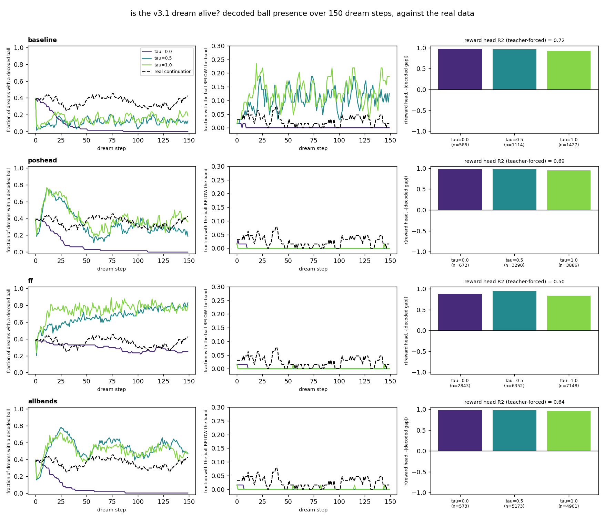
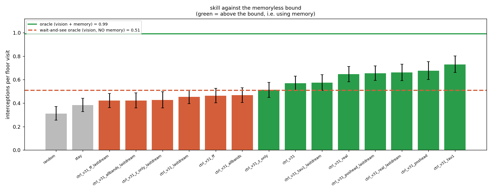

# v3.1 — 08: The controller. Does memory buy play?

*The dream is dead and the controllers beat the memoryless bound anyway. Both
halves of that sentence are the result.*

Full numbers, commands and caveats: [`wm/README_C31.md`](../../wm/README_C31.md).

---

## 1. The premise, checked first this time

v3's lesson was that the memoryless bound must be measured before anything is
trained. v3.1's is the next one along: **the dream must be measured before
anything is trained inside it.**

`wm.eval_dream_alive` dreams 150 steps from 64 real starts, decodes every frame,
and counts balls — against the *real continuation of the same 64 starts*, frame
for frame. Four dynamics models × three temperatures, 102 seconds.

| | ball present | ball below the band | arrivals below the band / 150 frames |
|---|---|---|---|
| **the real world** | 35.5 % | 2.5 % | **0.80** |
| `rnn_v31` (fair), τ=0 | 6.1 % | 0.1 % | 0.03 |
| `rnn_v31_poshead`, τ=1 | 40.5 % | 0.0 % | 0.03 |
| `rnn_v31_ff` (floor), τ=1 | **74.5 %** | 0.0 % | 0.05 |
| `rnn_v31_allbands`, τ=1 | 51.1 % | 0.1 % | 0.08 |

**The dream is not a world for this task.** And the way it fails is the thing to
take away: three of the four models paint a ball on 40–75 % of their frames — as
many as the world, or twice as many — and *every one of those balls is above the
band*, near the top of the box, where the paddle cannot reach it and no action
changes it. A presence-only criterion, which is what v3 used ("the ball is there
on 36 % of frames"), would have called these dreams healthy. The statistic that
separates a world from a picture of one is **arrivals in the region where the
agent can act**, and on that every model is at 4–10 % of the world's rate.

The one exception proves the same point. The fair model at τ ≥ 0.5 does put a
ball below the band — 4 to 6 times more often than the world does, with a
decoded height that barely varies. It has collapsed the ball onto the band's
lower edge and is flickering across the detector's threshold. More arrivals than
the world is not a more alive dream.

## 2. And yet: five of seven controllers beat the memoryless bound

Seven controllers, 150 evaluation episodes, band (0.13, 0.63), paddle 0.16.

| policy | interceptions / floor visit | short move | medium | long (>0.35) |
|---|---|---|---|---|
| `oracle` (vision + memory) | **0.99** | 1.00 | 1.00 | 0.97 |
| **`ctrl_v31_tau1`** (fair, τ=1) | **0.73** | 0.76 | **0.71** | **0.72** |
| *`ctrl_v31_poshead`* (privileged) | *0.68* | *0.76* | *0.59* | *0.71* |
| `ctrl_v31_real` (1.07 M real steps) | 0.65 | 0.86 | **0.80** | 0.37 |
| `ctrl_v31` (fair, τ=0) | 0.57 | 0.67 | 0.56 | 0.45 |
| `ctrl_v31_z_only` (no memory, control) | 0.51 | 0.92 | 0.45 | **0.11** |
| **`wait_and_see`** (vision, no memory) | **0.51** | 1.00 | 0.57 | **0.04** |
| `ctrl_v31_ff` (feed-forward floor) | 0.46 | 0.85 | 0.27 | 0.20 |
| `stay` | 0.38 | 0.99 | 0.13 | 0.00 |

(An independent re-check by the orchestrator on 90 fresh episodes, seeds
9000+, gives the same ordering: fair τ=1 **0.73**, privileged 0.70, memoryless
bound 0.53, `z`-only control 0.47, feed-forward floor 0.40, oracle 0.98 —
`runs/ctrl_eval_v31/recheck_seed9000.md`.)

The best fair controller is **+0.22 above the memoryless bound** with
non-overlapping intervals, closing 46 % of the bound-to-oracle gap — and it is
**flat** across the required-move split (0.76 / 0.71 / 0.72) in a bin where a
policy with perfect vision and zero memory scores 0.04. That flatness is the
object-permanence signature the design asked for, and it is the first time in
this project that it has been observable at all: on v3's band `wait_and_see` was
1.00 / 1.00 / 0.97 and the split measured nothing.

The negative control fired the right way, too — and there is a *matched* one.
`ctrl_v31_z_only_tau1` has the same V, the same M, the same training temperature
and the same optimiser as the 0.73 row, and differs only in that `h` is removed
from its inputs, which makes knowing anything about a hidden ball impossible by
construction. It scores **0.51** — exactly the memoryless bound — and **0.06** on
long moves. The 0.22 is `h`. (In v3 this control *won* the long bin and
destroyed the interpretation.)

And the paddle now moves in the dark. The fair controller is in motion on **52 %**
of hidden frames (v3: 13 %), moves toward the landing point on 63 % of those,
and covers **28 %** of the required move while blind (v3: 3 %) against the
oracle's 79 %. On the long band it covers **49 %**: the longer it cannot see, the
more of the journey it makes anyway.

## 3. So what is the dream doing?

It is a **feature-conditioned reward model, not a simulator.**

M's dense reward head reads the true `1 − |ball_x − paddle_x|` at R² 0.72 on
real latents, and *inside the dream* its output tracks the decoded ball-paddle
gap at r = 0.92–0.98. Meanwhile `h` carries the hidden ball's horizontal
position at R² 0.52 (doc 07). So CMA-ES can discover "move toward where `h` says
the ball is" without ever having seen a dreamed ball come out of the band —
which is exactly what the numbers in §2 say it discovered. Doc 07 §4 anticipated
this ("the reward head may still be informative even when the decoded frame
shows no ball"); it is now measured rather than hoped.

Calling this "training in a world model" would overclaim. The rollout supplies
the *state sequence*; the head supplies the *objective*; the part that would
make it a world — a ball that goes behind an occluder and comes out the other
side — is the part that does not work.

## 4. The three controls, and what each one settled

**The privileged ceiling did not beat the fair model** (0.68 vs 0.73, intervals
overlapping) and **collapsed off its training band** (0.30 and 0.16 on the short
and long bands, below the feed-forward floor, where the fair controller is flat
at 0.55 / 0.57 / 0.56). This is the third version of this project in which
supervising the hidden position explicitly buys nothing for play. On v3.1 there
is finally a clean reason: doc 07 showed the fair model's hidden-`x` memory had
already caught up with the privileged model's (R² 0.52 vs 0.48), so there was
nothing left to add — and what the position head did add did not generalise.

**The real-trained controller did not beat them either** (0.65). Same policy
class, same inputs, 1.07 M real environment steps — 5.4× any dream run's — and
fitness measured as real interceptions. Its shape gives it away: **0.80** on
medium moves, the best in the table, and **0.37** on long ones. Direct
optimisation of a sparse outcome finds the best *reaction* policy and overfits
its seed block (its real score peaks at generation 20 of 40 and then declines).
What the dream supplies that real rollouts do not is a **dense** reward at every
step — the signal that pays for moving while blind.

**The feed-forward floor is a real floor** (0.46, below the bound), and the gap
from it to 0.73 is the largest effect in the table.

## 5. The honest failures

- **The temperature chosen in advance was the wrong one.** The selection rule
  picked τ = 0 for the fair model because its τ ≥ 0.5 dream over-arrives. Skill
  turns out to be monotone in the training temperature — **0.57 / 0.61 / 0.73**
  for τ = 0 / 0.5 / 1.0 — i.e. exactly the opposite of the ranking. The rule was
  applied honestly and before training, and it lost.
- **One seed per row.** The 0.73-vs-0.68 fair-vs-privileged ordering is well
  inside what a second CMA-ES seed could move.
- **No causal test** that the controllers read `h`'s hidden-`x` specifically;
  the behavioural controls (`z_only`, `ff`) are the whole argument.
- **The required-move bins are policy-dependent** — measured from each policy's
  own paddle — so within-bin comparisons are between different visit sets.
- **The long bin rewards late arrival as well as early commitment.** A floor
  visit lasts about six frames, in which the paddle can cross more than its own
  width, so a wandering policy can win long-bin visits without committing: one
  `z`-only parameter set scores 0.43 there while covering 2 % of the required
  move while blind. The displacement column of the paddle-motion table is the
  statistic immune to this, and it is where the behavioural claim actually
  lives.
- **The measured bound is 0.51**, not the design sweep's 0.48; the sweep used 60
  episodes and this uses the same 150 as every row it is compared to.

## 6. Lessons

- **Measure the environment before training in it — including the one you
  built.** v3's lesson was "measure the memoryless bound"; v3.1's is "measure
  the dream". Both cost minutes and both change what every later number means.
- **"Is the object there" is not "is the object where the agent can act".** A
  dream can be 75 % full of balls and contain no reachable ball at all.
- **A world model can be useful while being a bad world.** What transferred here
  was a dense objective computed on a memory-carrying state, not a simulation.
  That is a weaker claim than the method usually makes and it is the one the
  evidence supports.
- **Negative controls are worth more than ceilings.** `z_only` settled the
  interpretation of this stage; the privileged ceiling has now failed to be
  informative three times running.

Next: [09 — v3.1 results and lessons](09_v31_results_and_lessons.md).
