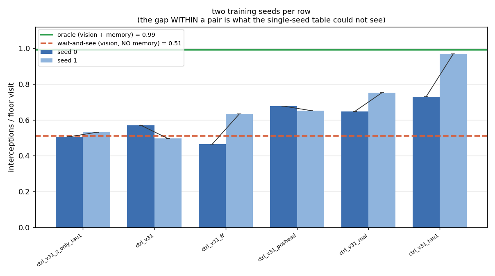

# v3.1 — 10: Two follow-ups. The exit clock, and a second seed

*One attempted fix that failed in an instructive way, and a replication that
kept the headline and dropped most of the details.*

---

## 1. Reviving the exit clock — verdict: no

Doc 07 found the v3.1 dynamics model knows *where* the hidden ball is but not
*when* it comes out: `frames_hidden` from `h` at R² −0.23, and a dream that
never re-emerges the ball. The proposed fix was a **counter head**: a small
linear head on `h` trained to regress two numbers — frames since the ball was
last half-visible, and frames until it next is — with the targets derived from
a frozen probe on `z` (visibility is readable from `z` at R² 0.995), so the head
uses only information available from the model's own input stream. A
privileged twin used the simulator's visibility column and a `vy` head, as a
ceiling; a third variant added the 24-step emergence-weighted rollout.

| model | τ | arrivals below the band per 150 dreamed frames (real 0.80) | re-emergence of dreams that start hidden (bar 70%) | alive? |
|---|---|---|---|---|
| baseline | 0 / 0.5 / 1 | 0.03 / 3.6 / 4.8 | 0% / 100% / 100% | no |
| **counter head (fair)** | 0 / 0.5 / 1 | 0.03 / 0.02 / 0.03 | 0% / 0% / 3% | **no** |
| counter head (privileged) | 0 / 0.5 / 1 | 0.03 / 0.02 / 0.03 | 0% / 0% / 3% | no |
| counter + emergence rollout | 1 | 0.11 | 10% | no |

The counter head made the dream **deader**: where the baseline at τ ≥ 0.5 at
least re-emerges the ball (too often, parked at the band edge), the counter
models never do. The privileged twin is no better, so the frozen probe is not
to blame.

**The mechanism is the instructive part.** Splitting the head's two targets:

| | frames-*since* hidden | frames-*until* visible |
|---|---|---|
| held-out R² | **0.76** | **−0.06** |

Every model learned "how long has the ball been gone" and none learned "when
does it come back". *Since* is a running sum an LSTM can integrate for free;
*until* requires predicting a hidden object's future — precisely the capability
the head was meant to induce. A regression target does not supply a capability;
it measures its absence. And the head cost hidden-`x` memory (0.52 → 0.31) for
a little hidden-`y`, the wrong coordinate.

No controller was trained in these dreams. The exit-clock problem stands, and
it now has a sharper statement: the model cannot predict re-emergence time from
`h`, and no auxiliary regression fixes that. The candidate that remains is
architectural — attention back to the entry frames — which is the v4 question.

## 2. A second seed for every controller row

Every row of doc 08's table was retrained with CMA-ES seed 1 and all rows were
scored on the same 150 episodes.

| controller | seed 0 | seed 1 | mean | spread | above the bound (0.51) |
|---|---|---|---|---|---|
| **fair, τ = 1** | 0.73 | **0.97** | 0.85 | 0.24 | **both seeds** |
| real-trained (1.07 M real frames) | 0.65 | 0.75 | 0.70 | 0.10 | both |
| privileged ceiling | 0.68 | 0.65 | 0.66 | 0.02 | both |
| feed-forward "floor" | 0.46 | **0.63** | 0.55 | 0.17 | one |
| fair, τ = 0 | 0.57 | 0.50 | 0.53 | 0.07 | one |
| `z`-only control | 0.51 | 0.53 | 0.52 | 0.03 | one |

My own fresh-seed re-check (90 episodes, seeds 9000+) gives fair τ=1 at
0.73 / 0.86 for the two seeds, real-trained 0.65 / 0.71, feed-forward
0.40 / 0.58, memoryless bound 0.53 — the same picture with the seed-1 outlier
pulled in.

**What survives two seeds.** The fair τ=1 controller is above the memoryless
bound, the privileged ceiling, the τ=0 controller and the `z`-only control on
both seeds, with non-overlapping ranges; on long required moves it is above
*everything including the real-trained controller* (0.66–0.72 vs 0.37–0.51)
with the smallest spread of any row. The `z`-only control is at the bound on
both seeds and last on displacement-while-blind on both. Those are the claims
doc 08 rested on, and they hold.

**What does not.** Not one *adjacent* ordering in the table survives — every
gap is smaller than the spread it separates. The feed-forward "floor" is not a
floor: its second seed lands at 0.63, above the bound and above both τ=0 seeds.
"Fair beats real-trained" holds only on long moves. And the τ=0 controller is
indistinguishable from the `z`-only control overall.

## 3. Lessons

- **An auxiliary target measures a capability; it does not create one.** The
  counter head learned the half of its target that the recurrence gives for
  free and scored at chance on the half that needed prediction.
- **One seed per row was never enough**, and this table shows exactly how
  much was noise: seed spread of 0.1–0.25 against gaps of 0.02–0.08. The
  headline (memory beats the bound, and `h` is why) survived because it was
  measured against controls that differ by 0.2 or more; everything finer did
  not.
- **"Floor" and "ceiling" are labels for a design, not guarantees.** The
  feed-forward floor came out above the bound on one seed. With two seeds the
  honest floor is the `z`-only control, which sits on the bound both times.

Back to [09 — v3.1 results and lessons](09_v31_results_and_lessons.md).
