

Can a neural network watch a tiny physical world through 64×64 pixels,
learn a model of it good enough to <em>dream</em> the world forward, and then learn to
act using nothing but that dream? This project answers it four times over, on four
versions of the same paddle-and-ball game. Each version hides one more thing:
velocity (v1), a mass you can only read off the ball's colour (v2), the ball itself
behind an occluding band (v3, v3.1), and a gravity direction flipped by an invisible
event (v4). Every tier is a designed experiment with a stated null, a privileged
ceiling and an ablation — and the negative results are kept.

<a href="docs/README.html"><b>Read the write-up →</b></a>
<a href="https://github.com/anirudhmazumder/latent-physics-wm">Source on GitHub</a>
<a href="docs/glossary.html">Glossary</a>

<figure class="card">
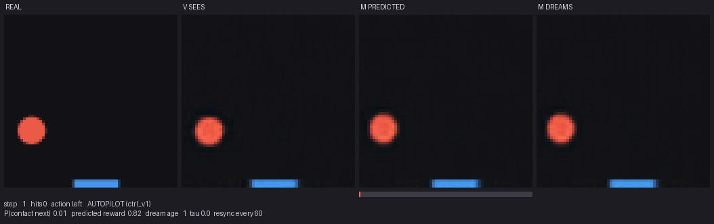
<figcaption>The whole model, live. Left to right at the same instant: the <b>real game</b>
played by the dream-trained controller; what the <b>VAE sees</b> (its reconstruction
of that frame); what the dynamics model <b>predicted</b> this frame would look like;
and a <b>free-running dream</b> that is re-synced to reality every 60 frames — watch
it drift, and watch the contact-probability bar light up before the ball reaches the
paddle. Reproduce with <code>python -m wm.live</code>.</figcaption>
</figure>

<h2 class="tier">v1 — the recipe works</h2>

The Ha &amp; Schmidhuber recipe from pixels: a VAE compresses each frame to 16 numbers,
an MDN-RNN learns to predict the next code, and an 819-parameter controller is trained
by evolution entirely inside the RNN's dream. Headline: **velocity is not in a single
frame (R² 0.02) but is in the dynamics model's memory (R² 0.92)**, and a policy
trained on **zero real frames** plays the real game at 85–90% of a privileged oracle.

<figure class="card">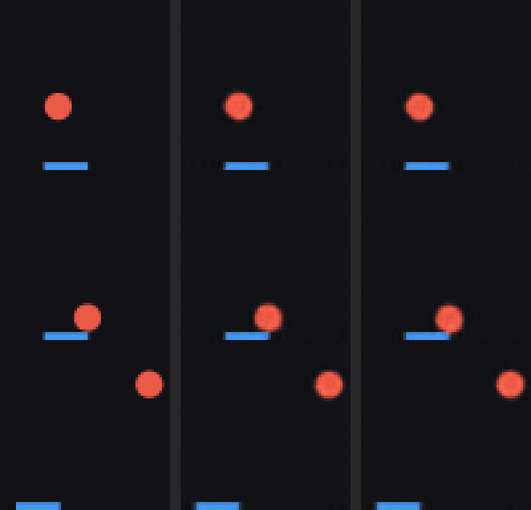
<figcaption><b>Dream vs reality.</b> Left the real episode, middle the VAE's reconstruction of it, right the dream — fed only the actions, never a real frame after warm-up. It tracks for ~35 frames.</figcaption></figure>
<figure class="card">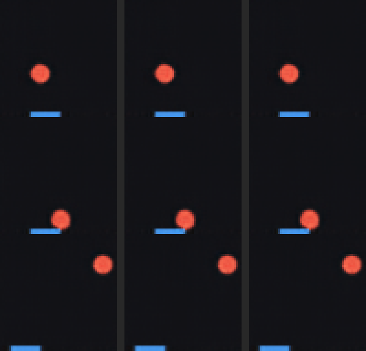
<figcaption><b>Counterfactual actions.</b> Three dreams from the same start: always left, stay, always right. The dreamed paddle stops exactly at the simulator's clamp limits — the model learned where the paddle's walls are.</figcaption></figure>
<figure class="card">
<figcaption><b>Where velocity lives.</b> Held-out R² for each true variable read from the frame code <code>z</code> versus the LSTM state <code>h</code>. Nobody told the network about velocity.</figcaption></figure>
<figure class="card">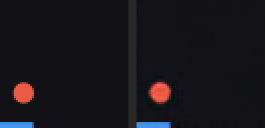
<figcaption><b>Real vs dream, same controller.</b> Left the real game, right the dream, from the same warm-up. They diverge within ~30 frames while the dream stays coherent — the controller learned a reflex, not a trajectory.</figcaption></figure>
<figure class="card">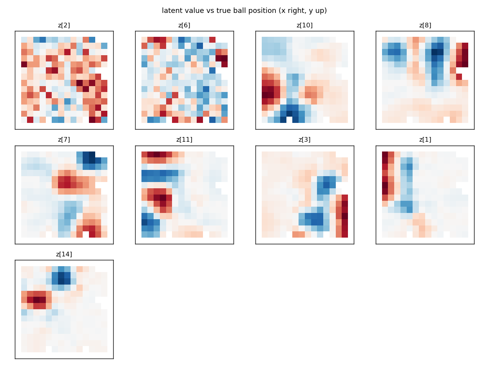
<figcaption><b>What the VAE actually learned.</b> Each panel is one latent dimension's mean value as a function of the ball's true position: blobs and stripes, not coordinates. A place-field code.</figcaption></figure>
<figure class="card">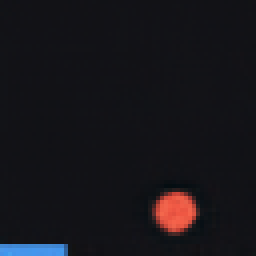
<figcaption><b>Playing inside the dream.</b> The controller in the RNN's imagination, decoded by the VAE. The border turns green when the model's contact head fires.</figcaption></figure>

[Docs 00–05 →](docs/README.html)

<h2 class="tier">v2 — an appearance → dynamics causal edge</h2>

The ball's colour now encodes its mass, and mass sets its speed. **The dynamics model
reads speed off colour from a single frame** (cold-start correlation 0.56 against 0.12
for a colour-blind twin trained on the same frames), and **repainting the ball inside a
dream changes its dreamed speed with the right sign** (slope −0.60 vs +0.01 for the
twin; the true law is −1). The first controller reached only 79% of the oracle
because colour *diffused* in stochastic dreams; a conservation penalty fixed that, and
the retrained controller plays at oracle level across all masses and on colours it
never saw.

<figure class="card">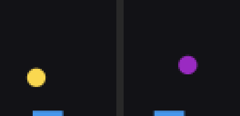
<figcaption><b>The world.</b> A light (yellow, fast) and a heavy (purple, slow) episode side by side. Colour is the only cue.</figcaption></figure>
<figure class="card">
<figcaption><b>Repaint and re-dream.</b> One real start, the ball repainted as five different masses, dreamed forward. Read down a column at step 23: the light ball has travelled visibly further. An intervention, not a correlation.</figcaption></figure>
<figure class="card">
<figcaption><b>Speed from one frame.</b> Dreamed speed after a single-frame warm-up (no motion visible) against the true speed: the colour-seeing model (left) has a slope; the colour-blind control (right) does not.</figcaption></figure>
<figure class="card">
<figcaption><b>Fixing colour drift.</b> Correlation of the dreamed ball's mass with the truth along a 200-step sampled dream. The baseline random-walks to −0.4; the conservation penalty holds it flat.</figcaption></figure>
<figure class="card">
<figcaption><b>Skill by mass.</b> Interceptions per floor visit for light, medium and heavy balls. Controllers trained in the fixed dream (teal) reach the oracle line; the ones from the drifting dream (blue) do not.</figcaption></figure>
<figure class="card">
<figcaption><b>Does the agent use colour?</b> Repaint the ball in a real history, hold everything else fixed, re-decide. Every v2 controller's decision shifts in the direction the physics predicts; the null control is exactly zero.</figcaption></figure>

[Docs v2 →](docs/README.html#v2--mass-from-colour-an-appearance--dynamics-causal-edge)

<h2 class="tier">v3 / v3.1 — memory, and an honest negative</h2>

An opaque band hides the ball. In v3 the model carried the hidden ball's *vertical*
state but not its horizontal position — and then a two-line memoryless oracle turned
out to catch 99% of balls, so the tier never needed what it was measuring. v3.1
re-designed the band with an oracle sweep until a memoryless policy catches only half.
The model then does carry the hidden ball's horizontal position (R² 0.17 → 0.52), and
**a controller trained in its dream scores 0.73 against a memoryless bound of 0.51,
moving the paddle while the ball is hidden** — while the same controller with its
memory input removed lands exactly on the bound.

<figure class="card">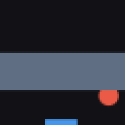
<figcaption><b>The world.</b> The ball passes behind the band and bounces off a side wall while hidden; where it comes out depends on a collision no frame showed.</figcaption></figure>
<figure class="card">
<figcaption><b>Honest silence.</b> Real frames above, reconstructions below: visible balls, partial balls in the right place, and <em>no</em> ball when it is hidden — no hallucination.</figcaption></figure>
<figure class="card">
<figcaption><b>Memory decays.</b> Position read out of the recurrent state as the ball stays hidden, against a no-memory baseline and a memoryless model. Vertical yes, horizontal barely — the mechanism is named in the docs.</figcaption></figure>
<figure class="card">
<figcaption><b>Above the bound is memory.</b> Every controller against the wait-and-see oracle (vision, no memory) and the full oracle. Green bars use memory; the <code>h</code>-ablation sits on the line.</figcaption></figure>
<figure class="card">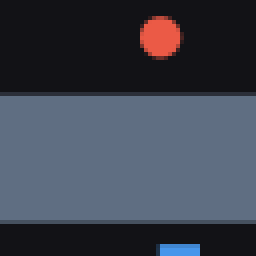
<figcaption><b>Moving in the dark.</b> The paddle starts toward the landing point while the ball is still behind the band.</figcaption></figure>
<figure class="card">
<figcaption><b>Two seeds.</b> The headline survives a second training seed; every finer ordering does not. The gap <em>within</em> each pair is what a single-seed table cannot see.</figcaption></figure>

[Docs v3 →](docs/README.html#v3--the-occlusion-band-object-permanence)

<h2 class="tier">v4 — inference beats memory</h2>

A hidden gravity sign, flipped by paddle contact, invisible in any single frame. Two
oracle sweeps showed the sign never matters for play, so v4 became a dynamics tier: an
LSTM and a causal transformer both learn to *infer* the sign from the trajectory's
curvature, and **neither remembers the flip** — the interventional flip counterfactual
is at chance for every model, and the transformer that cannot see back as far as the
flip is the best predictor of all.

<figure class="card">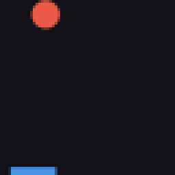
<figcaption><b>The world.</b> Watch the arc: its curvature flips at the paddle contact. Nothing else changes.</figcaption></figure>
<figure class="card">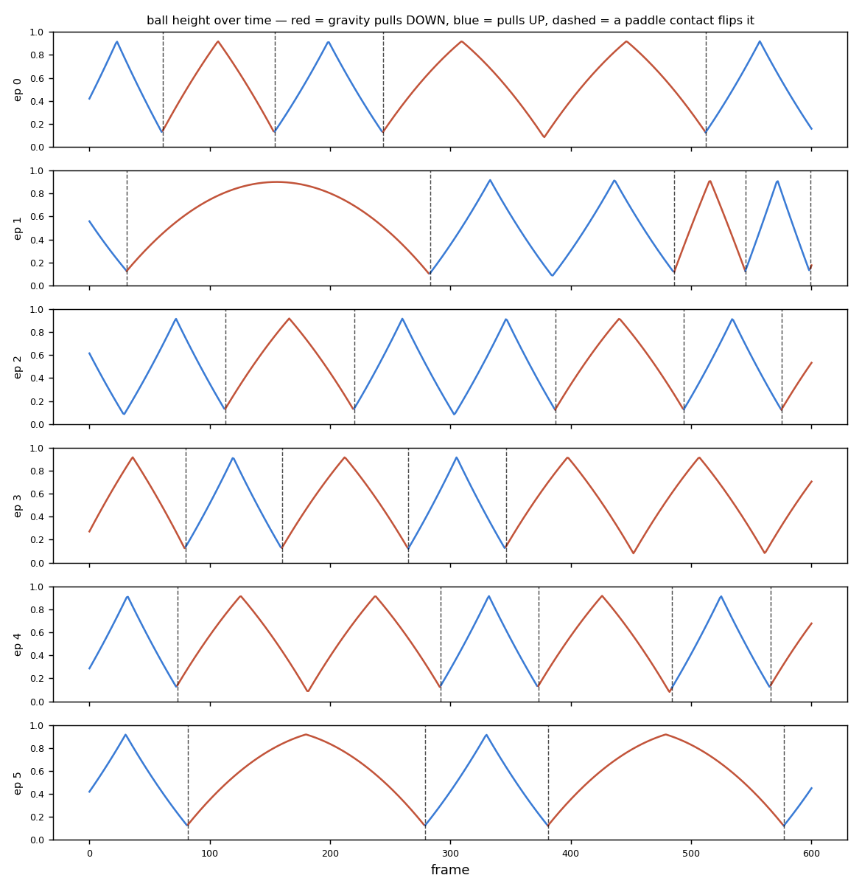
<figcaption><b>Two signs, two trajectories.</b> Ball height over time under gravity-down and gravity-up, with a flip marked. Indistinguishable frame to frame, obvious over a traverse.</figcaption></figure>
<figure class="card">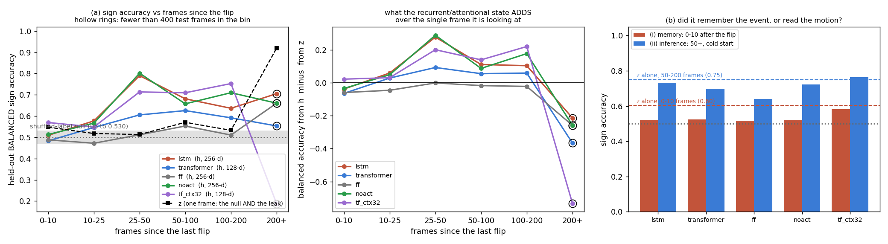
<figcaption><b>The result.</b> Sign recall from the model's state versus frames since the flip <em>rises</em> from chance — inference from motion, not memory of the event — for LSTM and transformer alike.</figcaption></figure>

[Docs v4 →](docs/README.html#v4--the-gravity-switch-a-bit-set-by-an-event-held-indefinitely)

<h2 class="tier">About</h2>

A personal project with a research bent. The recipe is Ha &amp; Schmidhuber's
*World Models* (2018); everything here ran on one Apple M1 laptop. Claude was used
for implementation and documentation. Code and every checkpoint and figure are in
the [repository](https://github.com/anirudhmazumder/latent-physics-wm), MIT licensed.
