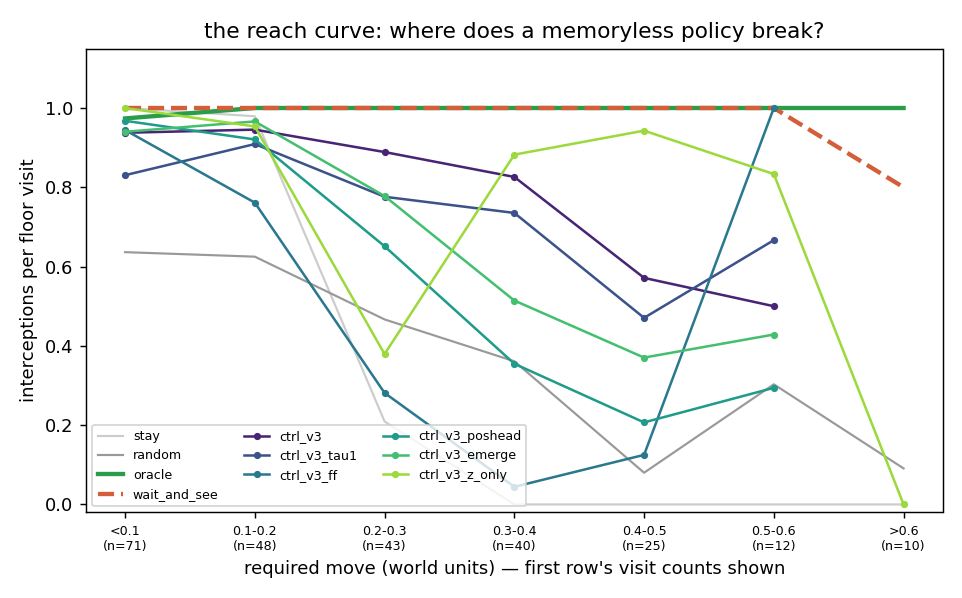
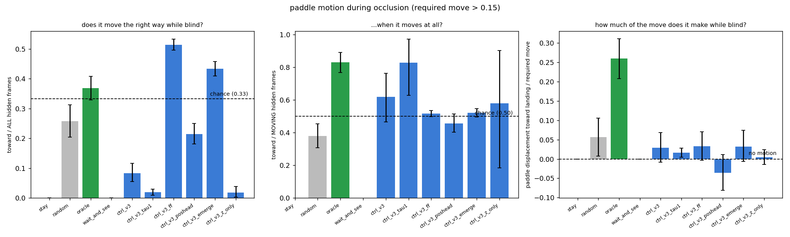

# V3 stage three ("C") — the controller through the occlusion band

Technical log. Hardware: Apple M1, 8 GB, CPU. Interpreter
`python`, every command from the repo root. The v3
VAE (`runs/vae_v3/vae.pt`) and all five v3 dynamics checkpoints were frozen, and
no dataset was modified. Read [`docs/v3/00_v3_design.md`](../docs/v3/00_v3_design.md)
§3-C first, then [`README_M3.md`](README_M3.md) and [`README_FIX3.md`](README_FIX3.md)
for what stage two established and which checkpoint is the fair one.

**The one-sentence question for stage three of v3:** the paddle has to commit
while the ball is behind the band — does it?

---

## The answer, up front, and it is not the one the design predicted

**No trained controller commits during the occlusion, and it does not need to,
because the band as configured does not actually pose the problem.** The
memoryless upper bound — a privileged tracker that is switched off the instant
the ball goes behind the band — scores **0.99 interceptions per floor visit
against the full oracle's 1.00**, and **0.97 on the long-move bin** where the
design document predicted it would collapse. On the default band there is
essentially **nothing for object permanence to buy**.

The geometric argument in the design had two holes, and they are both worth
writing down because they are the kind of arithmetic that is easy to get wrong:

* **The paddle is 0.26 wide.** A "required move" of 0.40 is covered once the
  paddle's *centre* is within 0.13 of the landing point, so only 0.27 of it has
  to be travelled.
* **The ball is readable long before it is fully out.** The design counted the
  ~10 frames between the band's bottom edge (y = 0.28) and contact height. But
  the ball has radius 0.08, so a *sliver* of it is visible from the moment its
  centre reaches y = 0.36 — roughly **15 frames** of run-up at a typical |vy|,
  and the stage-one result is that V encodes exactly that sliver correctly.

15 frames × 0.030 per frame + 0.13 of paddle = **~0.58 of reach with no memory
whatsoever**. The reach curve (`reach_curve.png`) confirms it empirically:
`wait_and_see` sits at 1.00 all the way out to a required move of 0.6 and only
falls to 0.80 beyond it, on 10 visits.

**Where the bound does bite is the taller bands**, which were collected for M's
memory-horizon test and turn out to be the only occlusion regime in this project
where a controller *has* to remember. There `wait_and_see` drops to 0.86
(band 0.22–0.64, ~16 hidden frames) and **0.65** (band 0.16–0.70, ~25 hidden
frames) against an oracle that stays at 0.99. And on those bands the fair
controller does **not** close the gap: `ctrl_v3` scores 0.78 and **0.53**, i.e.
below the memoryless bound at both heights.

### Scoring the C-stage predictions from [`docs/v3/00_v3_design.md`](../docs/v3/00_v3_design.md) §4

| prediction | outcome |
|---|---|
| flat interceptions/visit across the required-move split for a controller with permanence | **no.** `ctrl_v3` 0.95 / 0.89 / 0.59 across short / medium / long. But the *reference* is flat too — `wait_and_see` is 1.00 / 1.00 / 0.97 with zero memory — so the split does not measure what it was designed to measure on this band |
| paddle moves toward the landing point during occlusion | **barely.** `ctrl_v3` moves at all on **13 %** of hidden frames and covers **3 %** of the required move while blind (oracle 26 %). When it does move, 62 % of those moves are toward the landing point (chance 50 %, CI [0.47, 0.76]) — a real but tiny signal |
| the `z`-only controller collapses | **no, and this is the sharpest negative result here.** `ctrl_v3_z_only` scores **0.80** overall and **0.91** on long moves — the best long-move score of any trained row. A policy that provably sees nothing while the ball is hidden is *not* handicapped |
| skill degrades gracefully on a taller band | **it degrades, and so does everything else.** `ctrl_v3` 0.85 → 0.78 → 0.53; but V's reconstruction MSE also goes 0.00012 → 0.016 → 0.031 on those bands, so a large part of the drop is the encoder, not the policy |
| the feed-forward M gives the floor | **yes, decisively.** `ctrl_v3_ff` 0.53 overall and 0.09 on long moves, the worst trained row on both |
| the privileged ceiling shows what permanence is worth | **it shows the opposite.** `ctrl_v3_poshead` scores **0.69**, *below* the fair `ctrl_v3`'s 0.85. The M with four times the hidden-ball position information in `h` makes a **worse** controller |

---

## 1. Files added or changed

| file | what |
|---|---|
| `wm/rnn.py` | the feed-forward branch now returns its **own last hidden layer** as the carried state instead of passing the incoming zero dummy back out. Nothing about the model changes (the MLP still ignores its `h` argument, every per-step output and every number in README_M3 is bit-identical) — but `h[0][0]`, which is what `DreamEnv` and `eval_controller` hand the controller as `h_pre`, was a constant zero vector before. Left alone, `ctrl_v3_ff` would silently have been a second `ctrl_v3_z_only` |
| `wm/eval_controller.py` | `make_box_cfg` / `add_env_args` / `env_kwargs` gained `--occluder` and `--occluder-y`, threaded through `run_real_episodes`, `run_population_real` and `real_vs_dream_gif`, so training and evaluation cannot disagree about the world. **`episode_masses` now takes `mass_from_color` instead of guessing from the array width** — v3's seventh column is `ball_visible`, and reading it as a mass would have handed `floor_visit_stats` a per-episode "speed" of `0.022 / visibility`, i.e. infinite on a hidden frame |
| `wm/dream_env.py` | `StartPool.mass_col`, read from the dataset's own `meta["state_names"]`. Same trap, same fix: the column index is not recoverable from the width |
| `wm/controller.py` | **`WaitAndSeeOracleController`** — the memoryless upper bound |
| **`wm/eval_controller_v3.py`** | new — the by-occlusion evaluator: floor-visit extraction with the descent's last hidden run, the required-move split, the paddle-motion-during-occlusion statistics, the reach curve, the taller-band runs, the VAE reconstruction check, the transfer grid and the GIFs. `--replot` redraws the figures from an existing `summary.json` without re-running a single rollout |
| **`tests/test_controller_v3.py`** | new — 15 tests. Suite is now **116**, all passing |

Artifacts: `runs/ctrl_v3/`, `runs/ctrl_v3_tau1/`, `runs/ctrl_v3_ff/`,
`runs/ctrl_v3_poshead/`, `runs/ctrl_v3_emerge/`, `runs/ctrl_v3_z_only/` (each
with `controller.pt`, `history.json`, `fitness.png`, `dream_vs_real.png`), and
`runs/ctrl_eval_v3/`.

## 2. Commands, in order, with wall clock

The six trainings ran **three at a time** with `OMP_NUM_THREADS=2`
(`runs/_train_ctrl_v3.sh`). Per-generation time is therefore 2–3× the solo
figure, and the second batch was slower than the first (2 400 s against 1 000 s
for the same 200 generations) because the machine had been saturated for half
an hour by then — the same thermal/contention artefact README_FIX3 §2 saw.

```bash
COMMON="--vae runs/vae_v3/vae.pt --data data/v3/train data/v3/train_mix \
        --occluder --inputs zh --reward dense \
        --dream-steps 150 --popsize 32 --rollouts 16 --generations 200 --sigma0 0.5 \
        --real-eval-every 5 --real-eval-episodes 24 --real-eval-seed-base 7000 \
        --real-eval-metric interceptions"

# batch 1, concurrently
python -m wm.train_controller --out runs/ctrl_v3      --rnn runs/rnn_v3/rnn.pt    --temperature 0.5 $COMMON  # 1048 s
python -m wm.train_controller --out runs/ctrl_v3_tau1 --rnn runs/rnn_v3/rnn.pt    --temperature 1.0 $COMMON  # 1061 s
python -m wm.train_controller --out runs/ctrl_v3_ff   --rnn runs/rnn_v3_ff/rnn.pt --temperature 0.5 $COMMON  #  878 s

# batch 2, concurrently
python -m wm.train_controller --out runs/ctrl_v3_poshead --rnn runs/rnn_v3_poshead/rnn.pt --temperature 0.5 $COMMON            # 2408 s
python -m wm.train_controller --out runs/ctrl_v3_emerge  --rnn runs/rnn_v3_emerge/rnn.pt  --temperature 0.5 $COMMON            # 2387 s
python -m wm.train_controller --out runs/ctrl_v3_z_only  --rnn runs/rnn_v3/rnn.pt         --temperature 0.5 $COMMON --inputs z # 2357 s

# the evaluation: 16 policy rows x 150 episodes, two taller bands, GIFs   1334 s
python -m wm.eval_controller_v3 --out runs/ctrl_eval_v3

python -m pytest tests/ -q        # 116 passed
```

Wall clock from the first training launch to the last figure: **1 h 43 min**.

**Sample budget.** Each training run: **15 360 000 dream steps**
(32 × 16 × 150 × 200) against **196 800 real steps** (41 real checks ×
24 episodes × 200), a ratio of **78 : 1** — the whole point of the world model,
and the same ratio as v1 and v2. The evaluation itself spent 480 000 real steps
in distribution (16 rows × 150 × 200) plus 120 000 on the taller bands.

## 3. Training

| run | M | τ | inputs | best real int./ep | final dream fitness | transfer r (smoothed) |
|---|---|---|---|---|---|---|
| `ctrl_v3` | `rnn_v3` (fair) | 0.5 | zh | **1.71** | 133.7 | **−0.01** |
| `ctrl_v3_tau1` | `rnn_v3` | 1.0 | zh | 1.58 | 130.4 | 0.41 |
| `ctrl_v3_ff` | `rnn_v3_ff` (floor) | 0.5 | zh | 1.17 | 143.2 | 0.24 |
| *`ctrl_v3_poshead`* | *`rnn_v3_poshead` (PRIVILEGED)* | 0.5 | zh | 1.25 | 142.0 | 0.13 |
| `ctrl_v3_emerge` | `rnn_v3_emerge` | 0.5 | zh | 1.33 | 156.1 | 0.23 |
| `ctrl_v3_z_only` | `rnn_v3` | 0.5 | **z** | 1.46 | 132.3 | 0.62 |

Two things to read off this table before any of the occlusion analysis.

* **Dream fitness is anti-correlated with real skill across runs.** `emerge` has
  the highest dream return (156.1) and the second-worst real score; `ctrl_v3` has
  nearly the lowest dream return and the best real score. Dream return is a
  quantity in M's own head and each M has its own head, so the column is not
  comparable across rows — that is the standard caveat — but it is a useful
  reminder that "the dream got better" is never evidence.
* **`ctrl_v3`'s own within-run transfer correlation is −0.01.** Its dream
  fitness rose smoothly for 200 generations while its real score peaked around
  generation 80 and then *drifted down* (see `dream_vs_real_all.png`, top left).
  This is the v1 failure mode, and it is why `params_best_real` — selected on
  the periodic 24-episode check — beats `params_last_dream` on almost every row
  below.

## 4. The headline: interceptions per floor visit by required move

The **required move** is |paddle_x at the frame the ball became fully hidden on
its way down − the ball's landing x|. 150 episodes × 200 steps, seeds
5000–5149, identical starts for every row. Full table, CIs and per-bin visit
counts in `runs/ctrl_eval_v3/summary.md`.

| controller | overall | short (<0.15) | medium (0.15–0.35) | long (>0.35) |
|---|---|---|---|---|
| `stay` | 0.51 | 1.00 | 0.38 | 0.00 |
| `random` | 0.43 | 0.65 | 0.44 | 0.22 |
| **`oracle`** (vision + memory) | **1.00** | 0.99 | 1.00 | **1.00** |
| **`wait_and_see`** (vision, **no memory**) | **0.99** | 1.00 | 1.00 | **0.97** |
| `ctrl_v3` (fair, τ=0.5) | **0.85** | 0.95 | 0.89 | 0.59 |
| `ctrl_v3_lastdream` | 0.81 | 0.93 | 0.85 | 0.48 |
| `ctrl_v3_tau1` (τ=1.0) | 0.79 | 0.84 | 0.82 | 0.58 |
| `ctrl_v3_tau1_lastdream` | 0.81 | 0.95 | 0.82 | 0.33 |
| `ctrl_v3_ff` (**floor**) | 0.53 | 0.89 | 0.37 | 0.09 |
| `ctrl_v3_ff_lastdream` | 0.50 | 0.91 | 0.35 | 0.09 |
| *`ctrl_v3_poshead`* (**privileged**) | *0.69* | *0.97* | *0.67* | *0.23* |
| *`ctrl_v3_poshead_lastdream`* | *0.68* | *0.89* | *0.60* | *0.38* |
| `ctrl_v3_emerge` | 0.76 | 0.96 | 0.78 | 0.40 |
| `ctrl_v3_emerge_lastdream` | 0.57 | 0.94 | 0.42 | 0.09 |
| `ctrl_v3_z_only` (**negative control**) | 0.80 | 1.00 | 0.55 | **0.91** |
| `ctrl_v3_z_only_lastdream` | 0.76 | 1.00 | 0.54 | 0.74 |


Four readings, in order of how much they change the story.

1. **`wait_and_see` is flat.** 1.00 / 1.00 / 0.97. The split was designed to
   separate permanence from reaction, and on this band it cannot, because
   reaction is enough. Every comparison in the rest of the table is therefore a
   comparison of *reaction quality*, not of memory.
2. **`ctrl_v3_z_only` does not collapse — it wins the long bin.** 0.91, ahead of
   `ctrl_v3`'s 0.59. Its policy is close to "stand still (78 % STAY), then move
   hard when the ball appears", which is exactly the optimal memoryless strategy
   given a 0.26-wide paddle, and standing still also keeps it near the middle of
   the box where the next ball is more likely to be. The design called this the
   sharp negative control; it is, and it fired the other way.
3. **The privileged ceiling is not a ceiling.** `ctrl_v3_poshead` (0.69) is
   below `ctrl_v3` (0.85) everywhere except the short bin. Its M carries four
   times the hidden-ball `ball_x` information (R² 0.71 vs 0.17, README_FIX3) and
   the controller built on it is *worse*. Same for `emerge` (0.76): the two
   models with the most positional memory make the second- and third-worst
   `zh` controllers. Whatever a controller reads out of `h` on this task, it is
   not hidden-ball position.
4. **The feed-forward floor is a real floor** — 0.53 overall, 0.09 long — and the
   gap from it to `ctrl_v3` (0.85) is the largest effect in the table. But that
   gap is not permanence: `z_only`, which also has no memory of the hidden ball,
   scores 0.80. What `rnn_v3`'s `h` is worth to this controller is **velocity**,
   the v1 quantity, and the ff model's `h` is a one-frame function of `z` that
   cannot carry it.

`stay` scoring 1.00 in the short bin is a selection effect, not skill: a
stationary paddle's "short required move" visits are by definition the visits
where the ball happened to come down on it.

## 5. The reach curve: where a memoryless policy actually breaks



| controller | <0.1 | 0.1–0.2 | 0.2–0.3 | 0.3–0.4 | 0.4–0.5 | 0.5–0.6 | >0.6 |
|---|---|---|---|---|---|---|---|
| `oracle` | 0.97 | 1.00 | 1.00 | 1.00 | 1.00 | 1.00 | 1.00 |
| `wait_and_see` | 1.00 | 1.00 | 1.00 | 1.00 | 1.00 | 1.00 | 0.80 |
| `ctrl_v3` | 0.94 | 0.95 | 0.89 | 0.83 | 0.57 | 0.50 | — |
| `ctrl_v3_ff` | 0.94 | 0.76 | 0.28 | 0.04 | 0.12 | 1.00† | — |
| *`ctrl_v3_poshead`* | *0.97* | *0.92* | *0.65* | *0.35* | *0.21* | *0.29* | — |
| `ctrl_v3_emerge` | 0.94 | 0.97 | 0.78 | 0.51 | 0.37 | 0.43 | — |
| `ctrl_v3_z_only` | 1.00 | 0.95 | 0.38 | 0.88 | 0.94 | 0.83 | 0.00 |

† one visit. Counts per slice are in `summary.md`; anything under ~15 visits is
noise, and the `>0.6` column has 0–11 visits per row.

This is the table that kills the design's premise. The memoryless bound is at
the ceiling out to 0.6 of required move. `ctrl_v3` is *below* it from 0.2
onward — it is not limited by what it knows, it is limited by how well it reacts.

## 6. Paddle motion during occlusion

Over the descending hidden runs (mean **9.6 frames** on the default band), with
the visits whose required move is under 0.15 excluded — on those, standing still
is the correct behaviour and a low score would mean nothing.

| controller | moved on (frac. of hidden frames) | toward / ALL hidden frames (chance 1/3) | toward / MOVING frames (chance 1/2) | displacement / required move |
|---|---|---|---|---|
| `stay` | 0.000 | 0.000 | — | 0.000 |
| `random` | 0.678 | 0.257 | 0.380 | 0.057 |
| `oracle` | 0.444 | 0.369 | **0.831** | **0.260** |
| `wait_and_see` | 0.000 | 0.000 | — | 0.000 |
| `ctrl_v3` | 0.133 | 0.082 | 0.619 [0.47, 0.76] | 0.029 [−0.01, 0.07] |
| `ctrl_v3_lastdream` | 0.216 | 0.154 | 0.715 [0.62, 0.80] | 0.095 [0.05, 0.14] |
| `ctrl_v3_tau1` | 0.023 | 0.019 | 0.829 [0.63, 0.97] | 0.016 [0.01, 0.03] |
| `ctrl_v3_ff` | **0.995** | 0.514 | 0.517 [0.50, 0.54] | 0.033 [−0.00, 0.07] |
| *`ctrl_v3_poshead`* | *0.468* | *0.214* | *0.456* | *−0.036* |
| `ctrl_v3_emerge` | 0.833 | 0.434 | 0.520 [0.50, 0.55] | 0.032 [−0.01, 0.07] |
| `ctrl_v3_z_only` | 0.032 | 0.019 | 0.580 [0.18, 0.90] | 0.004 [−0.01, 0.03] |



**The two "toward" columns disagree, and the disagreement is the finding.** The
raw fraction (the statistic the design asked for) is dominated by how twitchy a
policy is: `ctrl_v3_ff` scores the highest of any trained row (0.514, well above
the 1/3 chance line) purely because it is in motion on **99.5 %** of hidden
frames — when it moves, it is toward the landing point exactly **51.7 %** of the
time, which is chance. Conditioning on the frames where the policy actually
moved inverts the ranking: `ctrl_v3` 0.62, `tau1` 0.83, `ff` 0.52, `poshead`
0.46. So the recurrent controllers do carry a weak above-chance signal about
where the hidden ball is going, and the memory floor carries none — which is the
result the design wanted.

**And it does not matter.** The displacement column is the behavioural
bottom line, and every trained row is between **0.00 and 0.10** of the required
move against the oracle's **0.26**. `ctrl_v3` moves at all on 13 % of hidden
frames and covers 3 % of the distance. **No trained controller commits during
the occlusion in any quantity that affects an outcome.** What they do instead is
stand still and react fast, which — §5 — is enough.

Note that `oracle` is not a ceiling for these columns either: it chases the
ball's *current* x rather than its landing x and is usually already inside its
dead zone when the ball vanishes. The meaningful references are chance and
`wait_and_see`'s structural 0.000.

## 7. Taller bands: the only regime where memory would pay

60 episodes each, seeds 6000+ and 6100+, bands the VAE, the RNN and the
controller have all never seen.

| controller | default (0.28, 0.58) | tall (0.22, 0.64) | taller (0.16, 0.70) |
|---|---|---|---|
| mean hidden run (frames) | 9.6 | 15.8 | 25.0 |
| `oracle` | 1.00 | 0.99 | 0.99 |
| **`wait_and_see`** | **0.99** | **0.86** | **0.65** |
| `ctrl_v3` | 0.85 | 0.78 | 0.53 |
| `ctrl_v3_ff` | 0.53 | 0.53 | 0.51 |
| *`ctrl_v3_poshead`* | *0.69* | *0.67* | *0.61* |

Read the second row: as the occlusion lengthens, the memoryless bound finally
separates from the oracle — 0.99 → 0.86 → 0.65 — which is exactly the effect the
default band was supposed to produce and did not. **That is where a controller
with object permanence would show up, and none of ours does:** `ctrl_v3` is
*below* `wait_and_see` at both heights, and on the tallest band the privileged
`poshead` controller (0.61) is the best of the three trained rows for the first
time — a hint that the position head buys something once the occlusion is long
enough to need it, on 60 episodes and therefore not a claim.

**How much of the degradation is V's fault.** The frozen encoder on frames from
the datasets collected at those bands:

| dataset | band | recon MSE |
|---|---|---|
| `data/v3/val` | (0.28, 0.58) | **0.00012** |
| `data/v3/tall` | (0.22, 0.64) | 0.01599 |
| `data/v3/taller` | (0.16, 0.70) | 0.03142 |

That is a **133×** and **262×** increase in reconstruction error. V was trained
on one band position and treats a different one as an out-of-distribution
object; `ctrl_v3_ff`'s flat 0.53 / 0.53 / 0.51 says the floor policy is
insensitive to all of it, but for every row that reads `z` seriously the taller
bands confound "longer occlusion" with "broken encoder", and no split of this
experiment can separate them. **The taller-band numbers are therefore a lower
bound on what these controllers could do with an encoder that had seen the
band.** Re-training V on mixed band heights is the obvious next step and was not
done here.

## 8. The GIFs

* **`runs/ctrl_eval_v3/real_play_ctrl_v3.gif`** — seed 5100, chosen out of the
  150 evaluation episodes as the **longest required move (0.53) on which the
  paddle moved during the occlusion** (4 of 8 hidden frames toward the landing
  point; 2 interceptions in the episode). **This is a cherry-pick and it is the
  point of the figure**: it is a demo that the behaviour exists at all, not a
  sample of the average episode — §6 is the average, and the average is 13 % of
  frames moved.
* **`runs/ctrl_eval_v3/dream_play_ctrl_v3.gif`** — the controller inside its own
  dream, decoded by V (best of 16 dreams by predicted contact, as in v1/v2).
  **The dreamed ball is present on only 36 % of frames**, against 84 % in the
  real episode next to it (measured by counting ball-coloured pixels in both
  GIFs). The band and the paddle are rendered crisply and the paddle moves
  sensibly; the ball disappears behind the band and frequently never comes back,
  or reappears somewhere unrelated a few frames later.

That last number is, I think, the mechanism behind everything in §6. **CMA-ES
cannot learn to commit early in a dream where the ball does not reliably come
back out.** README_M3 measured the same thing from the dynamics side — the
dreamed hidden ball keeps its vertical direction on 60 % of stretches at τ = 0
and 50 % at τ = 1, a coin flip — and this is what that failure looks like from
inside the controller's objective.

## 9. τ = 0.5 against τ = 1.0

| | τ = 0.5 (`ctrl_v3`) | τ = 1.0 (`ctrl_v3_tau1`) |
|---|---|---|
| interceptions/visit | **0.85** | 0.79 |
| long bin | 0.59 | 0.58 |
| best real int./ep during training | **1.71** | 1.58 |
| transfer r (smoothed) | −0.01 | **0.41** |
| moved on (frac. of hidden frames) | 0.133 | 0.023 |

τ = 0.5 is better by 0.06 interceptions per visit (the CIs overlap:
[0.80, 0.91] vs [0.74, 0.84]), which is consistent with README_M3's
recommendation to train at low temperature on a dream whose conservation is
poor. The more interesting column is the last one: the **τ = 1.0 controller
learned to stand almost perfectly still during occlusions** (2.3 % of hidden
frames moved). In a noisier dream the ball's hidden trajectory is even less
predictable, so the optimiser finds the "wait" policy faster. It is the right
response to a bad dream and it is the opposite of what the experiment was
looking for.

`params_last_dream` vs `params_best_real` is worth one line: the gap is small on
the two `rnn_v3` runs (0.85 → 0.81, 0.79 → 0.81) and **large on `emerge`**
(0.76 → 0.57) and on the long bin nearly everywhere. Selecting on 24 real
episodes every 5 generations is buying 0.04–0.19 interceptions per visit, and
that is the cost of the dream being exploitable.

## 10. Surprises and honest failures

**10.1 The experiment's premise was not checked before the experiment was
built.** The one measurement that decides whether stage three of v3 has a
question at all — "how well can a privileged policy with no memory do?" — takes
four minutes and needed no trained controller. It was not in the design, it is
the first row of the results now, and it says 0.99/1.00. Every hour spent
training six controllers was spent measuring reaction speed. The v1/v2 lesson
was "the oracle must score ≈1.0 to validate the detector"; the v3 lesson is
**the memoryless bound must score < 1.0 to validate the task**.

**10.2 The feed-forward carried state was a zero vector, and it would have been
invisible.** `wm.rnn`'s feed-forward branch returned the incoming dummy `h` from
`forward`, which is correct for everything README_M3 did (every probe reads
`parts["h"]`) and wrong for the one thing stage three does (`h[0][0]`). Shapes
match, training runs, the number comes out — and `ctrl_v3_ff` would have been a
`z`-only controller under a different name, i.e. the memory floor would have
been measuring the absence of `z` rather than the absence of memory. Caught by
writing the test before the run. `tests/test_controller_v3.py::test_feedforward_h_is_the_mlp_layer_not_a_zero_dummy`
pins it.

**10.3 `episode_masses` would have read `ball_visible` as a mass.** Same class
of bug in the other direction: the v2 harness inferred "this rollout has masses"
from `states.shape[-1] >= 7`, and v3's seventh column is `ball_visible`. The
derived per-episode speed `0.022 / m` would have been `0.022 / 0` on any episode
whose first frame had the ball behind the band, and that speed sets the
floor-visit threshold — i.e. the denominator of the headline metric. Now the
caller passes `mass_from_color` explicitly and a test asserts it.

**10.4 The raw "toward fraction" ranks the memory floor first.** §6. The
statistic the design specified (chance 1/3, STAY counts as not-toward) is
confounded by movement rate to the point of inverting the ranking. The fix is
one extra column, not a different experiment, but the lesson is that a
per-frame action statistic needs its denominator thought about: `ff` is in
motion 99.5 % of the time and scores 0.51; `ctrl_v3` is in motion 13 % of the
time and scores 0.08, and `ctrl_v3` is the one with the signal.

**10.5 The required-move bins are policy-dependent.** The required move is
measured from *this policy's own* paddle position, so the three bins do not hold
the same visits for different rows: `ctrl_v3` generates 46 long visits and
`z_only` generates 70. This is conditioning on a post-treatment variable and it
cannot be avoided without measuring the required move from a fixed reference
paddle (which would then not be "the move this policy had to make"). All counts
are reported per row; comparisons within a bin are between different visit sets
and should be read with that in mind.

**10.6 The taller-band test is confounded by V.** §7. 133–262× reconstruction
error means the generalisation result is not clean, and I did not find a way to
separate the two causes with the checkpoints that exist.

**10.7 `ctrl_v3`'s dream-to-real transfer correlation is −0.01**, the worst in
the project (v2's best runs were 0.4–0.7). Its real score peaked near generation
80 and declined for the remaining 120 generations while dream fitness rose
monotonically. 200 generations is too many for this dream; 100 would have given
the same controller for half the compute.

## 11. What I would do next

1. **Fix the task before fixing the agent.** Either widen the band to the
   `taller` geometry (0.16–0.70, where `wait_and_see` scores 0.65) or narrow the
   paddle to ~0.10 and re-run exactly this suite. Both make the memoryless bound
   bite; the band is the better choice because the datasets already exist.
2. **Re-train V on mixed band heights** so the taller-band controller result is
   about the controller.
3. **Give the dream a reason to keep the ball.** The 36 %-of-frames number in §8
   is the binding constraint on everything stage three could have shown. The
   `emerge` objective (README_FIX3) improved what `h` *knows* and made the dream
   worse; what is needed is the opposite trade.
4. **Report the memoryless bound first, in every future stage.** It costs
   minutes and it is the only thing that establishes there is a question.

---

### The two questions the brief asked, answered plainly

**(i) Does the fair controller act on memory during occlusion, and how far is it
from the privileged ceiling and the memoryless floor?**

Not in any quantity that matters. `ctrl_v3` moves on 13 % of hidden frames and
covers 3 % of the required move while blind, against the oracle's 26 %. There
*is* a weak signal — when it moves, 62 % of those moves are toward the landing
point, against the feed-forward floor's 51.7 % (chance) — so `h` is carrying
something about the hidden ball and the memoryless model's `h` is not. It does
not reach behaviour. On skill, the ordering is inverted relative to the labels:
`ctrl_v3` 0.85 > privileged `poshead` 0.69 > `ff` floor 0.53, with `z_only` at
0.80. The fair controller is *above* the "ceiling" and the gap it opens over the
floor is a velocity gap, not a permanence gap.

**(ii) Does the ceiling controller exploit permanence?**

No. `ctrl_v3_poshead` — whose M carries hidden `ball_x` at R² 0.71 against
`rnn_v3`'s 0.17 — scores **worse** on every skill metric (0.69 vs 0.85 overall,
0.23 vs 0.59 on long moves) and its paddle drifts *away* from the landing point
during occlusions (displacement −0.036). Four times the positional memory in `h`
bought nothing, and the only band where it looks best is the tallest one, on 60
episodes.

**So: object permanence is not the binding constraint for this task.** The
memoryless upper bound scores 0.99 of the oracle on the band this stage was run
on, which means there was at most 0.01 of headroom for permanence to buy before
a single controller was trained. The binding constraints are reaction quality
and — for the world-model controllers specifically — a dream that loses the ball
on two thirds of its frames.
