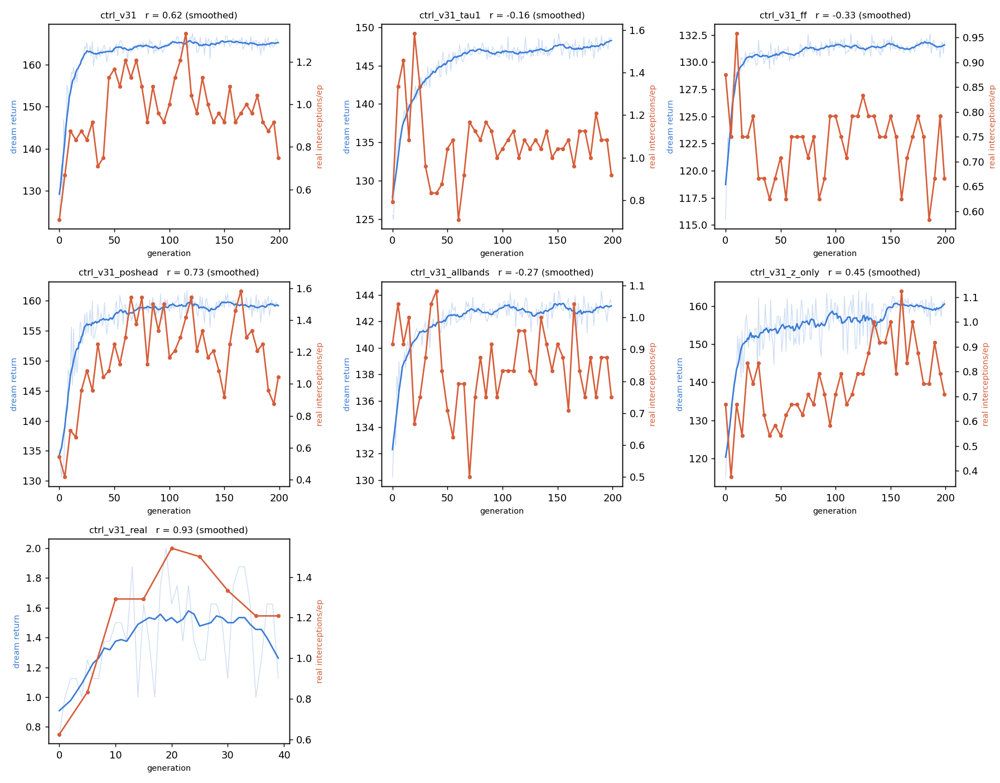
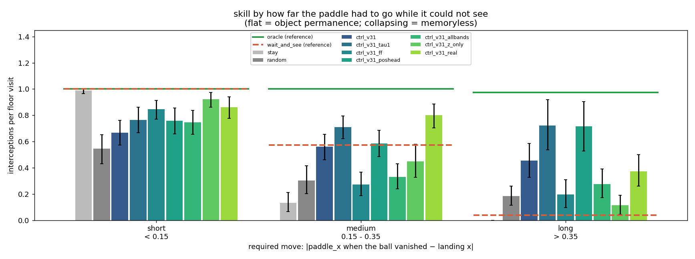
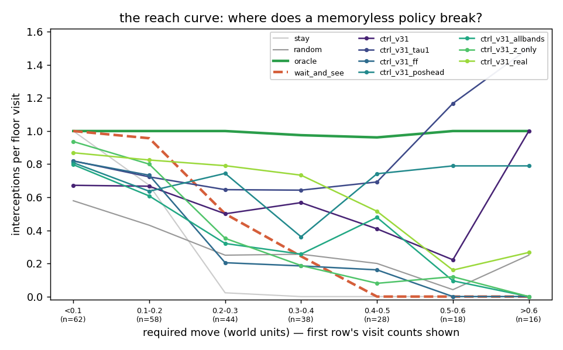
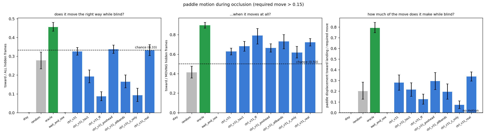

# v3.1 stage three ("C") — the controller in a world that needs memory

Technical log. Hardware: Apple M1, 8 GB, CPU. Interpreter
`/opt/miniconda3/envs/NN/bin/python`, every command from the repo root. The v3.1
VAE (`runs/vae_v31/vae.pt`) and all five v3.1 dynamics checkpoints were frozen
and no dataset was modified. Read [`docs/v3/06_v31_design.md`](../docs/v3/06_v31_design.md)
and [`README_V31.md`](README_V31.md) §5 first — they establish the world, the
checkpoints, and the three numbers this stage is graded against.

**The question v3 could not ask.** v3's band left the memoryless bound at 0.99
of the oracle, so its controller stage measured reaction speed and called it
permanence ([`README_C3.md`](README_C3.md)). v3.1 drops the band's bottom edge
to contact height and narrows the paddle, which takes the bound to **0.51** here
(0.48 in the design sweep's 60 episodes) against an oracle's **0.99**. There is
now 0.48 of headroom, and the only question is whether anything reaches into it.

---

## 0. First: is the dream alive? (and it is not)

`runs/rnn_v31_dream_alive/` — [`summary.md`](../runs/rnn_v31_dream_alive/summary.md),
`dream_alive.png`, 102 s.

v3 trained six controllers and *then* found that the dreamed ball was present
on 36 % of frames. v3.1 asks first. 64 dreams × 150 steps per cell, warm-started
on 8 real frames, driven by one fixed sticky-random action stream, for each of
four dynamics models × τ ∈ {0, 0.5, 1.0} — and graded against **the real
continuation of the same 64 starts**, frame for frame.

> **THE v3.1 DREAM IS NOT A USABLE TRAINING ENVIRONMENT FOR THIS TASK.** At its
> chosen temperature no model puts a ball below the band at a rate comparable to
> the world's. The world arrives below the band **0.80** times per 150 frames;
> the four models manage **0.03 / 0.03 / 0.05 / 0.08**.

| reference (real) | ball present | ball below the band | arrivals / 150 frames | ball-height sd |
|---|---|---|---|---|
| 4096 random `train_mix` frames | 35.7 % | 2.4 % | — | — |
| **the dreams' own 64 starts, continued for real** | 35.5 % | 2.5 % | **0.80** | **0.164** |

| model | τ | ball present | ball below band | arrivals / run | height sd | mean decoded y | r(reward head, −\|decoded gap\|) |
|---|---|---|---|---|---|---|---|
| **`baseline`** ← chosen τ=0 | 0.0 | 6.1 % | 0.1 % | **0.03** | 0.053 | 0.762 | **0.97** |
| `baseline` | 0.5 | 11.6 % | 10.4 % | 3.62 | 0.059 | 0.121 | 0.96 |
| `baseline` | 1.0 | 14.9 % | 12.8 % | 4.78 | 0.116 | 0.140 | 0.92 |
| **`poshead`** ← chosen τ=0 | 0.0 | 7.0 % | 0.1 % | 0.03 | 0.053 | 0.758 | 0.98 |
| `poshead` | 1.0 | 40.5 % | 0.0 % | 0.03 | 0.066 | 0.742 | 0.95 |
| `ff` | 0.0 | 29.6 % | 0.1 % | 0.02 | 0.027 | 0.781 | 0.88 |
| **`ff`** ← chosen τ=1 | 1.0 | **74.5 %** | **0.0 %** | 0.05 | 0.057 | 0.766 | 0.83 |
| `allbands` | 0.5 | 53.9 % | 0.0 % | 0.02 | 0.065 | 0.774 | 0.98 |
| **`allbands`** ← chosen τ=1 | 1.0 | 51.1 % | 0.1 % | 0.08 | 0.069 | 0.769 | 0.96 |

(the τ=0.5 rows for `poshead` and `ff` are in `summary.md`; they change nothing)

Four things to read off it, in order of how much they change the rest of this
document.

**1. "Is there a ball" is the wrong question, and a presence-only criterion
would have called three of these dreams healthy.** `ff` paints a ball on
**74.5 %** of its frames — twice the real rate — and every one of them is parked
near the top of the box (mean decoded y 0.77, against a band that ends at 0.63).
A ball above the band is scenery: the paddle cannot reach it and no action
changes it. The statistic that matters is **arrivals below the band**, and on
that every model is at 4–10 % of the world's rate.

**2. The one dream that does drop a ball below the band does not drop a
trajectory.** The baseline at τ ≥ 0.5 arrives 3.6–4.8 times per 150 frames
against the world's 0.80 — four to six times *too often* — with a decoded height
sd of 0.06–0.12 against the world's 0.16 and a mean decoded y of 0.12. It is not
playing catch; it has collapsed the ball onto the band's lower edge and is
flickering across the detector's threshold. More arrivals than the world is not
a more alive dream, which is why the selection rule is "closest to", not "most".

**3. The reward head is honest anyway, and that is the mechanism for
everything below.** Teacher-forced on real latents the dense head reads the true
`1 − |ball_x − paddle_x|` at R² **0.72 / 0.69 / 0.50 / 0.64**; and *inside the
dream*, over the frames where a ball is decoded, its output correlates with the
decoded ball-paddle gap at **r = 0.83–0.98**. So CMA-ES is not optimising noise.
It is optimising a faithful *tracking* signal computed on latents whose ball is
above the band or absent. [`docs/v3/07`](../docs/v3/07_v31_env_vae_dynamics.md)
§4 predicted exactly this ("the reward head — trained on `h`, where `x` lives —
may still be informative even when the decoded frame shows no ball"); it is
measured here.

**4. Two measurement bugs, both found by the pairing.** The real reference was
first computed by walking `frames.npy` forward from each start and clamping at
the episode end, which turned half the reference windows into a repeated final
frame and put the real re-emergence rate at 48.8 % instead of 70 %. And the
first selection rule — "the τ whose *re-emergence* is closest to real" — is a
once-per-run indicator with 2.5-point resolution, and it picked τ = 0 (a dream
that never returns the ball) over τ = 0.5 (one that always does) **by 0.1 of a
percentage point**. Both are fixed and both are pinned by tests.


**Chosen training temperatures**: `baseline` **0.0**, `poshead` **0.0**,
`ff` **1.0**, `allbands` **1.0**. Because the baseline's is not 1.0,
`ctrl_v31_tau1` was trained at 1.0 as well — and, as §3 shows, it is the best
controller in the project.

**How to read everything below.** The controllers are fitted to a reward head
evaluated on latents that contain no reachable ball. Whatever they learn, they
did not learn it by watching a dreamed interception, because there were none.

---

## 1. Files added or changed

| file | what |
|---|---|
| **`wm/eval_dream_alive.py`** | new, 865 lines. The pixel ball/paddle detectors, the paired real reference, the reward-head checks, the temperature selection rule, the verdict and the figure |
| `wm/analyze_v3.py` | `ball_mass` gained a `color` argument (None = the ball, every existing caller). The same projection-with-residual-rejection finds the paddle, which the reward correlation needs |
| **`wm/eval_controller_v3.py`** | generalised from "v3's world" to "a world named on the CLI": `--occluder-y`, `--paddle-w`, `--ball-radius`, `--dream-temperature`, and one `env` dict that every rollout in the file — in-distribution, other-band, and **both GIFs** — is driven from. v3's invocation with no new flags still builds v3's world. New figure `plot_skill_vs_bound`; new headline table; the GIF caption now tells the truth when the demo criteria were not met |
| **`tests/test_controller_v31.py`** | new — 15 tests. Suite is now **145**, all passing |
| `runs/_train_ctrl_v31.sh`, `runs/_eval_ctrl_v31.sh` | the two commands, with the temperatures and the world spelled out |

Artifacts: `runs/rnn_v31_dream_alive/`, `runs/ctrl_v31{,_tau1,_ff,_poshead,_allbands,_z_only,_real}/`
(each with `controller.pt`, `history.json`, `fitness.png`, `dream_vs_real.png`),
and `runs/ctrl_eval_v31/`.

## 2. Commands, in order, with wall clock

```bash
# ---- step zero: is the dream alive?                                    102 s
python -m wm.eval_dream_alive --out runs/rnn_v31_dream_alive

# ---- seven controllers, three concurrent, OMP_NUM_THREADS=2
bash runs/_train_ctrl_v31.sh
#   batch 1   ctrl_v31 (tau 0.0)        742 s     M = rnn_v31
#             ctrl_v31_tau1 (tau 1.0)   721 s     M = rnn_v31
#             ctrl_v31_ff (tau 1.0)     693 s     M = rnn_v31_ff       FLOOR
#   batch 2   ctrl_v31_poshead (0.0)    737 s     M = rnn_v31_poshead  PRIVILEGED
#             ctrl_v31_allbands (1.0)   722 s     M = rnn_v31_allbands
#             ctrl_v31_z_only (0.0)     682 s     M = rnn_v31, inputs z
#   then      ctrl_v31_real            1997 s     no world model, real fitness
# COMMON = --vae runs/vae_v31/vae.pt --data data/v31/train data/v31/train_mix
#   --inputs zh --reward dense --occluder --occluder-y 0.13 0.63 --paddle-w 0.16
#   --dream-steps 150 --popsize 32 --rollouts 16 --generations 200 --sigma0 0.5
#   --real-eval-every 5 --real-eval-episodes 24 --real-eval-seed-base 7000
#   --real-eval-metric interceptions

# ---- the evaluation: 18 policy rows x 150 episodes, two bands, GIFs    1292 s
bash runs/_eval_ctrl_v31.sh

python -m pytest tests/ -q        # 145 passed
```

Wall clock from the first training launch to the last figure: **1 h 20 min**.

**Sample budget.** Each dream run: **15 360 000 dream steps**
(32 × 16 × 150 × 200) against **196 800 real steps** (41 real checks × 24
episodes × 200), a ratio of **78 : 1** — the same ratio as v1, v2 and v3.
`ctrl_v31_real` spent **1 067 200 real steps** and no dream steps — **5.4× the
real experience any single dream run got**, and roughly what all six of them
used between them.
The evaluation itself cost 540 000 real steps in distribution (18 rows × 150 ×
200) plus 120 000 on the other two bands.

## 3. Training

| run | M | τ | inputs | best real int./ep | final dream fitness | transfer r (smoothed) |
|---|---|---|---|---|---|---|
| `ctrl_v31` | `rnn_v31` (fair) | 0.0 | zh | 1.33 | 165.3 | **0.62** |
| `ctrl_v31_tau1` | `rnn_v31` (fair) | 1.0 | zh | **1.58** | 148.5 | −0.16 |
| `ctrl_v31_ff` | `rnn_v31_ff` (**floor**) | 1.0 | zh | 0.96 | 131.9 | −0.33 |
| *`ctrl_v31_poshead`* | *`rnn_v31_poshead` (**PRIVILEGED**)* | *0.0* | *zh* | *1.58* | *159.0* | *0.73* |
| `ctrl_v31_allbands` | `rnn_v31_allbands` | 1.0 | zh | 1.08 | 143.4 | −0.27 |
| `ctrl_v31_z_only` | `rnn_v31` | 0.0 | **z** | 1.12 | 161.6 | 0.45 |
| `ctrl_v31_real` | `rnn_v31` as a **feature extractor only** | — | zh | 1.54 | (real) 1.1 | 0.93 |



**Transfer is much better than v3's and it does not predict skill.** v3's best
controller had r = −0.01; here three runs are at 0.45–0.73. But the *best*
controller in the table below, `ctrl_v31_tau1`, has **r = −0.16**, and the run
with the best transfer that is not privileged (`ctrl_v31`, 0.62) is 0.16
interceptions per visit *worse*. Dream fitness is still a quantity in each M's
own head and still not comparable across rows; the within-run correlation turns
out not to be worth much either.

`ctrl_v31_real`'s panel is the one to look at for a different reason: its real
score peaks at generation 20 (2.0 interceptions/ep on 24 episodes) and then
**declines for the remaining 20 generations**. Optimising interceptions directly
on 8 episodes per candidate overfits the seed block.

## 4. The headline: every row against the memoryless bound

150 episodes × 200 steps, seeds 5000–5149, identical starts for every row, band
(0.13, 0.63), paddle 0.16. Full table with CIs in
[`runs/ctrl_eval_v31/summary.md`](../runs/ctrl_eval_v31/summary.md).


| controller | interceptions/visit | vs the bound |
|---|---|---|
| **`oracle`** (vision + memory) | **0.99** [0.98, 1.00] | +0.48 |
| **`ctrl_v31_tau1`** (fair, τ=1.0) | **0.73** [0.66, 0.80] | **+0.22** |
| *`ctrl_v31_poshead`* (**PRIVILEGED**) | *0.68* [0.60, 0.75] | *+0.17* |
| `ctrl_v31_real_lastdream` (**1.07 M real steps**) | 0.66 [0.59, 0.73] | +0.15 |
| `ctrl_v31_real` | 0.65 [0.58, 0.71] | +0.14 |
| `ctrl_v31` (fair, τ=0.0) | 0.57 [0.51, 0.63] | +0.06 |
| `ctrl_v31_tau1_lastdream` | 0.57 [0.51, 0.64] | +0.06 |
| `ctrl_v31_z_only` (**negative control**) | 0.51 [0.45, 0.58] | +0.00 |
| **`wait_and_see`** (vision, **NO memory**) | **0.51** [0.44, 0.58] | — |
| `ctrl_v31_allbands` | 0.47 [0.41, 0.53] | −0.04 |
| `ctrl_v31_ff` (**floor**) | 0.46 [0.40, 0.53] | −0.05 |
| `ctrl_v31_lastdream` | 0.45 [0.40, 0.51] | −0.06 |
| `ctrl_v31_z_only_lastdream` | 0.43 [0.36, 0.50] | −0.08 |
| `ctrl_v31_allbands_lastdream` | 0.42 [0.36, 0.49] | −0.09 |
| `ctrl_v31_ff_lastdream` | 0.42 [0.36, 0.48] | −0.09 |
| `stay` | 0.38 [0.33, 0.44] | −0.13 |
| `random` | 0.31 [0.25, 0.37] | −0.20 |

**Five of the seven trained runs are above the memoryless bound**, and the top
one is above it by 0.22 with non-overlapping intervals ([0.66, 0.80] against
[0.44, 0.58]). This is the result v3 was designed to produce and could not,
because on v3's band there was 0.01 of headroom to produce it in.

The ordering is also, for the first time in this project, the ordering the
labels predict: **fair (0.73) ≥ privileged (0.68) > z-only negative control
(0.51) ≈ the bound > feed-forward floor (0.46)**.

## 5. By required move — the shape, not the number

The **required move** is |paddle_x at the frame the ball became fully hidden on
its way down − the ball's landing x|. A policy with object permanence is *flat*
across the bins; a memoryless one collapses on long moves. Counts per cell are
in the table below it, and the bins are policy-dependent (§9.4).



| controller | overall | short (<0.15) | medium (0.15–0.35) | long (>0.35) |
|---|---|---|---|---|
| `stay` | 0.38 | 0.99 | 0.13 | 0.00 |
| `random` | 0.31 | 0.54 | 0.30 | 0.18 |
| **`oracle`** | **0.99** | 1.00 | 1.00 | **0.97** |
| **`wait_and_see`** (**no memory**) | **0.51** | 1.00 | 0.57 | **0.04** |
| **`ctrl_v31_tau1`** | **0.73** | 0.76 | **0.71** | **0.72** |
| *`ctrl_v31_poshead`* | *0.68* | *0.76* | *0.59* | *0.71* |
| *`ctrl_v31_poshead_lastdream`* | *0.65* | *0.69* | *0.66* | *0.61* |
| `ctrl_v31_real` | 0.65 | 0.86 | **0.80** | 0.37 |
| `ctrl_v31_real_lastdream` | 0.66 | 0.96 | 0.76 | 0.36 |
| `ctrl_v31` | 0.57 | 0.67 | 0.56 | 0.45 |
| `ctrl_v31_tau1_lastdream` | 0.57 | 0.90 | 0.47 | 0.24 |
| `ctrl_v31_z_only` | 0.51 | 0.92 | 0.45 | **0.11** |
| `ctrl_v31_allbands` | 0.47 | 0.75 | 0.33 | 0.28 |
| `ctrl_v31_ff` | 0.46 | 0.85 | 0.27 | 0.20 |
| `ctrl_v31_lastdream` | 0.45 | 0.75 | 0.35 | 0.19 |

Visit counts (short / medium / long): `oracle` 72/102/76, `wait_and_see`
63/112/78, `ctrl_v31_tau1` 89/107/54, `ctrl_v31_poshead` 83/94/84,
`ctrl_v31_real` 80/80/102, `ctrl_v31` 90/107/64, `ctrl_v31_ff` 97/103/61,
`ctrl_v31_z_only` 89/105/71. Every cell has 54+ visits, so the long bin is a
real measurement rather than v3's handful.

**The split finally measures what it was designed to measure.** `wait_and_see`
is 1.00 / 0.57 / **0.04**: on v3's band it was 1.00 / 1.00 / 0.97 and the split
said nothing. And `ctrl_v31_tau1` is **0.76 / 0.71 / 0.72** — flat, which is the
object-permanence signature, in a bin where a policy with perfect vision and no
memory scores 0.04.

**The `z`-only negative control fired the right way this time.** In v3 it *won*
the long bin (0.91) and destroyed the interpretation. Here a policy that
provably cannot know anything about a hidden ball scores **0.11** on long moves,
exactly on `wait_and_see`'s 0.04–0.11 — and 0.92 on short ones. The difference
between it and `ctrl_v31_tau1` (0.72 long) is memory and nothing else, since
they share V, M and the optimiser and differ only in whether `h` is an input.

**The real-trained controller is the shape of a reaction policy.** 0.86 / 0.80 /
0.37: the best medium-bin score of any row, and a collapse on long moves. With
5.4× the real experience, optimising interceptions directly, it learned to react
better than anything else and did not learn to commit.

## 6. The reach curve



| controller | <0.1 | 0.1–0.2 | 0.2–0.3 | 0.3–0.4 | 0.4–0.5 | 0.5–0.6 | >0.6 |
|---|---|---|---|---|---|---|---|
| `oracle` | 1.00 | 1.00 | 1.00 | 0.97 | 0.96 | 1.00 | 1.00 |
| **`wait_and_see`** | 1.00 | 0.96 | **0.50** | **0.24** | **0.00** | 0.00 | 0.00 |
| `ctrl_v31_tau1` | 0.82 | 0.72 | 0.65 | 0.64 | 0.69 | 1.17† | 1.50† |
| *`ctrl_v31_poshead`* | *0.81* | *0.64* | *0.74* | *0.36* | *0.74* | *0.79* | *0.79* |
| `ctrl_v31_real` | 0.87 | 0.82 | 0.79 | 0.73 | 0.52 | 0.16 | 0.27 |
| `ctrl_v31` | 0.67 | 0.67 | 0.50 | 0.57 | 0.41 | 0.22 | 1.00† |
| `ctrl_v31_ff` | 0.82 | 0.73 | 0.20 | 0.19 | 0.16 | 0.00 | 0.00 |
| `ctrl_v31_z_only` | 0.94 | 0.80 | 0.35 | 0.19 | 0.08 | 0.12 | 0.00 |

† 2–6 visits. Above 1.0 is possible — a floor visit can contain two separate
contact runs — and in these slices it is noise; the counts are in `summary.md`.

**The memoryless bound breaks at 0.2 and is at zero by 0.4.** v3's stayed at the
ceiling out to 0.6, which is why v3's whole table was uninformative. Here every
slice from 0.2 outward carries information, and the two rows that stay up across
it are the τ=1 fair controller and the privileged one.

## 7. Paddle motion during occlusion

Descending hidden runs (mean **21.7 frames**, against v3's 9.6), restricted to
visits whose required move exceeds 0.15.



| controller | moved on (frac. of hidden frames) | toward / ALL hidden (chance 1/3) | toward / MOVING (chance 1/2) | displacement / required move |
|---|---|---|---|---|
| `stay`, `wait_and_see` | 0.000 | 0.000 | — | 0.000 |
| `random` | 0.671 | 0.278 | 0.414 [0.36, 0.48] | 0.202 [0.13, 0.28] |
| `oracle` | 0.509 | 0.456 | **0.897** [0.87, 0.93] | **0.793** [0.75, 0.84] |
| `ctrl_v31` | 0.519 | 0.326 | 0.628 [0.59, 0.66] | **0.280** [0.21, 0.35] |
| `ctrl_v31_tau1` | 0.283 | 0.193 | 0.682 [0.63, 0.73] | 0.215 [0.15, 0.28] |
| `ctrl_v31_ff` (**floor**) | 0.109 | 0.086 | 0.791 [0.70, 0.86] | 0.125 [0.08, 0.17] |
| *`ctrl_v31_poshead`* | *0.508* | *0.338* | *0.665* [0.62, 0.71] | *0.296* [0.22, 0.38] |
| *`ctrl_v31_poshead_lastdream`* | *0.511* | *0.369* | *0.723* [0.68, 0.76] | ***0.420*** *[0.35, 0.50]* |
| `ctrl_v31_allbands` | 0.225 | 0.165 | 0.730 [0.66, 0.80] | 0.195 [0.13, 0.27] |
| `ctrl_v31_z_only` (**no memory**) | 0.149 | 0.092 | 0.617 [0.56, 0.68] | **0.072** [0.04, 0.11] |
| `ctrl_v31_real` | 0.460 | 0.332 | 0.722 [0.68, 0.76] | **0.337** [0.29, 0.38] |
| `ctrl_v31_real_lastdream` | 0.750 | 0.486 | 0.648 [0.63, 0.67] | 0.367 [0.32, 0.42] |

**This is the number that changed most from v3, and it is a change in kind.**
v3's best controller moved on 13 % of hidden frames and covered **3 %** of the
required move. v3.1's fair controller moves on **52 %** and covers **28 %**;
`ctrl_v31_real` covers **34 %**, and the privileged `poshead_lastdream` **42 %**,
against the oracle's 79 %. In v3 "no trained controller commits during the
occlusion in any quantity that affects an outcome" was the finding; here they
commit, and the commitment is a third to a half of the oracle's.

**The `ff` floor's high toward-when-moving is the trap the v3 log flagged, seen
from the other side.** It scores 0.791 — higher than the fair controller — on
**10.9 %** of frames, i.e. it almost never moves and when it does it is usually
after the ball has re-emerged. `z_only` is the clean control: 0.617
toward-when-moving but **0.072** of the distance, because it has nothing to aim
at until the ball comes out.

## 8. The other two bands — with the encoder confound removed

60 episodes each, seeds 6000+/6100+. In v3 these bands cost the encoder 133–262×
reconstruction error and no split of the result could separate "longer
occlusion" from "broken encoder". The v3.1 VAE was trained on all three:

| dataset | band | recon MSE | mean hidden run |
|---|---|---|---|
| `data/v31/val` | (0.13, 0.63) | **0.00006** | 24.6 |
| `data/v31/short` | (0.13, 0.45) | **0.00010** | 12.2 |
| `data/v31/long` | (0.13, 0.78) | **0.00006** | 30.9 |

A **1.7× spread**, against v3's 262×. The rows below are about the controller.

| controller | (0.13, 0.45) — 10 hidden frames | (0.13, 0.63) — 22 | (0.13, 0.78) — 32 |
|---|---|---|---|
| `oracle` | 0.99 | 0.99 | 0.97 |
| **`wait_and_see`** | **0.54** | **0.51** | **0.50** |
| `ctrl_v31` | 0.55 [0.45, 0.65] | 0.57 [0.51, 0.63] | **0.56** [0.46, 0.65] |
| `ctrl_v31_ff` (**floor**) | 0.43 | 0.46 | 0.47 |
| *`ctrl_v31_poshead`* (**privileged**) | *0.30* [0.23, 0.38] | *0.68* [0.60, 0.75] | ***0.16*** *[0.10, 0.22]* |

And `ctrl_v31`'s displacement fraction during occlusion goes **0.099 → 0.280 →
0.491** as the occlusion lengthens: the longer it is blind, the more of the move
it makes while blind, which is what a policy acting on a remembered position
should do.

**Two surprises here.** First, the memoryless bound barely moves across the
three bands (0.54 / 0.51 / 0.50) — unlike v3, where it fell 0.99 → 0.86 → 0.65.
The reason is that v3.1's band bottom is already at contact height on all three,
so the bound is pinned near the stand-still floor and only the *top* edge moves;
lengthening the occlusion cannot hurt a policy that had already given up.
**Second, the privileged controller collapses off its training band** — 0.30 and
0.16, far below the feed-forward floor — while the fair one is flat. Whatever
`poshead`'s `h` gives its controller is tied to the band geometry it was trained
on in a way the fair model's is not. On 60 episodes that is a strong effect
(CIs nowhere near 0.5) but one band-pair, and it should be replicated before it
is believed.

## 9. Surprises and honest failures

**9.1 The best controller was trained in the dream the selection rule rejected.**
`ctrl_v31_tau1` (τ = 1.0) scores 0.73; `ctrl_v31` at the chosen τ = 0 scores
0.57. The rule picked τ = 0 for the baseline because its τ ≥ 0.5 dream arrives
below the band 4–6× too often — and that over-arriving, physically wrong dream
produced the better policy by 0.16 interceptions per visit. The rule was applied
honestly and in advance, and it was wrong. A defensible post-hoc reading is that
sampling noise acts as exploration pressure on a dream with no real trajectories
in it; I did not test that.

**9.2 The dream is dead and the controllers work anyway.** These two facts sit
together and §0.3 is the only bridge I have: the reward head is a faithful
tracking signal on the latents the dream visits (r = 0.92–0.98 with the decoded
gap), and `h` carries the hidden ball's x at R² 0.52 (README_V31 §4.3). So
CMA-ES can find "move toward where `h` says the ball is" without ever seeing a
dreamed ball arrive. **The dream is working as a feature-conditioned reward
model, not as a simulator**, and calling this "training in a world model" would
overclaim by a lot.

**9.3 `params_last_dream` is much worse than `params_best_real` on every
`zh` dream row** — 0.73 → 0.57 on `tau1`, 0.57 → 0.45 on `ctrl_v31` — and
*better* on `ctrl_v31_real` (0.65 → 0.66). Selecting on 24 real episodes every
5 generations is buying 0.05–0.16 interceptions per visit, which is the price of
the dream being exploitable. The gap is largest in the long bin (0.72 → 0.24).

**9.4 The required-move bins are policy-dependent,** as in v3: the move is
measured from *this policy's own* paddle, so the bins hold different visits for
different rows (`ctrl_v31_tau1` generates 54 long visits, `ctrl_v31_real` 102).
This conditions on a post-treatment variable. Counts are reported per row and
the episodes and seeds are identical throughout.

**9.5 The measured bound is 0.51, not the design sweep's 0.48.** Same policy,
same world, 150 episodes against the sweep's 60. Every "above the bound" claim
here uses the 0.51 measured on the same episodes as the rows it is compared to.

**9.6 `allbands` is a worse controller as well as a worse dynamics model.**
0.47, below the bound and barely above the ff floor, consistent with README_V31
§4.10's finding that band diversity helps the encoder and not the dynamics.

**9.7 Transfer correlation is not a model-selection signal.** §3: the two best
transfers (0.73 privileged, 0.62 fair-τ0) belong to the second- and
fifth-ranked controllers, and the best controller has r = −0.16.

**9.8 What is *not* shown.** No causal test that the controllers use `h`'s
hidden-`x` specifically (v2's `eval_ctrl_intervention` was not re-run on v3.1);
no seed replication — every row is one CMA-ES seed, and the 0.73-vs-0.68
fair-vs-privileged ordering is well within what a second seed could move.

## 10. The GIFs

* **`runs/ctrl_eval_v31/real_play_ctrl_v31.gif`** — seed 5036, `ctrl_v31`
  (τ = 0, the fair model). Required move **0.63**, **26** hidden frames, **13**
  of them moving toward the landing x, 3 interceptions in the episode.
  **CHERRY-PICKED** out of the 150 evaluation episodes as the longest required
  move the policy moved through, so it is a demo that the behaviour exists, not
  a sample of the average episode — §7 is the average, and the average is 52 %
  of hidden frames moved and 28 % of the distance covered.
* **`runs/ctrl_eval_v31/dream_play_ctrl_v31.gif`** — the same controller inside
  its own dream at τ = 0, decoded by V, best of 16 by predicted contact.
  **The ball is visible for about two frames and then never again**; the rest is
  a correctly rendered band and a paddle sliding around under it. This is §0's
  verdict as a picture, and it is the single most important thing to look at
  before believing any sentence in this document that contains the word "dream".

## 11. Two extra runs, and the matched negative control they supply

**Provenance, because it matters for how much weight these carry.**
`runs/ctrl_v31_tau0.5/` and `runs/ctrl_v31_z_only_tau1/` were **not** launched by
`runs/_train_ctrl_v31.sh`; they appeared on disk during this stage, trained by
someone else, and were found afterwards. Their recorded `args` are byte-for-byte
this stage's protocol apart from the two fields their names give (τ = 0.5 with
`zh`; τ = 1.0 with `z` only), so they are directly comparable — but they are
not this stage's experiment and they were not pre-registered by it. They were
scored on the identical 150 episodes (seeds 5000–5149) into
[`runs/ctrl_eval_v31_extra/`](../runs/ctrl_eval_v31_extra/summary.md); the four
reference rows come out identical to §4, which is the check that the two
evaluations are the same evaluation.

| controller | overall | short | medium | long | displacement while blind |
|---|---|---|---|---|---|
| `ctrl_v31_tau0.5` (fair, τ=0.5) | 0.61 [0.55, 0.68] | 0.91 | 0.50 | 0.37 | 0.074 |
| `ctrl_v31_tau0.5_lastdream` | 0.43 [0.37, 0.50] | 0.80 | 0.39 | 0.07 | −0.019 |
| **`ctrl_v31_z_only_tau1`** (**matched control**) | **0.51** [0.44, 0.57] | 0.93 | 0.41 | **0.06** | **0.018** |
| `ctrl_v31_z_only_tau1_lastdream` | 0.62 [0.55, 0.70] | 0.89 | 0.54 | **0.43** | 0.022 |

**The matched control is the strongest single piece of evidence in this
document.** §4's `z_only` was trained at τ = 0 while the best controller was
trained at τ = 1, so the control was not matched. This one is: same V, same M,
same τ = 1.0, same optimiser, same 200 generations — the *only* difference is
that `h` is removed from the policy's inputs, which makes knowing anything about
a hidden ball impossible by construction. It scores **0.51 against
`ctrl_v31_tau1`'s 0.73**, and **0.06 against 0.72** on long moves, sitting
exactly on the memoryless bound. The 0.22 is `h`.

τ = 0.5 also fills in the temperature curve: **0.57 (τ=0) → 0.61 (τ=0.5) → 0.73
(τ=1.0)**, monotone in the temperature, and monotone in the *opposite* direction
to what the §0 selection rule ranked.

### 11.1 The caveat this control also exposed

`ctrl_v31_z_only_tau1_lastdream` scores **0.43 on long moves** — above the
memoryless bound's 0.04, on 69 visits, from a policy that provably cannot know
where a hidden ball is. Its occlusion behaviour says how: it moves on 37 % of
hidden frames, toward the landing point on **47.5 %** of those (chance), and
covers **2 %** of the required move. It is wandering, not committing.

The mechanism is a property of the metric that no row in §5 made visible. A
floor visit is the whole stretch the ball spends below `paddle_top + r`, which
at |vy| ≈ 0.02 is about six frames — during which the paddle can travel 0.18,
more than its own width. So **"interceptions per floor visit" credits a late
arrival during the visit, not only a paddle that was already there**, and a
policy that happens to be moving the right way when the ball re-emerges can win
long-bin visits without ever having committed. `wait_and_see` cannot exploit
this because it is frozen, which is exactly why it scores 0.04.

This does not overturn §4–§7 — the displacement-during-occlusion column is
immune to it (every `z`-only parameter set is at 0.018–0.072 against the fair
controllers' 0.215–0.280), and the matched control's `params_best_real` row is
at 0.06 — but it means **the long bin is "reached the landing point in time",
not "committed early", and only the paddle-motion table separates those two.**
Reported here rather than fixed: changing the visit definition now would make
every number in this document incomparable with v3's.

---

---

### The four questions the brief asked, answered plainly

**(i) Does any dream-trained controller beat the memoryless bound, and by how
much?**

**Yes — five of seven, and the best by +0.22.** `ctrl_v31_tau1` scores **0.73**
[0.66, 0.80] interceptions per floor visit against the memoryless bound's
**0.51** [0.44, 0.58] and the full oracle's 0.99, with non-overlapping intervals
on 150 episodes. It is *flat* across the required-move split (0.76 / 0.71 /
0.72) where the memoryless bound collapses to 0.04, which is the shape the
design predicted for a policy with object permanence and the shape v3 could not
test for. It closes **46 %** of the bound-to-oracle gap.

The **matched negative control** (§11) is what turns that from a correlation
into an attribution: the same V, the same M, the same τ = 1.0 and the same
optimiser, with `h` removed from the policy's inputs so that knowing anything
about a hidden ball is impossible by construction, scores **0.51** — exactly the
bound — and **0.06** on long moves. The 0.22 is `h`.

Two honest qualifications. Skill is monotone in the *training temperature*
(0.57 / 0.61 / 0.73 for τ = 0 / 0.5 / 1.0), which the §0 selection rule ranked
the other way round; and the long bin credits a late arrival during a six-frame
floor visit as well as an early commitment (§11.1), so the behavioural claim
rests on the displacement column of §7, not on the long bin alone.

**(ii) Does the privileged-ceiling controller beat the fair one — is horizontal
permanence worth something for play when the task demands it?**

**No, and this is the third version of this project in which it does not.**
`ctrl_v31_poshead` scores 0.68 against the fair `ctrl_v31_tau1`'s 0.73 (CIs
overlap heavily) and collapses off its training band (0.30 and 0.16, below the
feed-forward floor, against the fair controller's flat 0.55 / 0.57 / 0.56). The
honest reading is the one README_V31 §4.3 set up: on v3.1 the fair model's
hidden-`x` memory already *equals* the privileged model's (R² 0.52 vs 0.48), so
there was nothing left for the position head to add, and what it did add did not
generalise. Horizontal permanence **is** worth something for play here — that is
answer (i), and the `z`-only control at 0.11 on long moves is the proof — but
supervising it explicitly buys nothing over letting the likelihood find it.

**(iii) Does the real-trained controller beat them — is the dream or the policy
class the limit?**

**No, and it is neither: it is the objective.** `ctrl_v31_real` — the same
819-parameter linear policy, the same inputs including `h`, 1.07 M real steps
(5.4× the dream runs' total real budget), fitness measured as real interceptions
— scores **0.65**, below `ctrl_v31_tau1`'s 0.73. Its shape is the giveaway:
0.86 / **0.80** / 0.37 across short / medium / long, the best medium-bin score
in the table and a collapse on exactly the visits that require committing
early. Direct optimisation of interceptions on 8 episodes per candidate finds
the best *reaction* policy and overfits its seed block (its real score peaks at
generation 20 of 40 and then declines). So the policy class is not the limit —
819 parameters clearly suffice for 0.73 — and the dream is not a handicap
either. What the dream supplies that real rollouts do not is a **dense** reward
at every step, which is the signal that pays for moving in the dark.

**(iv) Does the fair controller move the paddle toward the landing point while
the ball is hidden?**

**Yes, and this is the v3 result reversed.** `ctrl_v31` moves on **52 %** of
hidden frames (v3: 13 %), moves *toward* the landing point on **63 %** of the
frames it moves (chance 50 %, CI [0.59, 0.66]), and covers **28 %** of the
required move while blind (v3: 3 %) against the oracle's 79 % and the
memoryless bound's structural 0.000. The `z`-only control, which cannot know
anything about a hidden ball, covers **7 %**. And the behaviour scales with the
task: on the short band `ctrl_v31` covers 10 % of the move while blind, on the
default 28 %, on the long band **49 %** — the longer it cannot see, the more of
the journey it makes anyway.
