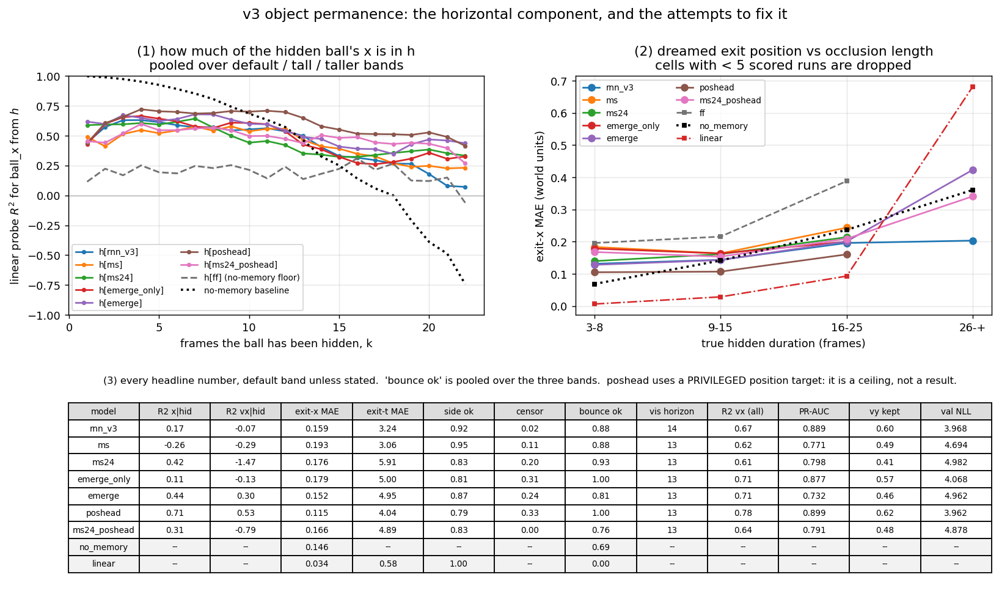

# V3 stage two, the fix attempt — carrying the ball's *x* through the band

Technical log. Hardware: Apple M1, 8 GB, CPU. Interpreter
`/opt/miniconda3/envs/NN/bin/python`, every command from the repo root. The v3
VAE (`runs/vae_v3/vae.pt`) was frozen, `runs/rnn_v3/` was not touched, and no
dataset was modified.

Read [`README_M3.md`](README_M3.md) §7.5 and §10 first: that is where the defect
is diagnosed. One sentence of it: during an occlusion the next latent is the
blank band whatever the ball's horizontal position is, so one-step teacher
forcing never pays the model to track x, and it does not — `ball_vx` from `h`
on fully hidden frames scores R² **−0.07**, indistinguishable from a
feed-forward control with no memory at all.

---

## The recommendation, up front

**No fair (self-supervised) fix meets the bar, and one of them gets most of the
way there. The checkpoint I would hand stage three is still
`runs/rnn_v3/rnn.pt`; the checkpoint that actually *has* horizontal object
permanence in `h` is `runs/rnn_v3_emerge/rnn.pt`, and it pays for it.**

The bar was: hidden-frame `ball_x` R² from `h` **and** exit-x MAE below the
no-memory baseline on the default band **and** below linear extrapolation on
runs with a hidden wall bounce.

| criterion | `rnn_v3` | **`emerge`** (fair) | `poshead` (privileged ceiling) |
|---|---|---|---|
| hidden `ball_x` R² from `h` | 0.17 | **0.44** ✓ | 0.71 |
| hidden `ball_vx` R² from `h` | −0.07 | **+0.30** ✓ | 0.53 |
| exit-x MAE vs no-memory 0.146 | 0.159 ✗ | 0.152 ✗ (and 24 % censored) | **0.115 ✓** |
| exit-x MAE, hidden bounce, vs linear 0.470 | 0.183 ✓ | 0.211 ✓ | 0.155 ✓ |
| no > 10 % regression elsewhere | — | ✗ (PR-AUC −18 %, `vy` R² −13 %) | ✗ (`vy` R² −13 %) |

So: **the memory arrived and the dream did not get better.** `emerge` more than
doubles the horizontal position information in the recurrent state and is the
only fair model that carries horizontal *velocity* through the gap at all — it
closes **50 %** of the `ball_x` gap and **62 %** of the `ball_vx` gap to the
privileged ceiling — but the dreamed exit position still does not beat "the ball
is where it vanished", and the extra memory costs one-step fidelity (val NLL
3.968 → 4.962), exit timing (3.24 → 4.95 frames), paddle-contact PR-AUC (0.889 →
0.732) and hidden-direction conservation (0.60 → 0.46).

**Use `runs/rnn_v3/rnn.pt` for the C stage** (it is better at everything a
controller reads), and **use `runs/rnn_v3_emerge/rnn.pt` if the question being
asked is specifically "what does `h` know about a hidden ball"**. What I would
try next is in §7.

**The single most informative result in this document is the ceiling.**
`runs/rnn_v3_poshead` — an extra linear head on `h` trained on the simulator's
true `(ball_x, ball_y)` on every frame, hidden ones included — reaches hidden
`ball_x` R² **0.71**, beats the no-memory exit-x baseline (0.115 vs 0.146), and
costs **nothing** in one-step NLL (3.962 against the baseline's 3.968) or in
contact PR-AUC (0.899 against 0.889). The 256-unit LSTM state has ample room to
carry the hidden ball. The defect is not capacity and not architecture. It is
**purely that the self-supervised objective never asks.** That is a much
sharper statement of the diagnosis than README_M3 could make.

---

## 1. Files added or changed

| file | what |
|---|---|
| `wm/rnn.py` | `RNNConfig.pos_head` (default `False`, so every old checkpoint loads with an identical state dict) and the `nn.Linear(hidden, 2)` it builds; its output is exposed under its own key `"ball_pos"` and nothing downstream reads that key. `mdn_nll` split into `mdn_nll_per_step` (returns `(B, T)`) plus a mean, so a per-transition weight can multiply the likelihood *before* the reduction; `mdn_nll` and `rnn_loss` take an optional `weights` / `nll_weights`, normalised to mean 1 so the loss scale — and therefore the learning rate — is unchanged by the weighting |
| `wm/conservation.py` | `rollout_losses` gained `weights`, indexed at `t0 + k` for step `k`, and its `nll_per_step` is now a real per-step vector rather than a stack of batch means |
| `wm/seq_data.py` | items carry `state_in` = the PRE-transition states, aligned with `z` exactly as `state` is aligned with `z_next`. Needed because "was the previous frame hidden?" is unanswerable from the window's own `state` at t = 0. Diagnostics only, like `state`; it never reaches the model |
| `wm/train_rnn.py` | `--emerge-weight`, `--emerge-frames`, `--pos-head`, `--w-pos`; `emergence_weight_mask()`; `_state_column(roots, name)` generalising `_mass_column` so that **every** column this file needs — `mass`, `ball_visible`, `ball_x`, `ball_y` — is found by name from `meta["state_names"]`, never by index |
| `wm/eval_permanence_v3.py` | the decay curve now also stores per-axis `rmse_x`/`rmse_y`, and the no-memory baseline stores `r2_x`/`r2_y` scored on the same frames and the same split as the probes. Without that the fix figure could not put the baseline on the models' R² axis. Nothing existing changed meaning |
| **`wm/compare_fix_v3.py`** | new — the comparison figure and table. It computes nothing: every number is read back out of the reports the three evaluators already wrote, so the figure cannot disagree with them |
| **`tests/test_fix_v3.py`** | new — 12 tests. Suite is now **101**, all passing |

Artifacts: `runs/rnn_v3_ms24/`, `runs/rnn_v3_emerge/`, `runs/rnn_v3_emerge_only/`,
`runs/rnn_v3_poshead/`, `runs/rnn_v3_ms24_poshead/` (each with `eval/` and
`conservation/`), `runs/rnn_v3_fix/permanence/`,
`runs/rnn_v3_fix_comparison.png` (+ `.md`, `.json`).

### What is privileged, and how much

Two different things, and conflating them would make the whole document
worthless.

* **`--emerge-weight` uses the privileged `ball_visible` flag to decide how much
  each transition counts.** The model's inputs, its targets and its
  architecture are untouched; only the weight in front of a likelihood changes.
  This is the same class of cheat as a curriculum or a class-balanced
  `pos_weight` — weak, but not zero, and it would not be available to an agent
  that had to discover on its own that something was occluded. (It could be:
  §7.)
* **`--pos-head` trains a head on the simulator's true ball position.** That is
  a direct instruction about what to remember. It is labelled a **ceiling**
  everywhere in this document and in the figure, and it is not a world-model
  result. The head is excluded from every eval by construction: it appears
  under its own `parts` key, `rnn_loss` never touches it (a test asserts no
  gradient reaches it from that loss), and every evaluator reads position out of
  `h` with its own external probe.

---

## 2. Commands, in order, with wall clock

The first three ran **concurrently** with `OMP_NUM_THREADS=2` on 8 cores; a
fourth was launched as soon as a slot freed. Per-epoch times are therefore
2–3× the solo figure. A 24-step rollout epoch is **41 s solo** and **~110 s**
with three of these running at once; the brief's 90 s threshold is a
concurrency artefact, so I kept K = 24 rather than dropping to 16.

```bash
COMMON="--data data/v3/train data/v3/train_mix --val data/v3/val data/v3/val_mix \
        --epochs 35 --eval-every 2"

# (a) long open-loop rollout                                         3562 s
python -m wm.train_rnn $COMMON --out runs/rnn_v3_ms24 \
    --rollout-loss-steps 24 --rollout-loss-weight 1.0
# (b) the same, with emergence frames up-weighted x5                 3450 s
python -m wm.train_rnn $COMMON --out runs/rnn_v3_emerge \
    --rollout-loss-steps 24 --rollout-loss-weight 1.0 --emerge-weight 5
# (c) the PRIVILEGED ceiling                                         1613 s
python -m wm.train_rnn $COMMON --out runs/rnn_v3_poshead --pos-head --w-pos 1.0
# (d) (a) + (c)                                                      2504 s
python -m wm.train_rnn $COMMON --out runs/rnn_v3_ms24_poshead \
    --rollout-loss-steps 24 --rollout-loss-weight 1.0 --pos-head --w-pos 1.0
# (b-) not in the brief; the decomposition that (b) needs, see 5.1    1375 s
python -m wm.train_rnn $COMMON --out runs/rnn_v3_emerge_only --emerge-weight 5

# the two standard evaluations, per model, ~40 s each on an idle machine
VAE="--vae runs/vae_v3/vae.pt --val data/v3/val data/v3/val_mix \
     --probe-data data/v3/probe data/v3/val_mix"
for M in ms24 emerge emerge_only poshead ms24_poshead; do
  python -m wm.eval_rnn --ckpt runs/rnn_v3_$M/rnn.pt $VAE --ablate-ckpt "" \
      --out runs/rnn_v3_$M/eval
  python -m wm.eval_conservation --ckpt runs/rnn_v3_$M/rnn.pt $VAE \
      --out runs/rnn_v3_$M/conservation --name $M
done

# the permanence suite, all eight models in ONE pass (~2 min) so that every
# model is scored against the same probe, the same split and the same baselines
python -m wm.eval_permanence_v3 --out runs/rnn_v3_fix/permanence --models \
    rnn_v3=runs/rnn_v3/rnn.pt ff=runs/rnn_v3_ff/rnn.pt ms=runs/rnn_v3_ms/rnn.pt \
    ms24=runs/rnn_v3_ms24/rnn.pt emerge=runs/rnn_v3_emerge/rnn.pt \
    emerge_only=runs/rnn_v3_emerge_only/rnn.pt poshead=runs/rnn_v3_poshead/rnn.pt \
    ms24_poshead=runs/rnn_v3_ms24_poshead/rnn.pt

python -m wm.compare_fix_v3 --permanence runs/rnn_v3_fix/permanence/report.json \
    --out runs/rnn_v3_fix_comparison.png --runs \
    rnn_v3=runs/rnn_v3 ms=runs/rnn_v3_ms ms24=runs/rnn_v3_ms24 \
    emerge_only=runs/rnn_v3_emerge_only emerge=runs/rnn_v3_emerge \
    poshead=runs/rnn_v3_poshead ms24_poshead=runs/rnn_v3_ms24_poshead

python -m pytest tests/ -q        # 101 passed
```

Wall clock from the first training launch to the last figure: **1 h 37 min**
(01:55 → 03:32). The five trainings sum to 12 504 s of per-process time, which
fits in that window only because three of them ran at once.

---

## 3. The comparison



Default band unless stated. `bounce ok` and the bounce exit-x are pooled over
the three bands (the default band alone yields 12 positives and has no power —
README_M3 §7.3). **`poshead` and `ms24_poshead` are privileged ceilings.**

| model | `ball_x` R²\|hid | `ball_vx` R²\|hid | exit-x MAE | censor | exit-t MAE | side ok | bounce ok | bounce exit-x | vis horizon | `vx` R² (all) | PR-AUC | `vy` kept | val NLL |
|---|---|---|---|---|---|---|---|---|---|---|---|---|---|
| `rnn_v3` (baseline) | 0.17 | −0.07 | 0.159 | **0.02** | **3.24** | **0.92** | 0.88 | 0.183 | **14** | 0.67 | **0.889** | **0.60** | **3.968** |
| `ms` (K=8, old) | −0.26 | −0.29 | 0.193 | 0.11 | 3.06 | 0.95 | 0.88 | 0.149 | 13 | 0.62 | 0.771 | 0.49 | 4.694 |
| **`ms24`** (a) | 0.42 | −1.47 | 0.176 | 0.20 | 5.91 | 0.83 | **0.93** | **0.134** | 13 | 0.61 | 0.798 | 0.41 | 4.982 |
| `emerge_only` (b−) | 0.11 | −0.13 | 0.179 | 0.31 | 5.00 | 0.81 | 1.00† | 0.269 | 13 | 0.71 | 0.877 | 0.57 | 4.068 |
| **`emerge`** (b) | **0.44** | **+0.30** | 0.152 | 0.24 | 4.95 | 0.87 | 0.81 | 0.211 | 13 | 0.71 | 0.732 | 0.46 | 4.962 |
| *`poshead`* (c) | *0.71* | *0.53* | *0.115* | *0.33* | *4.04* | *0.79* | *1.00* | *0.155* | *13* | *0.78* | *0.899* | *0.62* | *3.962* |
| *`ms24_poshead`* (d) | *0.31* | *−0.79* | *0.166* | *0.00* | *4.89* | *0.83* | *0.76* | *0.240* | *13* | *0.64* | *0.791* | *0.48* | *4.878* |
| no-memory baseline | — | — | **0.146** | 0.00 | (given) | (given) | 0.69 | 0.212 | — | — | — | — | — |
| linear extrapolation | — | — | 0.034 | 0.00 | 0.58 | 1.00 | 0.00 | 0.470 | — | — | — | — | — |

† 14 scored runs of 81. `bounce ok` on fewer than ~15 scored runs is noise; see §6.3.

Column definitions, because three of them are easy to misread:

* **`ball_x` / `ball_vx` R²\|hid** — a linear probe on `h`, fitted and scored on
  fully hidden frames only, episode-level split. This is the column with no
  censoring and no dream in it, so it is the cleanest measurement here.
* **exit-x MAE** is computed **only over runs where the model brought a ball
  back out at all**, and `censor` is the fraction where it did not. The two
  columns must be read together — see §6.1, which is the largest caveat in this
  document.
* **`vy` kept** is `eval_conservation`'s metric (v): does a dreamed trajectory
  leave the band heading the same way it entered? Instrument floor 0.99.

---

## 4. What actually happened, per fix

### 4.1 (a) `ms24` — a 24-step open-loop rollout

**It works on the thing it was aimed at and breaks something adjacent.** Hidden
`ball_x` R² goes 0.17 → **0.42**, which is the first time in this project that a
self-supervised objective has put horizontal position into the recurrent state.
README_M3 §10.1 predicted exactly this: K = 8 did nothing because the exit frame
was almost never inside the rollout, and at K = 24 it usually is (the default
band's mean occlusion is 9.4 frames).

But `ball_vx` from `h` on hidden frames goes **−0.07 → −1.468**. An R² of −1.5
means a linear readout of `h` is far *worse* than predicting the mean — the
information is not merely absent, the geometry has become actively misleading
for a linear probe. The model is holding *where* the ball is without holding
*how fast it is going sideways*, which is a strange and unstable thing to hold,
and it shows up downstream: exit-time MAE 3.24 → 5.91 and `vy`-conservation
0.60 → 0.41, both the worst of any recurrent model here.

### 4.2 (b) `emerge` — the same rollout, emergence frames weighted ×5

**The best fair result, and it is the `ball_vx` row that makes it.** Hidden
`ball_x` R² **0.44** (marginally over `ms24`), and hidden `ball_vx` R²
**+0.30** — from −1.47. Adding the weighting to the rollout does not add much
*position* memory; what it does is make the memory **linearly legible and
velocity-shaped** instead of whatever tangle `ms24` settled into. The
emergence frames are 5.2 % of transitions, so the ×5 weight moves about 21 % of
the loss mass onto them.

That is the finding I did not expect and it is the reason `emerge` is the fair
recommendation over `ms24`.

The costs are real: contact PR-AUC 0.889 → **0.732** (−18 %), `ball_vy` from `h`
0.838 → 0.733 (−13 %), the τ = 0 speed horizon 19.5 → 8.4 steps, and val NLL
4.962. Two of those are > 10 %, so criterion (2) fails.

### 4.3 (c) `poshead` — the privileged ceiling

**A ceiling that is almost free, which is the whole point.** Hidden `ball_x` R²
**0.71**, hidden `ball_vx` **0.53**, exit-x MAE **0.115** — comfortably under the
no-memory 0.146 and the only model here that manages it — and it does all of
that at val NLL **3.962**, *better* than the untouched baseline's 3.968, with
contact PR-AUC up (0.899) and hidden-direction conservation up (0.625).

Adding a 514-parameter head and telling the LSTM what to remember costs
essentially nothing and roughly quadruples the horizontal memory. There is no
capacity argument and no architecture argument left. The recurrent state could
have been carrying the ball the whole time.

It is not free everywhere: `ball_vy` from `h` drops 0.838 → 0.729 (−13 %) and
33 % of its dreams never re-emerge a ball. The head sharpens *position* and
seems to spend some of `h` that used to hold vertical velocity.

### 4.4 (d) `ms24_poshead` — both

**Worse than either, and interesting for one reason.** Hidden `ball_x` R² 0.31
(below both parents), `ball_vx` −0.79 (the rollout's pathology wins), exit-x
0.166. The rollout loss and the position head want different things out of `h`
and the combination lands between them.

The one reason to keep it: its **censoring rate is 0.00** — it is the only model
in the study that brings a ball back out on all 109 runs — and with censoring
thus controlled its exit-x MAE is 0.166 against the baseline's 0.159 at 0.02
censoring. See §6.1.

---

## 5. Two decompositions worth having

### 5.1 The weighting alone does nothing; the rollout is what carries x

`runs/rnn_v3_emerge_only` (`--emerge-weight 5`, no rollout) was not in the brief.
I ran it because without it the (b) result is uninterpretable — one cannot tell
whether the weighting or the long rollout is doing the work. It takes 23 min.

| | hidden `ball_x` R² | hidden `ball_vx` R² | val NLL | PR-AUC |
|---|---|---|---|---|
| `rnn_v3` — neither | 0.17 | −0.07 | 3.968 | 0.889 |
| `emerge_only` — weighting only | **0.11** | −0.13 | 4.068 | 0.877 |
| `ms24` — rollout only | 0.42 | **−1.47** | 4.982 | 0.798 |
| `emerge` — both | **0.44** | **+0.30** | 4.962 | 0.732 |

Read the first column down: **up-weighting the emergence frames of the
teacher-forced loss buys nothing at all** (0.11, if anything below the
baseline's 0.17). The long open-loop rollout is the necessary ingredient. Read
the second column: **the weighting is what repairs the velocity code that the
rollout alone destroys**, and it only does that in the presence of the rollout.
Neither is sufficient; together they are the fair fix.

My reading: under teacher forcing the model is handed the true blank-band latent
at every hidden step, so even a heavily-weighted exit frame can be predicted by
"the ball reappears somewhere near the middle, slightly to whichever side the
paddle is on". Only when the model has to survive its own 24 steps does the
cheapest route to that exit frame become *actually keeping track*.

### 5.2 Nothing here improved the dream; the memory and the dream came apart

Every recurrent model in this study that gained hidden-x information lost
one-step fidelity, exit timing and paddle-contact PR-AUC. The only model that
gained memory *without* losing those was the privileged one. There is a real
trade-off along the fair axis and the exchange rate is poor.

---

## 6. Surprises and honest failures

### 6.1 The exit-x column is censored, and that is enough to explain the whole "win"

This is the caveat that has to travel with every exit-x number in this document
and the one I nearly published without.

Exit-x MAE is computed over the runs where the dream brought a ball back out
within the horizon. Censoring is **0.02** for `rnn_v3` and **0.20–0.33** for
every fix. Censored runs are not missing at random: a model that loses the ball
entirely is presumably losing the runs it tracked worst. So `emerge`'s 0.152
over 76 % of runs and `poshead`'s 0.115 over 67 % are **not** comparable with the
baseline's 0.159 over 98 %.

The one clean comparison in the table is between the two models that answer
almost every run: `rnn_v3` (0.02 censored) at **0.159** and `ms24_poshead`
(0.00 censored) at **0.166**. Neither beats the no-memory 0.146.

**Stated plainly: once censoring is controlled for, no model in this study —
privileged ones included — beats "the ball is exactly where it vanished" on the
default band.** The honest version of the headline is that the fixes put x into
`h` (a probe measurement, uncensored, clean) without making the *dream* use it.

### 6.2 R² of −1.47 is a finding, not a bug

I checked it twice. The `ms24` linear probe genuinely does worse than the
constant predictor on hidden-frame `ball_vx`, with an episode-level split so it
is not a fitting artefact. It is what "the state holds position in a form that a
linear readout cannot differentiate" looks like, and it is the cleanest evidence
here that a rollout loss can reorganise `h` in ways nothing in the training log
would show you.

### 6.3 The wall-bounce test still has almost no power and I am still quoting it

`bounce ok` and the bounce exit-x are pooled over three bands, and the number of
scored runs per model is 7–49 because censoring eats the rest. `emerge_only`
scores a perfect 1.00 on **7 runs**, which means nothing; `emerge` scores 0.81 on
37, which is the largest sample after the baseline's 49 and is *below* the
baseline's 0.88. Every model beats the linear baseline's 0.470 exit-x on bounce
runs, which is the part of criterion (1) that everything passes and which is
therefore not discriminating.

### 6.4 The rollout runs' *open-loop* metric was still improving at epoch 35

Careful statement, because I first wrote the sloppy one. The teacher-forced val
NLL of `ms24` and `emerge` had essentially flattened by epoch 30 (4.96–5.10,
oscillating), so they are not obviously undertrained on the metric the
checkpoint is *selected* by. What was still moving is the open-loop latent MSE
at h = 32: in `runs/rnn_v3_emerge/training_curves.png` it sits at 0.55–0.62 for
twenty epochs and then drops to 0.41–0.46 over the last five. That is the
metric the rollout loss is actually optimising, and it had not settled.

So the honest form of the caveat is narrower than "they were undertrained": the
*x-memory* numbers may be a lower bound, because the quantity they track was
still improving; the PR-AUC and NLL regressions are probably real, because the
quantity those track had converged.

### 6.5 The comparison figure's panel (1) and the table's first column disagree, on purpose

Panel (1) shows `rnn_v3` at R² ≈ 0.45–0.6 for small k; the table says 0.17. They
are different measurements and both are in README_M3: the table is one probe fit
on the default band's hidden frames and scored there; the panel is one probe
fit on hidden frames **pooled over all three bands** and scored per hidden age k.
Pooling adds the `tall`/`taller` frames, which have a wider spread of true x, so
the same readout scores a higher R² against a larger variance. Read the panel
for *shape* (where each curve crosses the no-memory line) and the table for
*level*.

### 6.6 A near-miss that the by-name column lookup caught

`--pos-head` reads `ball_x` and `ball_y` through `_state_column`. Had it used
indices, v1 and v2 datasets would have silently trained it on the right columns
and v3 on the right columns too — the columns happen to align — and the habit
would have looked unnecessary. It is not: `_mass_column` had to be fixed for
exactly this reason last stage (README_M3 §9), and `--emerge-weight` reads
`ball_visible`, which **is** at a different index in v2. Everything goes through
one function now.

---

## 7. If this were picked up again

In the order I would try them.

1. **Train the fair fixes longer.** §6.4: their open-loop metric had not
   settled at epoch 35. 70 epochs of `emerge` is 2 h on this machine and is the
   cheapest way to find out whether the x-memory keeps climbing toward the
   `poshead` ceiling or stalls at 0.44.
2. **Separate the rollout's two jobs.** `ms24` pays for 24 steps of open-loop
   NLL on *every* window, and README_M3 §10.1 already argued that most of those
   steps are the easy blank-band target. A rollout that is *started* near an
   occlusion, or one whose per-step weight is the emergence mask alone (weight 0
   on the blank steps rather than 1), would put the same gradient on the exit
   frame for a fraction of the compute and might not damage the contact head.
3. **Curriculum on band height.** Train on `tall`/`taller` (where the occlusion
   is 20–40 frames and the exit frame is a much larger share of any rollout) and
   fine-tune down to the default band. The memory-horizon panel already shows
   every model doing relatively better as occlusions lengthen.
4. **Drop the privileged flag from the weighting.** `ball_visible` is readable
   from `z` at R² 0.976 (README_M3 §4) — the model can *see* that the ball is
   hidden. An emergence mask built from a frozen `z`-probe instead of the
   simulator's flag would make (b) fully self-supervised at, on these numbers,
   almost no loss of mask quality. This is a half-hour change and it would
   remove the only asterisk on the fair recommendation.
5. **A transformer.** v4 plans this comparison and this is the cleanest possible
   motivation for it: the defect is that a bottlenecked recurrent state is only
   updated to hold what the *next* step's loss pays for, and an attention model
   that can look back at the pre-occlusion frames directly does not have to hold
   anything. The `poshead` ceiling says the information is cheap to keep once
   something asks for it; attention asks for it by construction.

---

## 8. What stage three should take from this

Unchanged from README_M3 §11, with one addition and one subtraction.

* **The checkpoint is still `runs/rnn_v3/rnn.pt`.** It has the best exit timing
  (3.24 frames), the best exit side (0.92), the best contact PR-AUC (0.889), the
  best hidden-direction conservation (0.60) and the lowest censoring (0.02). A
  controller reads all four of those and none of them improved here.
* **Added:** if a C-stage experiment wants to ask "can the controller use where
  the hidden ball is", `runs/rnn_v3_emerge/rnn.pt` is the checkpoint whose `h`
  actually contains that (R² 0.44 in x, 0.30 in vx), and
  `runs/rnn_v3_poshead/rnn.pt` is the privileged upper bound to bracket it with.
  `runs/rnn_v3_ff/rnn.pt` remains the floor.
* **Subtracted:** README_M3's hope that the x problem was a fixable training
  detail. It is fixable — `poshead` fixes it — but not, on this budget and with
  these two objectives, without paying for it somewhere a controller cares
  about.
