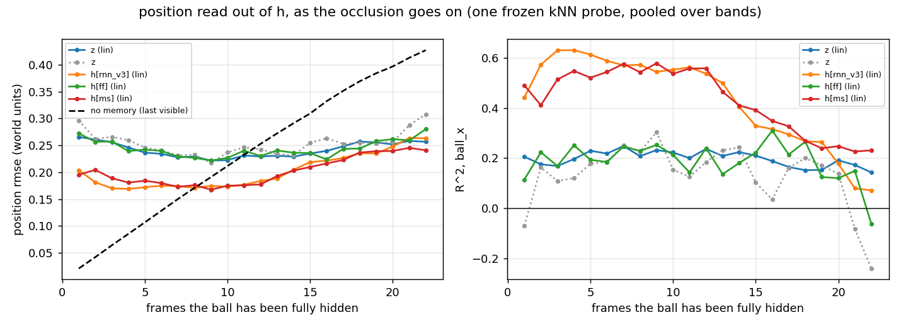
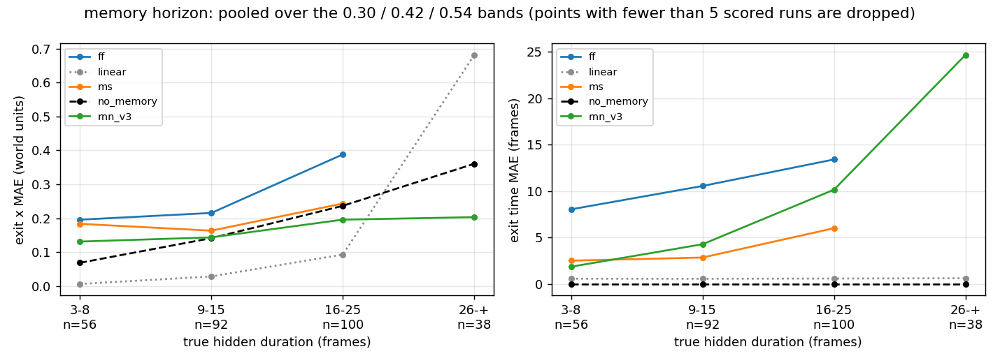

# V3 stage two ("M") — the dynamics model, and the object-permanence experiments

Technical log. Hardware: Apple M1, 8 GB, CPU. Interpreter
`python`, every command from the repo root. The v3
VAE (`runs/vae_v3/vae.pt`, z_dim 16) was frozen and no dataset was modified.
Read [`docs/v3/00_v3_design.md`](../docs/v3/00_v3_design.md) §3-M first, then
[`README_V3.md`](README_V3.md) for what stage one established.

**The one-sentence question for stage two of v3:** the frame contains no
information about the ball for a sixth of every episode — does `h` carry the
ball through the gap?

**The answer, up front. Half of it, and it is a clean half.** The recurrent
model knows **when** the ball will come back and **which side** it will come
out of: dreaming open-loop through a real occlusion it gets the exit time
within two frames on **60 %** of runs (mean error **3.2 frames**) and the exit
**side right on 92 %**, against a feed-forward control that manages 5 % and
41 % and simply never re-emerges a ball at all on **49 %** of runs. On hidden
frames `h` carries `ball_vy` at R² **0.67** and "how many frames have I been
hidden" at R² **0.54**, both at or below zero for the control. That is object
permanence in the vertical: the model is running a clock and a falling ball
behind the band.

**It does not know *where*.** Exit-x error is **0.159** world units for the
recurrent model against **0.146** for a baseline that says "the ball is exactly
where it vanished" — the model is *worse* than doing nothing, on the default
band. `ball_vx` from `h` on hidden frames is R² **−0.07**. Flip the entry
velocity in x and re-dream (experiment (e)) and the dreamed exit moves the
right way only **55 %** of the time, i.e. chance. The horizontal component of
the state estimator is not there.

**The one place the x memory shows up is long occlusions**, and it is a real
crossing: on the `tall` and `taller` bands, exit-x error stops growing with the
occlusion length (0.131 → 0.144 → 0.196 → 0.203 over the 3–8 / 9–15 / 16–25 /
26+ frame bins) while the no-memory baseline grows linearly past it (0.069 →
0.141 → 0.237 → 0.361). **The crossover is at about 13 hidden frames** — longer
than the default band's mean occlusion of 9.4, which is exactly why the default
band's headline number is a loss. Read with the caveat in §7.3: at 26+ frames
the model only produced an exit at all on 14 of 38 runs.

**And the conservation verdict is bad, which matters for stage three.** Across
a dreamed occlusion the ball's vertical direction of travel survives on **60 %**
of stretches at τ = 0 (instrument floor **99 %**) and on **50 %** at τ = 1 —
a coin flip. Do not train a controller in a sampled v3 dream. Details and the
recommendation in §8.

### Scoring the M-stage predictions from [`docs/v3/00_v3_design.md`](../docs/v3/00_v3_design.md) §4

| prediction | outcome |
|---|---|
| position R² from `h` on fully hidden frames > 0.9 | **no.** ball_x 0.17 (linear) / 0.26 (kNN); ball_y 0.51 / 0.52. Control: −0.21 / −0.41 and −0.07 / −0.18 |
| exit-time error < 2 frames | **close.** mean 3.2 frames, median error +1, 60 % within ±2. Control 9.5 frames, 5 % |
| exit-x error well below the no-memory baseline | **no on the default band** (0.159 vs 0.146); **yes past ~13 hidden frames** (§7.3) |
| hidden wall bounces predicted above chance | **yes, weakly.** 0.88 vs a no-memory 0.69 on 49 scored runs pooled over three bands (chance 0.50). On the default band alone there are 12 such runs and the test has no power |
| memory horizon > the band's natural occlusion length | **yes, in the sense that matters**: the exit-x error is *flat* in occlusion length where the baseline is linear, out to 26+ frames |
| the feed-forward control gives the floor | **yes, decisively** — it is at or below the `z` reference on every memory metric and censors half the dreams |
| the v2 lesson (conservation before C) | **applied, and it failed** (§8) |

---

## 1. Files added or changed

| file | what |
|---|---|
| `wm/rnn.py` | `RNNConfig.feedforward` — the LSTM is replaced by a 2×256 tanh MLP on `[z_t, a_t]`; `h` becomes its last hidden layer so every probe and eval that reads `h` is unchanged; `init_hidden`/`step`/`forward` keep their signatures and pass a dummy state through. Default `False`, so every pre-v3 checkpoint loads bit-identically |
| `wm/train_rnn.py` | `--feedforward`; `_mass_column()` — the mass column is now found **by name** from `meta["state_names"]` instead of at index 6, because v3's 7th column is `ball_visible` and the old check would have let `--mass-head` train a "mass" head on the occlusion flag |
| `wm/eval_rnn.py` | v3 generalisation of part (b): everything is reported twice, unconditionally and **over frames whose true ball is visible**, with a matching probe floor. On an occluded world the unconditional horizon is meaningless (§5) |
| `wm/eval_conservation.py` | new metric (v), `hidden_velocity_conservation()` — does a dream hold the hidden ball's direction and speed across the band? Switched on automatically when the dataset's meta says `occluder` |
| **`wm/permanence.py`** | new — hidden-run extraction from events, the hidden-age counter, the exit detector, and the two baselines. Separated from the evaluator because these are the functions that can be silently wrong, and they are unit-tested |
| **`wm/eval_permanence_v3.py`** | new — the six experiments |
| `tests/test_rnn_v3.py` | new — 12 tests (suite is now **89**, all passing) |

Artifacts: `runs/rnn_v3/`, `runs/rnn_v3_noact/`, `runs/rnn_v3_ff/`,
`runs/rnn_v3_ms/`, `runs/rnn_v3/eval/`, `runs/rnn_v3/conservation/`,
`runs/rnn_v3/permanence/`, `runs/rnn_v3_ms/{eval,conservation}/`.

## 2. Commands, in order, with wall clock

All four trainings ran **concurrently** with `OMP_NUM_THREADS=2`, which is why
the per-epoch times below are 2–4× the solo figure; the machine was saturated
(load average 7–10 on 8 cores) for the whole 38 minutes.

```bash
# the four models -- 31 / 32 / 14 / 38 min wall clock, all four at once
COMMON="--data data/v3/train data/v3/train_mix --val data/v3/val data/v3/val_mix \
        --epochs 35 --eval-every 2"
python -m wm.train_rnn $COMMON --out runs/rnn_v3                                  # 1891 s
python -m wm.train_rnn $COMMON --out runs/rnn_v3_noact --ablate-actions           # 1907 s
python -m wm.train_rnn $COMMON --out runs/rnn_v3_ff    --feedforward              #  824 s
python -m wm.train_rnn $COMMON --out runs/rnn_v3_ms \
    --rollout-loss-steps 8 --rollout-loss-weight 1.0                              # 2261 s

# the standard evaluations -- ~3 min each
VAE="--vae runs/vae_v3/vae.pt --val data/v3/val data/v3/val_mix \
     --probe-data data/v3/probe data/v3/val_mix"
python -m wm.eval_rnn --ckpt runs/rnn_v3/rnn.pt $VAE \
    --ablate-ckpt runs/rnn_v3_noact/rnn.pt --out runs/rnn_v3/eval
python -m wm.eval_rnn --ckpt runs/rnn_v3_ms/rnn.pt $VAE --ablate-ckpt "" \
    --out runs/rnn_v3_ms/eval
python -m wm.eval_conservation --ckpt runs/rnn_v3/rnn.pt    $VAE --out runs/rnn_v3/conservation
python -m wm.eval_conservation --ckpt runs/rnn_v3_ms/rnn.pt $VAE --out runs/rnn_v3_ms/conservation

# the permanence suite -- 4 min, all three models in one pass
python -m wm.eval_permanence_v3 --out runs/rnn_v3/permanence

python -m pytest tests/ -q        # 89 passed in 14 s
```

`--mass-head` and `--cons-loss-weight` are **off** everywhere here: v3 has no
mass. `train_rnn` now refuses them on a v3 dataset by name rather than by
column count (§9).

## 3. Training

| run | config | best val NLL | val hit F1 | val reward MSE | open-loop latent MSE @ h=32 |
|---|---|---|---|---|---|
| `runs/rnn_v3` | K=5 MDN, delta, LSTM 256 | **3.968** | 0.578 | 0.0069 | 0.450 (best 0.407) |
| `runs/rnn_v3_ms` | + 8-step open-loop loss | 4.694 | 0.423 | 0.0119 | 0.527 (best 0.452) |
| `runs/rnn_v3_noact` | actions zeroed | 5.010 | 0.525 | 0.0066 | 0.634 |
| **`runs/rnn_v3_ff`** | **2×256 MLP, no recurrence** | **6.240** | 0.310 | 0.0138 | 0.934 (best 0.807) |

327k params for the three recurrent runs, **114k** for the feed-forward one
(no gates, no recurrent matrices). Training hit rate 0.759 %, `pos_weight` 130.8.

Three things to read off this table.

* **The ff/RNN NLL gap is 2.27 nats and it is honest.** Both models see the
  same latents, the same targets and the same heads, and NLL is in the same
  units. Recurrence is worth 2.27 nats per transition on a world where a sixth
  of the frames are blank — more than the action input is worth (1.04 nats),
  which is the first time in this project a control has beaten `--ablate-actions`
  for margin.
* **The ff model peaked at epoch 23 and then got worse** (6.240 at ep 23, 6.5–6.6
  after). It is the only one of the four that overfits, which is what you expect
  from the one model that cannot use the extra information in the sequence and
  so has spare capacity for memorising.
* **The multi-step loss costs 0.73 nats of teacher-forced NLL and buys almost
  nothing here.** Its open-loop latent MSE is *worse* than the plain model's
  (0.527 vs 0.450), which is the opposite of what it did in v2. See §10.1.

v3's NLL is not comparable to v1's 2.21 or v2's 1.39: a different VAE means a
different latent scale, and the MDN's NLL is a density in that space.

## 4. The v1-style table, v3 against v1 and v2

30 val episodes, warm-up 8 true latents, horizon 64, true actions, frozen kNN
position probe fit on `data/v3/probe` + `data/v3/val_mix`.

| | v1 (`rnn_v1`) | v2 (`rnn_v2`) | **v3 (`rnn_v3`)** |
|---|---|---|---|
| best val NLL | 2.210 | 1.394 | 3.968 *(different latent space; see above)* |
| useful dream horizon, τ=0 | 35 | 26 | **14** (visible frames only) / 0 (unconditional) |
| speed horizon, τ=0 | — | — | 16.0 frames |
| ball_x error @ h=16, τ=0 | 0.019 | — | 0.091 (0.117 visible-only) |
| probe floor, ball_x | 0.0040 | — | 0.0299 / **0.0038 visible-only** |
| velocity from `z` (linear) | 0.024 / −0.109 | — | 0.032 / −0.066 |
| velocity from `h` (linear) | **0.918 / 0.867** | — | **0.670 / 0.838** |
| paddle separation, all-left vs all-right @ h=30 | 0.660 | — | 0.709 (ablation 0.000) |
| paddle contact PR-AUC | 0.727 | — | **0.889** |
| wall bounce predicted within ±2 | 24 % (chance 11 %) | — | **40 %** (chance 19.5 %) |

The dream horizon halving from 26 to 14 is the headline regression and it is
mostly *not* a regression in the model. Three contributions, in order of size:

1. **The occlusion itself.** A dream that loses the ball for nine frames and
   re-emerges it two frames late has a large position error at the moment of
   re-emergence, and 17.6 % of frames are hidden.
2. **The measuring instrument got worse, because it had to.** The frozen kNN
   probe's own error on TRUE latents is **0.0299** in ball_x unconditionally
   against v1's 0.0040 — on a hidden frame there is nothing to read and the
   probe returns roughly the dataset mean. Conditioned on the ball being
   visible the same probe scores **0.0038**, i.e. v1's number. This is why
   `eval_rnn` now reports both, and why the unconditional horizon is 0: at
   h = 1 the *mean* ball error is already 0.085, larger than the ball radius,
   purely from the hidden frames in the average.
3. Genuine dynamics error. What is left after (1) and (2).

Everything else went *up*. PR-AUC on paddle contact 0.727 → 0.889 and wall
bounces 24 % → 40 % (against a doubled chance level, so the lift is 2.1× rather
than v1's 2.2× — about the same). Velocity from `h` is down (0.918 → 0.670 in
vx), which fits the story the rest of this document tells: vx is the component
v3 damages.

A new row that only exists in v3: **`ball_visible` is readable from `h` at
R² 0.985 and from `z` at 0.976** (kNN). The model knows whether the ball is
behind the band. That is the analogue of v2's `speed`-from-colour: a quantity
that is a deterministic function of a well-encoded one.

## 5. `eval_rnn` on an occluded world: what had to change

Nothing about the dynamics, one thing about the ruler. `part_b_state` now takes
the `ball_visible` column (by name, absent in v1/v2) and reports a second copy
of every horizon number averaged only over `(episode, step)` pairs whose TRUE
ball is fully visible, plus a matching probe floor. The visible-only column is
the one comparable with v1 and v2 and is what §4 quotes. Both are in
`report.json`; nothing was removed.

The `speed` and `log_mass` derived probe targets simply do not exist here —
`analyze.add_derived_targets` already returned the state unchanged when there
is no mass column, and `horizon_by_mass` is already behind `if mass is not
None`, so `eval_rnn` needed no other v3 work. Same for `eval_conservation`,
whose `Episodes.has_mass` is a name lookup.

## 6. Conservation (`runs/rnn_v3/conservation/`)

30 episodes × 200 dream steps, warm-up 8, τ ∈ {0, 0.5, 1}.

**(iii) speed.** The ball's speed is a hard constant 0.022 in v3, as in v1.

| τ | ratio @0 | @24 | @60 | @120 | @199 | speed horizon |
|---|---|---|---|---|---|---|
| 0.0 | 1.010 | 0.985 | 1.084 | 1.252 | 2.300 | **19.5** |
| 0.5 | 4.697 | 2.270 | 4.131 | 4.079 | 4.258 | 1.5 |
| 1.0 | 12.915 | 5.599 | 8.449 | 7.671 | 6.548 | 0.3 |
| floor (true latents) | 1.000 | 1.000 | 1.000 | 1.000 | — | 41.4 |

Same shape as v1 and v2: τ = 0 holds the constant for about 20 steps and then
inflates; τ > 0 is off the law immediately, and most of that inflation is
per-step sampling jitter that the position probe cannot distinguish from
motion. `rnn_v3_ms` scores 14.7 rather than 19.5 — the multi-step loss did not
help here either.

**(v) the new metric: the hidden ball's velocity.** v3's conserved quantity.
Nothing inside the band can turn a ball around, so a dreamed trajectory that
goes in heading down must come out heading down, at the same speed. This
compares the dream against **itself**, before and after each hidden stretch, so
unlike everything else in that file it is meaningful at τ = 1.

| τ | stretches | vy sign kept | \|v\| out/in | \|vx\| out/in | vx flipped |
|---|---|---|---|---|---|
| 0.0 | 145 | **0.600** | 0.938 | 0.891 | 0.579 |
| 0.5 | 303 | 0.462 | 0.996 | 1.079 | 0.551 |
| 1.0 | 458 | 0.498 | 0.991 | 0.966 | 0.478 |
| floor | 90 | **0.989** | 1.000 | 1.000 | 0.267 |

Read the first and last columns. On true latents the ball keeps its vertical
direction across the band on 99 % of stretches (and flips vx on 27 %, which is
the real wall-bounce rate plus probe noise — the instrument is calibrated). The
τ = 0 dream keeps it on 60 %, and the sampled dreams on 50 %, which is a coin
flip. The **magnitudes** are conserved fine (|v| ratio 0.94–1.00): the dream
holds the speed and loses the direction. That is the same failure the exit-x
numbers show, seen from another angle.

The dream also produces **more** hidden stretches than exist (145 and 458
against 90) because a jittering dreamed position crosses the band edge
spuriously; treat the stretch counts as an upper bound.

**(iv) well-formedness is uninterpretable on v3 and I am not quoting it.** The
proxy calls a frame well-formed if its decoded ball area is within 50–150 % of a
per-episode reference — but in v3 a *correct* hidden frame has no ball at all
and fails by construction, as does most of the 39 % partial bin. The ceiling is
about 0.44 and the τ = 0 dream scores 0.386, which says more about how often the
dream hides the ball than about whether the ball is well formed. The metric
needs a v3 rewrite (condition on visibility, like everything else); it did not
get one, and the figure's lower panel should be ignored.

## 7. The permanence experiments (`runs/rnn_v3/permanence/`)

Three models in one pass: `rnn_v3`, `ff`, `ms`. 109 hidden runs of ≥ 3 frames
on `val`+`val_mix` (4 more dropped for starting inside the first 8 frames of an
episode, where there is no warm-up), 95 on `tall`, 82 on `taller`.

First, the instrument check that everything else depends on: the frozen kNN
position probe applied to **true** fully hidden frames returns a mean y of
**0.425**, inside the band interior [0.36, 0.50], and falls outside it on only
**3.1 %** of frames. So a hidden frame does not spuriously trigger the exit
detector. Its x reading on those frames is pure noise (rmse 0.236 ≈ the sd of
ball_x), which is the correct behaviour and is what stage one proved.

### 7.1 (a) Position from `h`, by visibility

Episode-level splits **within each bin**. R² / rmse in world units; rmse is the
column to read across bins (the hidden bin's variance is much smaller).

```
probe = linear                 visible                partial                 hidden
z                  0.41/0.185  0.41/0.222    0.70/0.131  0.88/0.055   -0.07/0.212 -0.10/0.046
h[rnn_v3]          0.99/0.022  1.00/0.016    0.88/0.082  0.98/0.024    0.17/0.187  0.51/0.030
h[ff]              0.99/0.025  1.00/0.018    0.87/0.087  0.96/0.032   -0.21/0.226 -0.07/0.045
h[ms]              0.99/0.023  1.00/0.019    0.88/0.085  0.98/0.024   -0.26/0.230  0.59/0.028

probe = knn                    visible                partial                 hidden
z                  0.99/0.018  1.00/0.014    0.85/0.094  0.95/0.035   -0.51/0.252 -0.21/0.048
h[rnn_v3]          0.99/0.019  1.00/0.018    0.87/0.086  0.96/0.029    0.26/0.176  0.52/0.030
h[ff]              0.99/0.017  1.00/0.018    0.84/0.095  0.94/0.038   -0.41/0.244 -0.18/0.047
h[ms]              0.99/0.020  1.00/0.020    0.87/0.087  0.97/0.028    0.14/0.190  0.58/0.028
```
(each cell pair is ball_x then ball_y; 3136 / 2567 / 1297 frames per bin)

The design asked for R² > 0.9 on the hidden bin. It is **0.17–0.26 in x** and
**0.51–0.59 in y**. But the control is the argument, and the control is clearly
below zero on both: **−0.21 / −0.41 in x** and **−0.07 / −0.18 in y**, i.e.
indistinguishable from `z`, which stage one proved carries nothing. So the
recurrent model has *some* position memory and the feed-forward model has none,
and the y component is three times the x component.

Note also that on `h` the **linear** probe is as good as kNN, where on `z` it is
far worse (0.41 vs 0.99 in the visible bin). The LSTM has re-coded the VAE's
place-field position code into a linear one — the same observation v1 made
(`README_M` §(c)), and it is why the decay curve below uses a linear readout.

### 7.2 The decay curve — `position_from_h_by_hidden_time.png`



One frozen kNN/linear probe fit once on all hidden frames pooled over the three
bands (episode-level split), then scored separately at each hidden age k. Fitting
a fresh probe per k would confound memory decay with having fewer frames to fit
on at k = 22. Provenance: k = 1 draws 12/24/34 test frames from
default/tall/taller, k = 10 draws 5/23/31, k = 20 draws 2/11/18 — past about
k = 12 the curve is almost entirely `taller`.

rmse in world units, linear readout:

| k | 1 | 3 | 5 | 8 | 12 | 16 | 20 |
|---|---|---|---|---|---|---|---|
| `h[rnn_v3]` | 0.204 | 0.170 | 0.172 | 0.171 | 0.184 | 0.222 | 0.248 |
| `h[ms]` | 0.195 | 0.189 | 0.184 | 0.176 | 0.177 | 0.216 | 0.240 |
| `h[ff]` | 0.272 | 0.257 | 0.242 | 0.227 | 0.230 | 0.224 | 0.262 |
| `z` | 0.265 | 0.256 | 0.236 | 0.229 | 0.229 | 0.240 | 0.252 |
| **no memory** | **0.021** | **0.064** | **0.107** | **0.171** | **0.253** | **0.332** | **0.397** |

Two readings, and they point opposite ways:

* **Against the control**, the recurrent models are flat at ≈ 0.17–0.18 out to
  k ≈ 13 and then decay towards the ff/z floor by k ≈ 18. In R²(ball_x) the same
  curve runs 0.44 (k = 1) → 0.63 (k = 4) → 0.54 (k = 12) → 0.18 (k = 20) against a
  ff line that never leaves 0.11–0.31. The memory is real and it has a horizon of
  roughly **15–18 frames**.
* **Against the no-memory baseline**, the recurrent models are *worse* until
  k ≈ 11 and better after. A ball hidden for three frames has barely moved, so
  "it is where it vanished" is an excellent predictor and the model's 0.17 is
  not close. This is the same crossing that experiment (d) finds independently.

The `z` line is not zero because half the episodes use a tracking policy and
the paddle — visible on every frame — leaks some ball x. `h[ff]` sits on top of
it, which is exactly right: it has that cue and nothing else. **That is why the
floor for these tests is `ff` and not 0.**

### 7.3 (b), (c), (d) Emergence

Warm-up on 8 true latents ending on the last partially visible frame, then
dream open-loop at τ = 0 on the true actions through the hidden stretch and 10
frames beyond, decode with the frozen kNN probe, and find the first frame whose
decoded ball leaves the band interior for two consecutive frames. Exit time is
counted in frames from the entry frame, so the truth is `length + 1`.

**(b), default band, 109 runs.** `censor` = fraction of runs where the dream
never brought the ball out at all within the horizon.

| | n | exit_x MAE | bias | exit_t MAE | \|Δt\|≤2 | side ok | censor |
|---|---|---|---|---|---|---|---|
| `rnn_v3` | 109 | 0.159 | +0.041 | **3.24** | **0.60** | **0.92** | 0.02 |
| `ff` | 109 | 0.221 | +0.137 | 9.50 | 0.05 | 0.41 | **0.49** |
| `ms` | 109 | 0.191 | −0.005 | 3.05 | 0.62 | 0.95 | 0.10 |
| no-memory baseline | 109 | **0.146** | +0.018 | (given) | — | 0.00 | — |
| linear extrapolation | 109 | 0.034 | −0.005 | 0.58 | 1.00 | 1.00 | — |

* **Exit time and side are the win.** 3.24 frames and 92 % against 9.50 and
  41 %. The error histogram (`exit_time_error_hist.png`) shows the recurrent
  models peaked at **+1 to +3 frames — they re-emerge the ball slightly late**,
  consistently — while `ff` is flat across the whole range with a pile-up at the
  +12 clip (the censored runs).
* **Exit x is the loss.** 0.159 against a do-nothing 0.146. The scatter
  (`exit_x_pred_vs_true.png`) says why: `rnn_v3` has a real but shallow slope
  and `ff` is a horizontal line at ≈ 0.65 — it has learned the *marginal* exit
  position and nothing else, which is precisely what a model with no memory
  should learn.
* The linear-extrapolation baseline is near-exact on runs without a wall bounce
  (MAE **0.0008**), which is the check that the graders are right: with no
  bounce behind the band, a straight line *is* the truth.
* `ms` trades a little exit-x accuracy for a lower censoring rate and a slightly
  better exit time. It is not a clear win anywhere.

**(c) hidden wall bounces.** 12 on the default band, 81 pooled over all three.
The obvious version of this test is worthless and I got it wrong first: scoring
"is the dream nearer the truth or nearer the straight line" gives every model
1.00, including a baseline with no memory, because the straight line usually
lands *outside the box*. The fair alternative hypothesis is the straight line
**clipped at the wall** — "the ball kept going and is now against the wall" —
which is where a model that saw the ball heading for the wall but did not
simulate the bounce would put it. Both hypotheses are then inside the box, the
separation is the overshoot rather than twice it, and chance really is 0.50.

Pooled over the three bands (mean overshoot 0.228):

| | n scored | nearer reflected | n clear | (overshoot > 0.05) | exit_x MAE, bounce | no bounce |
|---|---|---|---|---|---|---|
| `rnn_v3` | 49 | **0.88** | 37 | **0.84** | 0.183 | 0.150 |
| `ms` | 17 | 0.88 | 8 | 0.75 | 0.149 | 0.195 |
| `ff` | 6 | 1.00 | 1 | 1.00 | 0.353 | 0.205 |
| no-memory | 81 | 0.69 | 64 | 0.62 | 0.212 | 0.181 |
| linear | 81 | 0.00 | 64 | 0.00 | 0.470 | 0.0004 |

So: above the no-memory baseline (0.88 vs 0.69; 0.84 vs 0.62 on the runs where
the two hypotheses are well separated), and the exit-x error on bounce runs
(0.183) is only a little worse than on no-bounce runs (0.150) where the linear
baseline blows up from 0.0004 to 0.470. **That is evidence for simulation over
extrapolation, and it is weak evidence** — n = 49, one model, and `ff`'s
meaningless 1.00 on 6 runs is a reminder that a model which always puts the
ball near the middle scores well on a test about being "inward". On the default
band alone (12 runs, 5 with a real overshoot) the test has no power at all and
I would not quote it.

**(d) memory horizon** — `memory_horizon.png`, exit-x MAE pooled over the three
bands, binned by the true hidden duration.



| hidden frames | 3–8 | 9–15 | 16–25 | 26+ |
|---|---|---|---|---|
| runs in bin | 56 | 92 | 100 | 38 |
| `rnn_v3` | 0.131 | 0.144 | **0.196** | **0.203** |
| `ms` | 0.184 | 0.163 | 0.243 | 0.101 † |
| `ff` | 0.196 | 0.216 | 0.388 | — † |
| **no memory** | **0.069** | **0.141** | 0.237 | 0.361 |
| linear | 0.006 | 0.028 | 0.093 | 0.681 |
| `rnn_v3` runs actually scored | 56 | 83 | 55 | 14 |

† fewer than 5 scored runs; dropped from the figure.

**The crossover is at about 13 hidden frames.** The recurrent model's error is
essentially flat in occlusion length (0.131 → 0.203, a factor of 1.5 over an
8× range of durations) where the memoryless baseline's grows linearly (0.069 →
0.361, a factor of 5.2). That is the signature of a state estimator rather than
a "remember the last sighting" heuristic, and it is the cleanest positive result
for x memory in this document.

**The caveat that must travel with it:** `rnn_v3` only produced an exit at all
on 55/100 and 14/38 runs in the last two bins, so those numbers are conditioned
on the dreams that did not simply lose the ball. The censoring is not random —
it presumably favours the runs the model tracked best — so the 16–25 and 26+
cells are optimistic by an unknown amount. The 3–8 and 9–15 cells (56/56 and
83/92) are close to complete and are where the crossing happens, so the headline
survives; the *magnitude* of the win at 26+ does not.

### 7.4 (e) Counterfactual entry

Re-simulate each episode from 8 frames before the occlusion with `vx → −vx`,
re-render, re-encode with the frozen VAE, and dream. Unlike v2's recolour
intervention, this counterfactual has a **ground truth**, because the simulator
produced it. Re-simulating from a recorded state reproduces the original
trajectory to 6e-8 (asserted in passing during development), so the only error
sources are the re-encode and the model.

| branch | model | exit_x MAE | signed | Δx sign agrees | mean Δx pred | true |
|---|---|---|---|---|---|---|
| replay (vx unchanged) | `rnn_v3` | 0.137 | +0.017 | 0.63 | +0.010 | −0.007 |
| | `ff` | 0.216 | +0.170 | 0.65 | +0.174 | +0.004 |
| | `ms` | 0.195 | −0.051 | 0.53 | −0.049 | +0.002 |
| flip (vx negated) | `rnn_v3` | 0.176 | +0.018 | **0.55** | +0.016 | −0.001 |
| | `ff` | 0.291 | +0.143 | 0.47 | +0.175 | +0.032 |
| | `ms` | 0.243 | −0.060 | 0.61 | −0.065 | −0.005 |

**A clean negative.** "Δx sign agrees" is whether the dreamed horizontal
displacement across the band has the same sign as the true one; 0.55 and 0.63
are not distinguishable from chance on 38 runs. The counterfactual manipulates
exactly the quantity — horizontal velocity at entry — that (f) says `h` does not
carry, so this is the same finding a third time rather than an independent one.
Worth noting that the *replay* branch also sits at 0.63, so the failure is not
caused by the intervention; the model simply does not propagate x.

The one thing that does show: `ff`'s mean predicted Δx is **+0.174 in both
branches** while the truth is ≈ 0. It is not responding to the warm-up at all,
just drifting to its learned marginal.

### 7.5 (f) What else is in `h` while hidden

Linear R², hidden frames only, episode-level split.

| feature | ball_vx | ball_vy | frames_hidden |
|---|---|---|---|
| `z` | 0.053 | −0.176 | −0.127 |
| `h[rnn_v3]` | **−0.068** | **0.671** | **0.535** |
| `h[ff]` | −0.102 | −0.446 | −0.189 |
| `h[ms]` | −0.288 | 0.671 | 0.523 |

This is the table that explains the whole document. During an occlusion the
recurrent state holds the **vertical** velocity (0.67) and a **clock** (0.54 for
how many frames the ball has been hidden), and holds **nothing at all** about
the horizontal velocity (−0.07, indistinguishable from the control's −0.10).

Which is exactly what one-step teacher forcing rewards. While the ball is
hidden, `z_{t+1}` does not depend on where the ball is behind the band — the
frame is byte-identical — so tracking x buys the model nothing on 8 of every 9
hidden transitions. It buys something only on the *last* one, where the ball
reappears, and even there the MDN can hedge with a wide or multimodal
component. Tracking y and counting frames, by contrast, pays off immediately:
they determine *when* the reappearance happens, which is a large, frequent term
in the loss. The model learned the part of object permanence that its objective
paid for.

## 8. The conservation verdict for stage three

The v2 lesson was: check what should be constant in long sampled dreams
**before** training C. Done, and the answer is worse than v2's.

* **τ = 1 is unusable.** Speed leaves the ±25 % band after 0.3 steps, and the
  hidden ball's vertical direction survives 50 % of stretches — a coin flip.
* **τ = 0.5 is also unusable** (1.5 steps, 46 %).
* **τ = 0 holds the speed for ~20 steps** but keeps the hidden ball's direction
  on only **60 %** of stretches against a 99 % instrument floor. A controller
  dreaming at τ = 0 through an occlusion is being told the wrong thing about
  which way the ball is going about four times in ten.

The concrete recommendation for C: train at **τ = 0**, keep dream horizons
**short (≲ 20 steps)**, and do not expect a dream-trained controller to commit
correctly during an occlusion, because the model it is dreaming inside does not
reliably carry the ball across one. If a v2-style targeted fix is wanted, the
conserved quantity to name is `sign(vy)` across a hidden stretch (and `|vx|`),
which is what `wm/eval_conservation.hidden_velocity_conservation` measures and
which `--cons-loss-weight` could be pointed at with a probe for `vy` instead of
log-mass. I did not build that; it is the obvious next experiment.

## 9. Choices made without asking

* **The feed-forward control uses tanh and 2×256**, matching the LSTM's output
  nonlinearity and width so that `h` lives in a comparable range and every
  probe is measuring the same kind of thing. It has more per-step nonlinearity
  than the LSTM and a third of the parameters.
* **`self.lstm` stays `None` when `feedforward=True`** and the MLP is a new
  attribute, so the two state dicts are disjoint and neither can silently load
  the other.
* **The mass column is found by name** in `train_rnn`. The old `mass_col = 6`
  plus a `state.shape[-1] <= 6` guard would have passed on a v3 dataset and
  trained the "log mass" head on `log(ball_visible)` — a privileged-target leak
  no shape assertion could catch. This is a bug fix in v2 code that v2 never
  triggered.
* **The exit detector requires two consecutive frames outside the band.** The
  kNN probe's nearest neighbour can be a frame's worth of motion away, so one
  frame poking over the edge is inside the instrument's noise. The cost is
  nothing: no ball re-enters the band immediately after leaving it.
* **Hidden runs touching either end of an episode are dropped** (no entry frame
  to warm up on, or no exit to score), as are runs starting in the first 8
  frames. 4 of 113 on the default band.
* **Censored dreams are excluded from the error columns and reported as a
  `censor` fraction** rather than being scored at the horizon. Scoring them at
  the horizon would have flattered `ff` (whose failures are "never brought the
  ball back") into looking like a model with a large but finite error. The
  censoring rate is the more honest statement and it is in every table.
* **Part (c) is reported pooled over the three bands** as well as on the default
  band, because the default band yields 12 positives. The bands differ only in
  how long the ball is hidden, so pooling is legitimate for a question about
  what happens *behind* the band.
* **The decay curve fits one probe on all hidden frames and scores per k**,
  rather than fitting per k. Both readouts are reported because they disagree
  on 256-d `h` (kNN distances concentrate).
* **`wm/permanence.py` is a separate module** from the evaluator, so the four
  functions that could be silently wrong — hidden-run extraction, the age
  counter, the exit detector, the baselines — are unit-testable without
  importing torch, matplotlib and a checkpoint.
* **`eval_rnn`'s visible-only columns were added rather than replacing the
  unconditional ones**, so no v1/v2 number in an existing report changes
  meaning.
* **Metric (v) switches itself on** from `meta["occluder"]`, so
  `eval_conservation` still produces byte-identical v1/v2 output.

## 10. Surprises and honest failures

**10.1 The multi-step loss did nothing here, and I expected it to be the fix.**
The reasoning in the brief was good: during an occlusion the model is already
running open-loop, since its input carries no ball, so teacher forcing should be
the wrong training signal and `--rollout-loss-steps 8` should be the cure. It
cost 0.73 nats of val NLL, made open-loop latent MSE *worse* (0.527 vs 0.450),
and on the permanence tests it is a wash: slightly better exit time (3.05 vs
3.24) and side (0.95 vs 0.92), slightly worse exit x (0.191 vs 0.159), the same
`ball_vy` R² (0.671), the same absent `ball_vx`. My best guess is that the
rollout loss rolls forward on the model's own *latents*, and during an occlusion
the correct latent is easy — it is the blank-behind-the-band latent, which the
model already predicts well. Rolling open-loop through a stretch where the
target is nearly constant does not teach you to track anything. A rollout loss
that would help would have to be scored on the *re-emergence*, which is one
transition out of ten and would need weighting.

**10.2 The model learned the clock and the fall, not the drift.** I went in
expecting position memory to be roughly isotropic and to decay with time. It is
not: y is carried at R² 0.51–0.59 and x at 0.17–0.26, and the reason (§7.5) is
that only y and the frame count have an immediate effect on the next latent.
This is a better finding than a uniform "R² 0.9, permanence achieved" would
have been, because it names the mechanism.

**10.3 The first version of the wall-bounce test gave every model 1.00,
including the no-memory baseline.** That is what caught it — the baseline
scoring perfectly on a test it cannot possibly pass. The cause is in §7.3; the
lesson is that a two-hypothesis test is only a test if both hypotheses are
*a priori* plausible, and "the ball is outside the box" is not.

**10.4 The `z` reference line on the decay curve is not zero.** Stage one
proved `z` carries nothing about ball position on a hidden frame — and it does
not, *directly*. But half the episodes use a tracking policy, so the always-
visible paddle is a partial proxy for ball x, and a probe pooled over bands
picks up R² ≈ 0.2. It took a confused half hour to work out. It is also the
reason the feed-forward model, and not zero, is the right floor: it has the
same cue and no memory.

**10.5 The unconditional dream horizon is 0 and that is the ruler's fault.**
`eval_rnn` reported "dreams stay accurate for about 0 steps" for a model that
is visibly fine for 14. The position probe cannot read a hidden frame, 17.6 % of
frames are hidden, and the mean error over episodes is above one ball radius at
h = 1 before the model has done anything. Fixed by conditioning (§5), but worth
recording as the v3 instance of a recurring hazard: **when the data changes, the
metric changes meaning, and a number that got worse is not evidence that the
model did.**

**10.6 `ff` overfits and the recurrent models do not.** The only run of the four
whose val NLL turns back up. Unexpected until stated plainly: it is the only
model that cannot extract more signal from more context, so its extra capacity
goes somewhere less useful.

**10.7 The well-formedness proxy is broken on v3** and I left it broken rather
than half-fixing it under time pressure (§6). It is in the figure; ignore it.

## 11. What stage three inherits

**The checkpoint: `runs/rnn_v3/rnn.pt`** — the plain recurrent model, best val
NLL 3.968 at epoch 34. Not `rnn_v3_ms`, which is worse on NLL, on open-loop
latent MSE and on exit x, and better only on exit time by a third of a frame.
`runs/rnn_v3_ff/rnn.pt` is the control, and it is worth keeping paired with
every C-stage experiment for exactly the reason it earned its place here: the
design document's §3-C tests ("does the paddle move toward the landing point
while the ball is hidden?") all need a floor, and `ff` **is** the floor.

What C can rely on:

* **Timing and side, yes.** The model will tell a controller *when* the ball is
  coming back and *which side of the band* it will come out of, to within a
  couple of frames and at 92 %. For a paddle that needs ~30 frames to cross the
  box, that is genuinely useful: it is the difference between starting to move
  and waiting.
* **Horizontal landing point, no.** The dreamed exit x is no better than
  assuming the ball comes back where it vanished, until the occlusion is longer
  than about 13 frames. The default band's mean occlusion is 9.4. So on the
  band C will actually be trained on, **the dream's x is not informative**, and
  a controller that appears to use it is using the paddle-tracking prior
  instead. The design's prediction "C is flat across the had-to-move-while-hidden
  split" should be expected to **fail**, and the interesting experiment becomes
  whether C degrades to a wait-and-see policy or to something worse.
* **Conservation: τ = 0 only, horizons ≲ 20 steps** (§8). The hidden ball's
  direction of travel survives a dreamed occlusion 60 % of the time at τ = 0 and
  50 % at τ = 1.

The `tall` and `taller` splits remain the held-out band-height test, and they
now have a stage-two result to be compared against: the model's exit-x error is
flat in occlusion length where the no-memory baseline is linear, so if C
degrades gracefully on them it is not because M stopped working.
