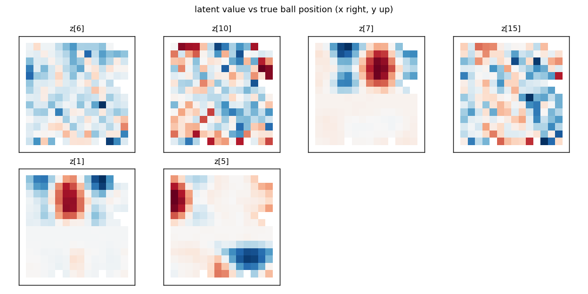

# V3 stage one — the vision model behind an occlusion band

Technical log for the v3 VAE. The environment side is documented in
[`worldsim/worldsim.md`](../worldsim/worldsim.md#v3--the-occlusion-band); read
that first, then this. For the architecture, the free-bits story and the
posterior-collapse failure mode see
[`docs/02_vae_the_vision_model.md`](../docs/02_vae_the_vision_model.md) — all
unchanged.

**The one-sentence question for stage one of v3:** when a band hides the ball
for a sixth of all frames, does `z` still carry ball position *when it can*,
does it correctly carry **nothing** when it cannot, and does the decoder resist
the temptation to draw a ball anyway?

**The answer, up front.** Yes on all three, cleanly. Ball position is
recoverable from a single frame's `mu` at **R² = 0.984 (x) / 0.984 (y)** on
fully visible frames and at **R² ≤ 0 on fully hidden frames** — which is the
correct answer, not a failure: on a hidden frame the image is byte-identical
for every ball position. Partially occluded balls come back at **0.825 / 0.947
(poly-2)** and are reconstructed as partial balls in the right place, not
smeared across the band edge. The hallucination rate is **0.024 balls** of
spurious ball mass outside the band on hidden frames, and the brightest
ball-like pixel on any of 512 hidden frames is **0.095** — diffuse decoder
haze, not a ball drawn in the wrong place. And the whole world costs **2.5
nats *less* KL than v1**, because occlusion genuinely removes information.

### Scoring the V-stage predictions from [`docs/v3/00_v3_design.md`](../docs/v3/00_v3_design.md)

| prediction (§3-V) | outcome |
|---|---|
| position R² from `z` ≈ 0.99 when visible | **yes** — 0.984 / 0.984 (kNN); poly-2 is lower (0.878 / 0.930), see §5.2 |
| ≈ 0 when fully hidden | **yes** — every probe ≤ 0 on the hidden bin (§5.1) |
| something in between when partial | **yes** — 0.825 / 0.947, and *better than the visible bin for a linear probe* (§5.3) |
| band rendered as static scenery without spending latent capacity | **yes** — the band is crisp in every prior sample; total KL *fell* from 14.4 to 11.9 nats (§6) |
| partially occluded ball reconstructed correctly | **yes**, by eye — `recon_by_visibility.png` (§4) |

---

## 1. Commands, in order, with wall clock

Everything ran on the M1 (8 GB) with `python`,
from the repo root.

```bash
# data -- 63 s total, 1.4 GB
COMMON="--ball-radius 0.08 --steps 200 --res 64 --occluder"
python -m worldsim.collect --out data/v3/train     --episodes 150 --seed 0   --policy sticky $COMMON
python -m worldsim.collect --out data/v3/train_mix --episodes 300 --seed 10  --policy mix --p-track 0.5 $COMMON
python -m worldsim.collect --out data/v3/val       --episodes 15  --seed 1   --policy sticky $COMMON
python -m worldsim.collect --out data/v3/val_mix   --episodes 20  --seed 11  --policy mix $COMMON
python -m worldsim.collect --out data/v3/probe     --episodes 120 --seed 777 --policy sticky \
    --steps 24 --ball-radius 0.08 --res 64 --occluder
python -m worldsim.collect --out data/v3/tall      --episodes 30  --seed 31  --policy mix $COMMON --occluder-y 0.22 0.64
python -m worldsim.collect --out data/v3/taller    --episodes 30  --seed 32  --policy mix $COMMON --occluder-y 0.16 0.70
python -m worldsim.v3_figures --data data/v3/train --gif-data data/v3/val --out runs/v3_env   # 8 s

# the VAE -- 29.5 min for 60 epochs on mps
python -m wm.train_vae --data data/v3/train --val data/v3/val --out runs/vae_v3 \
    --epochs 60 --z-dim 16 --free-bits 0.5 --warmup-epochs 5 --device mps --eval-every 10

# analysis -- 44 s + 9 s
python -m wm.analyze    --ckpt runs/vae_v3/vae.pt --data data/v3/probe --device mps --out runs/vae_v3/analysis
python -m wm.analyze_v3 --ckpt runs/vae_v3/vae.pt --data data/v3/probe --device mps --out runs/vae_v3/analysis

# latents for stage two -- 27 s for all seven splits
for d in train train_mix val val_mix probe tall taller; do
  python -m wm.cache_latents --ckpt runs/vae_v3/vae.pt --data data/v3/$d --device mps
done

# the live viewer, headless (stage two does not exist yet, so borrow the v1 M)
python -m wm.live --v3 --rnn ./runs/rnn_v1/rnn.pt --ctrl "" \
    --record runs/v3_env/live_v3_smoke.gif --steps 120 --seed 3

# tests -- 16 s
python -m pytest tests/ -q         # 77 passed (12 of them the new test_env_v3)
```

Training took **29.5 min** (29 s/epoch) against v2's 17 min for the same 60
epochs on the same data size. That is machine load, not anything about v3 — the
model and the batch are identical. Budget was 45 min, so no need to cut epochs.

## 2. Data

Full occlusion statistics per split are in
[`worldsim/worldsim.md`](../worldsim/worldsim.md#collecting-v3) and in each
split's `meta["occlusion"]`. The four numbers that matter for the VAE:

| band | splits | frames hidden | partial | visible | mean hidden run |
|---|---|---|---|---|---|
| 0.28–0.58 (default) | train, train_mix, val, val_mix, probe | **17.6%** | 38.8% | 43.7% | 9.4–10.2 |
| 0.22–0.64 (`tall`) | tall | 32.0% | 39.8% | 28.2% | 16.0 |
| 0.16–0.70 (`taller`) | taller | 46.6% | 36.0% | 17.4% | 23.5 |

So on the training distribution **a sixth of the frames carry no information at
all about ball position**, and a further 39% carry partial information. That
17.6% is the ceiling the unconditional probe numbers in `wm.analyze` are
fighting, and it is the reason every headline in this document is conditioned
on visibility instead.


## 3. Training curve

| | v1 (`vae_b1`, 80 ep) | v2 (`vae_v2`, 60 ep) | v3 (`vae_v3`, 60 ep) |
|---|---|---|---|
| final KL (nats) | 14.38 | 15.45 | **11.87** |
| global MSE | 0.00036 | 0.00043 | **0.00031** |
| ball MSE | 0.00424 | 0.00534 | **0.00317** |
| active units (report threshold) | 9 | 8 | **6** |

Both loss columns being the *best* of the three is not the VAE suddenly getting
good: it is the task getting easier. A sixth of the frames have no ball in them
and are nearly trivial to reconstruct, and another 39% have only part of one.
The same effect explains the KL: see §6.

There is no sign of collapse or of a late instability — the loss falls
monotonically from epoch 6 (end of β warm-up) to 59, and the last five epochs
move it by 0.05 nats.

## 4. Reconstructions: is a partial ball a partial ball?

`runs/vae_v3/analysis/recon_by_visibility.png` — six rows, real above recon,
eight frames each for fully visible / partial / fully hidden, with the partial
row sorted by coverage.


Read it top to bottom:

* **Visible** (rows 1–2): balls come back crisp and in the right place. Same as
  v1.
* **Partial** (rows 3–4): this is the row that could have gone wrong, and it
  did not. A ball that is 40% above the band's top edge is reconstructed as a
  *sliver* sitting on the edge, at the right x; a ball that is 4% visible is
  reconstructed as a barely-there smudge, not as a whole ball nudged out of the
  band and not as a blur straddling it. The decoder has learned the band's
  occlusion relationship, not just the band's pixels.
* **Hidden** (rows 5–6): empty, in both rows. Quantified in §7.

The band itself is reconstructed as a sharp, correctly-placed slab on every
frame including the prior samples (`prior_samples.png`), which is what "static
scenery" is supposed to look like.

## 5. Probes conditioned on visibility

The headline table. Episode-level splits *within each bin*, so the hidden-bin
number cannot be propped up by visible frames leaking through a shared training
set. `rmse` is in world units (the box is 1.0 across).

```
bin       frames  eps    linear.x       poly2.x         knn.x      linear.y       poly2.y         knn.y
visible     1304  100  0.501/0.182   0.878/0.090   0.984/0.033   0.118/0.256   0.930/0.072   0.984/0.035
partial     1138  109  0.767/0.105   0.825/0.091   0.725/0.115   0.880/0.050   0.947/0.033   0.926/0.040
hidden       558   76 -0.266/0.237  -0.158/0.227  -0.506/0.259  -0.188/0.047  -0.418/0.051  -0.419/0.051
```

### 5.1 The hidden bin: R² ≤ 0, exactly as it must be

Every probe — linear, poly-2, kNN — scores **at or below zero** on fully hidden
frames. The rmse column says what that means concretely: 0.23–0.26 in x, which
is the standard deviation of ball x itself. The probe has learned nothing and
falls back to predicting the mean (a negative R² is a probe that is
*marginally worse* than the test-split mean, which is what an uninformative
probe fit on a different episode split looks like).

This is the cleanest result in v3 so far, and it is worth being explicit about
why it is a *result* and not an absence of one:

1. It confirms the environment does what it claims. If the band leaked — a
   fringe pixel of ball surviving under the edge, an alpha-blend artefact —
   a kNN probe on 558 frames would find it. It found nothing.
2. It is the precondition for every stage-two claim. Any position information
   `h` has on a hidden frame **cannot** have come from `z_t`. The statement "M
   has object permanence" is only meaningful because this table is zero.

I checked the obvious contamination story and it is not there: `ball_visible`
in the hidden bin has mean 3.0e-4 and **maximum 0.0098** — under 1% of a disc,
which for this ball at 64×64 is 0.8 px² spread around a circumference, i.e. no
pixel anywhere near saturated. There was nothing for the probe to read.

### 5.2 Visible-bin kNN 0.984 but poly-2 only 0.878

The kNN number is the one to quote, and this pattern is familiar from v2 (see
[`README_V2.md`](README_V2.md#52-the-pattern-that-surprised-me-poly-2--097-but-knn--008),
where it ran the other way). kNN ≥ poly-2 means the code for ball position is
**present but not low-order polynomial** — and `tuning_maps.png` shows exactly
what it is instead:



z[7], z[1] and z[5] are **place fields** — localised blobs of activation over
ball (x, y) — not gradients. A degree-2 surface can approximate one blob
badly; a nearest-neighbour regressor reads them off perfectly. v1 had smoother,
more gradient-like maps and correspondingly better poly-2 numbers (0.981).

The interesting part of those maps is the **pale horizontal stripe across the
middle of every panel**: that is the band. Every latent's tuning goes flat
there, because within those rows the frame does not depend on where the ball
is. The occlusion is visible in the latent geometry itself.

### 5.3 The partial bin beats the visible bin on a *linear* probe

0.767 vs 0.501 for ball_x, 0.880 vs 0.118 for ball_y. That looked wrong until I
thought about the ranges. In the partial bin ball_y is confined to two narrow
strips 0.16 wide around the band edges (test-split sd 0.145, against 0.273 in
the visible bin),
and over a narrow range a place-field code *is* locally linear. So the partial
bin is not better encoded, it is an easier regression — which is exactly why
the rmse column is in the table. On rmse the ordering is the sensible one:
0.033 (visible, kNN) < 0.091 (partial) ≪ 0.237 (hidden).

This is worth remembering for stage two, where "R² by how many frames the ball
has been hidden" will have the same trap: R² is scored against the variance of
whatever slice you conditioned on.

### 5.4 Is there a `ball_visible` dimension? No.

```
ball_visible from mu:   linear = -0.037   poly2 = 0.984   knn = 0.949
from ONE dim (poly2):   z[1]=0.086  z[5]=0.071  z[7]=0.059  z[6]=-0.004  z[10]=-0.022
```

`ball_visible` is fully recoverable from the whole of `mu` (0.984) — unsurprising,
since it is a deterministic function of `ball_y`, which is itself well encoded.
But **no single dimension carries it**: the best one-dimensional probe reaches
0.086. The VAE did not allocate an axis to "is there a ball on screen"; it fell
out of the distributed position code. Same conclusion as v2's colour
(§5.4 there), reached the same way, and worth knowing before anyone tries to
read occlusion status off a single latent in stage two.

The unconditional MCC is correspondingly low (pearson 0.296, spearman 0.303,
vs paddle_x alone at 0.889): in v3 only paddle position is close to
axis-aligned.

## 6. Where the KL went: v3 is *cheaper* than v1

| | v1 | v2 | v3 |
|---|---|---|---|
| total KL | 14.38 | 15.45 | **11.87** |
| per-dim KL, sorted | 2.08 1.32 1.21 1.15 1.10 1.04 0.99 0.84 … | 1.78 1.73 1.62 1.56 1.54 1.53 0.79 0.76 … | 1.33 1.26 1.06 1.00 0.97 0.92 0.74 0.66 … |
| active units | 9 | 8 | **6** |

v2 *added* a nat because it added a factor (colour). v3 **subtracts 2.5 nats
and three active dimensions**, which is the right direction for the right
reason: the band destroys information. A sixth of the frames need only paddle
x; a further 39% need ball position at reduced precision (a 4%-visible sliver
pins y to within a pixel or two, but the encoder no longer has to resolve the
whole disc). The encoder is being asked to transmit strictly less, and it
transmits strictly less.

The band itself costs essentially nothing, as it should: it is in the same
place in every frame, so it is a constant the decoder can bake into its biases
rather than something `z` has to carry. Two figures confirm it. The band is
crisp and correctly placed in all 16 `prior_samples.png` tiles, including ones
where the ball is absent or malformed; and in `traversal.png` it does not move,
fade or wobble as *any* latent is swept ±3σ — only the ball and paddle respond.
A band that `z` were paying for would flicker somewhere in that grid.

## 7. Hallucination rate

Decode `mu` and measure ball-coloured pixel mass **outside the band**, in units
of one ball. `wm/analyze_v3.ball_mass` models each pixel as a blend between the
local background (band colour inside the band, background colour outside) and
the ball colour, solves for the blend fraction, and rejects the projection when
the residual is large — which is what stops the blue paddle from counting
(it projects at α ≈ 0.57 but leaves a ~220-unit residual).

```
bin           real    recon  real pk  recon pk   pk max
visible      1.001    1.023    1.000     0.999    1.000
partial      0.416    0.446    1.000     0.997    1.000
hidden       0.001    0.024    0.005     0.071    0.095
```

**Hallucination rate = 0.024 balls on fully hidden frames**, against **1.023**
on fully visible ones — a factor of 43. The `real` column calibrates the
measure: the actual hidden frames score 0.001, so the measure itself is sound
and 0.023 of the 0.024 is genuinely contributed by the decoder.

Is that 0.024 a faint ball or a haze? The peak column settles it. The
**brightest ball-like pixel on any of 512 hidden frames is 0.095** (median
0.071) — no pixel is even a tenth of a ball, where a real ball gives 1.000.
Breaking the residual down by row: about half of it sits in the bottom eight
rows around the (blurry) paddle, and the rest is spread thinly over the whole
frame. **There is no hallucinated ball.** This is ordinary VAE blur measured by
a sensitive instrument, and the instrument reporting it honestly is the point
of having the peak column at all.

## 8. Surprises

1. **v3 is cheaper than v1 in every loss column.** I expected the band to cost
   something. It costs nothing (it is a constant) and it *saves* 2.5 nats by
   deleting a sixth of the position information. Worth internalising: "the loss
   went down" says nothing about the model when the data changed.
2. **The position code became place-field-like.** v1's tuning maps were closer
   to gradients and poly-2 read them at 0.981; v3's are localised blobs and
   poly-2 drops to 0.878 while kNN stays at 0.984. Plausibly the band cuts the
   (x, y) plane into two disconnected regions, and a code that has to be
   discontinuous across the middle has no reason to stay globally smooth on
   either side. I have not tested that; it is a hypothesis, and if stage two's
   dynamics model struggles it is the first thing I would look at, because a
   place-field latent code is a harder thing for an MDN-RNN to step forward
   than a smooth one.
3. **The partial bin's linear probe beats the visible bin's** (§5.3), purely
   through range restriction. A trap to avoid re-falling into in stage two.
4. **The training-time recon panels came out entirely blank** —
   `runs/vae_v3/recon_ep*.png` takes eight fixed frames from `val`, which are
   episode 0 frames 0–7, and that episode happens to start with the ball
   already behind the band. So the whole of training was monitored on frames
   with no ball in them. Harmless in the end (and a free hallucination check —
   both rows stayed empty), but it is a reminder that on v3 a fixed-frame recon
   panel is a lottery, and it is why `recon_by_visibility.png` exists. The
   final `analysis/recon.png`, which draws from `probe`, happened to land on a
   run of *emerging* balls and is a good partial-occlusion picture in its own
   right.

## 9. Choices made without asking

* **The band colour stayed `(95, 110, 130)`** as specified. Its nearest
  neighbour is the paddle blue at 115 RGB units — the tightest margin in the
  project, but above the >100 threshold the v2 ramp is held to, and clearly
  distinct by eye (a dim desaturated slab vs a small vivid bar) in
  `runs/v3_env/sample_grid.png`. No grey-green was needed.
* **`ball_visible` is computed analytically** (circular-segment area) rather
  than by sampling pixels, so grading does not change with render resolution.
  Checked against 400k-point Monte Carlo to 3e-3 in the tests.
* **`visible_fraction` short-circuits the no-overlap case** to return exactly
  1.0 rather than 1.0 ± a few ulps, because tests and downstream binning rely
  on the exact value.
* **`EVENT_HIDDEN` is evaluated once per step**, after the substep loop, from
  the same `ball_visible` the state column reports — so the two can never
  disagree, and the test that asserts they agree is really testing that nobody
  later reimplements one of them.
* **Probe bins are `>0.99` / `0.01–0.99` / `<0.01`**, not a partition at 0 and
  1. The slivers left out keep the visible and hidden bins clean; a frame at
  `ball_visible = 0.995` belongs in neither.
* **The hallucination measure reports a peak as well as a total**, added after
  the first run returned 0.024 and I could not tell from that number alone
  whether it was haze or a small ball. It was haze (§7).
* **`wm/analyze_v3.py` is a separate module** rather than a flag on
  `analyze.py`. `analyze.py` is already carrying v2's colour machinery behind
  `if has_mass:`, and a third conditional block would have made it the place
  where every version's special cases live. `analyze_v3` imports what it needs
  from `analyze`/`probes`/`diagnostics` and adds nothing to the v1/v2 path.
* **`wm.live --v3` refuses to start without `runs/rnn_v3/rnn.pt`** with a
  message naming the two ways forward, rather than silently borrowing a v1
  dynamics model whose two right-hand panels would be meaningless. Pass `--rnn`
  explicitly to borrow one anyway; `runs/v3_env/live_v3_smoke.gif` is that,
  with the v1 M, and the `seen NN%` readout in the status line is new.
* **`data/v3/probe` uses the same 120 × 24 shape as v1/v2** even though that
  truncates hidden runs (mean 6.9 vs 9.4). It is the right shape for probing —
  many short episodes — and run length does not matter for a per-frame probe.

## 10. What stage two inherits

Cached `mu`/`logvar` for **all seven splits** (`data/v3/*/mu.npy`, ~15 MB
total), from `runs/vae_v3/vae.pt`. The two facts to build on:

* **`z` carries ball position when the ball is visible (R² 0.984) and
  provably nothing when it is not (R² ≤ 0).** Position during occlusion has to
  come from `h` or from nowhere.
* **A hidden frame's `z` is not noise** — it still carries paddle x (R² 0.99)
  and the fact that the ball is hidden. So M's input during an occlusion is
  informative about *everything except the thing it has to remember*, which is
  the cleanest possible setup for the memory experiments in
  [`docs/v3/00_v3_design.md §3-M`](../docs/v3/00_v3_design.md).

The `tall` and `taller` splits (mean hidden runs 16.0 and 23.5 frames, vs 9.7)
are collected, encoded and waiting for the memory-horizon test. 15–19% of
hidden runs on the default band contain a side-wall bounce, rising to 42% on
`taller` — that is the "simulates rather than extrapolates" test set, and there
are ~170 such runs in `train` + `train_mix`.
