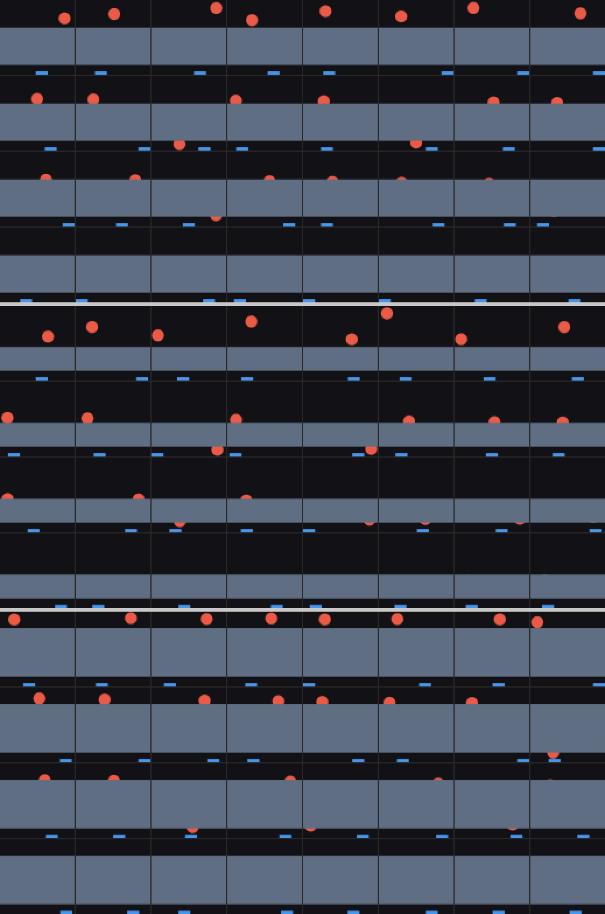
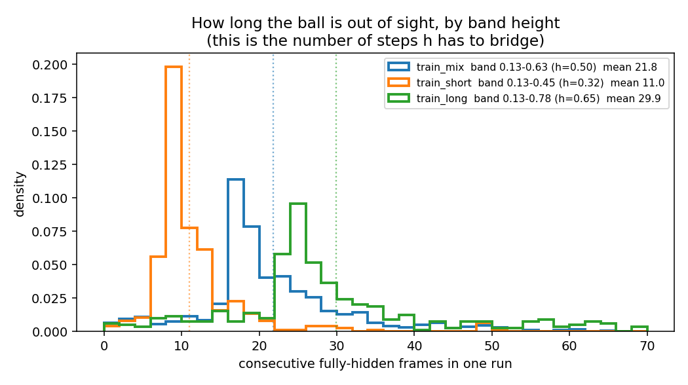
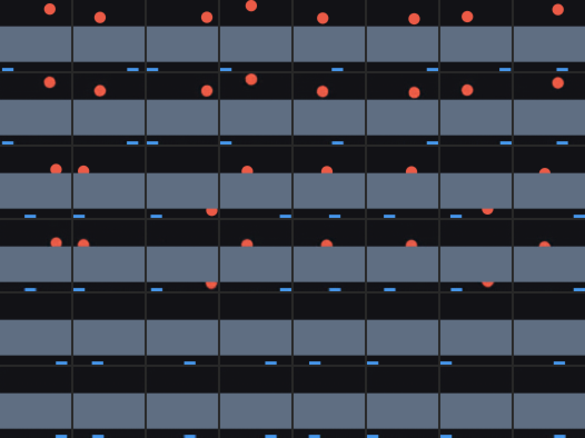
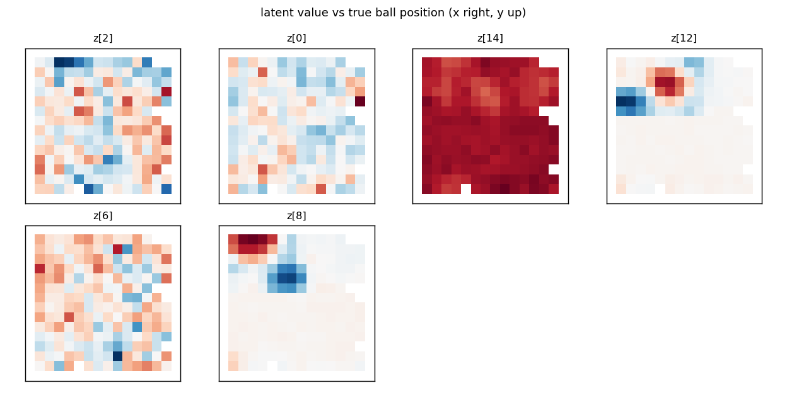
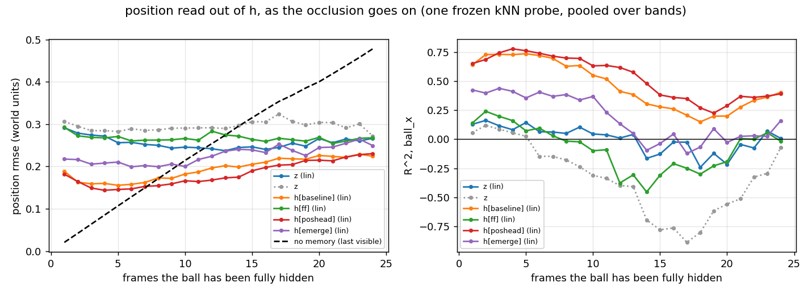
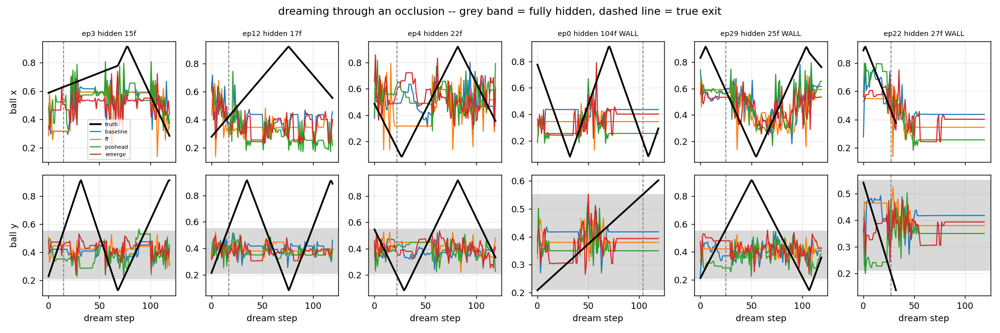
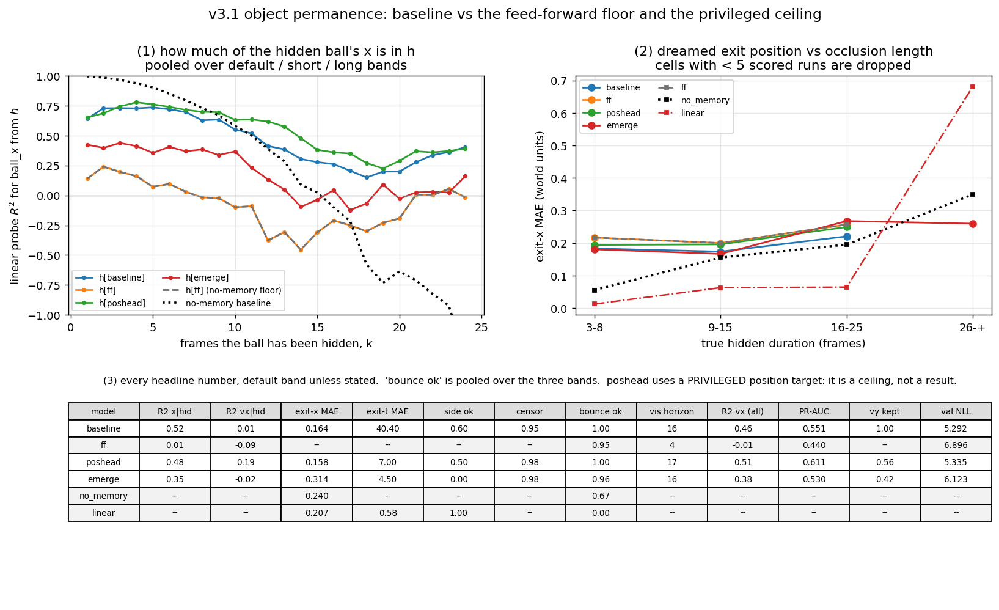

# v3.1 stages one and two — the same questions, in a world that needs the answer

Technical log for v3.1: the re-geometried occlusion environment, its VAE, and
its dynamics models. The design and the oracle sweep that motivated it are in
[`docs/v3/06_v31_design.md`](../docs/v3/06_v31_design.md) and
[`runs/v31_design/sweep.md`](../runs/v31_design/sweep.md); read those first.
v3's answers to the same questions — which this document re-asks on the new
geometry — are in [`README_V3.md`](README_V3.md), [`README_M3.md`](README_M3.md)
and [`README_FIX3.md`](README_FIX3.md). Hardware: Apple M1, 8 GB;
`python`; every command from the repo root. No
existing dataset or checkpoint was modified.

**Why v3.1 exists, in one sentence.** v3's band was placed by an argument about
frames that ignored the paddle's width, and a two-line memoryless oracle then
caught 99% of balls — so v3 *measured* object permanence but never tested
whether anything *needed* it. v3.1 drops the band's bottom edge to contact
height (0.13) and narrows the paddle to 0.16, which takes the memoryless
oracle from 1.00 to **0.48** against a full oracle's 0.99.

**Stage one, up front.** The re-geometried world hides the ball on **42.5%** of
frames (v3: 17.6%) for a mean of **21 frames** per crossing (v3: 9.4), and
**36%** of hidden runs now contain a side-wall bounce that happens out of sight
(v3: ~12 runs in the whole default-band val set). The encoder was trained on
all three band heights at once, and that removed v3's worst confound outright:
reconstruction MSE is **0.00006 / 0.00010 / 0.00006** across the three bands,
a 1.7× spread where v3's single-band encoder had 133–262×. Ball position is
recoverable from one frame's `mu` at **R² 0.989 (x, poly-2) / 0.937 (y, linear)**
when visible,
**0.723 / 0.852** when partial, and **≤ 0 when hidden** — still the correct
answer. The band's own height, now a three-valued nuisance factor, is carried
perfectly (**R² 0.997, 100.0% nearest-of-three**) and costs nothing:
total KL *fell* from 11.87 to **11.32**.

---

## 1. Commands, in order, with wall clock

```bash
# ---- data: 9 splits, 865 episodes, 173k frames -- 75 s, 1.9 GB
bash runs/v31_env/collect_v31.sh          # the nine `worldsim.collect` calls
python -m worldsim.v3_figures \
    --data data/v31/train data/v31/train_short data/v31/train_long \
    --gif-data data/v31/val_mix --gif-max-len 26 --gif-pad 10 \
    --hist-data data/v31/train_mix data/v31/train_short data/v31/train_long \
    --out runs/v31_env                                              # 9 s

# ---- the VAE, on ALL THREE bands -- 6579 s (110 min), 110 s/epoch on mps
python -m wm.train_vae \
    --data data/v31/train data/v31/train_mix data/v31/train_short data/v31/train_long \
    --val data/v31/val --out runs/vae_v31 \
    --epochs 60 --z-dim 16 --free-bits 0.5 --warmup-epochs 5 \
    --device mps --eval-every 10

# ---- stage-one analysis + latents for all nine splits -- 88 s total
bash runs/_stage1_v31.sh
#   wm.analyze                      on data/v31/probe
#   wm.analyze_v3                   on probe / short / long  (once per band)
#     ... with --band-roots data/v31/probe data/v31/short data/v31/long
#   wm.cache_latents                on all nine splits

# ---- the four dynamics models, concurrently, OMP_NUM_THREADS=2
bash runs/_train_rnn_v31.sh
#   rnn_v31          baseline (the fair model)                   1237 s
#   rnn_v31_ff       --feedforward (the floor)                    504 s
#   rnn_v31_poshead  --pos-head --w-pos 1.0 (PRIVILEGED ceiling)  1274 s
#   rnn_v31_emerge   --rollout-loss-steps 24 --rollout-loss-weight 1.0
#                    --emerge-weight 5 (the best fair fix from v3) 1861 s
# All four at once with OMP_NUM_THREADS=2 on 8 cores, so these are 2-3x the
# solo per-epoch cost. COMMON = --data data/v31/train data/v31/train_mix
#   --val data/v31/val data/v31/val_mix --epochs 35 --eval-every 2

# ---- the optional fifth: the same fair model on all four training roots  624 s
python -m wm.train_rnn --out runs/rnn_v31_allbands --epochs 35 --eval-every 2 \
    --data data/v31/train data/v31/train_mix data/v31/train_short data/v31/train_long \
    --val data/v31/val data/v31/val_mix

# ---- evaluation -- 22 min for everything
bash runs/_eval_rnn_v31.sh
#   wm.eval_rnn + wm.eval_conservation, once per model
#   wm.eval_permanence_v3, ALL FOUR MODELS IN ONE PASS, so that every model is
#     scored against the same frozen probe, split and baselines:
#       --bands short=data/v31/short long=data/v31/long
#       --extra 16 --max-age 40
#   wm.compare_fix_v3 -> runs/rnn_v31_permanence_comparison.png (+ .md, .json)

# the allbands row, scored the same way (baseline and ff rows come out
# byte-identical, which is the determinism check)
python -m wm.eval_permanence_v3 --out runs/rnn_v31_permanence_allbands \
    --vae runs/vae_v31/vae.pt --val data/v31/val data/v31/val_mix \
    --bands short=data/v31/short long=data/v31/long \
    --probe-data data/v31/probe data/v31/val_mix --extra 16 --max-age 40 \
    --models baseline=runs/rnn_v31/rnn.pt ff=runs/rnn_v31_ff/rnn.pt \
             allbands=runs/rnn_v31_allbands/rnn.pt --skip b e

python -m pytest tests/ -q        # 130 passed (14 of them the new test_v31)
```

### What changed in the code

Everything reused; nothing duplicated. Eight files gained a flag or a
generalisation, each with the old behaviour as the default:

| file | change |
|---|---|
| `worldsim/collect.py` | `--paddle-w` (default 0.26, the v1–v3 paddle), passed to `BoxConfig` and recorded in `meta["paddle_w"]` as well as `meta["config"]` |
| `wm/data.py` | `FrameDataset` / `make_loader` accept **one root or several** and concatenate them. Index `i` inside the first root's range still addresses that root's item `i`, so a single-root run is the multi-root path with one root rather than a separate code path. Roots must agree on resolution and `state_names`; they are free to differ in band geometry, episode count and episode length |
| `wm/train_vae.py` | `--data` / `--val` are `nargs="+"` |
| `wm/analyze_v3.py` | `--band-roots`: probes `mu` for the band's **top edge** across roots with different band heights — the nuisance factor v3.1 introduced |
| `wm/eval_permanence_v3.py` | the extra bands are **named on the CLI** (`--bands short=… long=…`) instead of being hard-coded as `tall`/`taller`; `--extra` (dream frames past the true exit) and `--max-age` (last *k* on the decay curve) are flags. v3's invocation with no new flags reproduces v3's published numbers exactly — checked |
| `wm/eval_controller.py` | `make_box_cfg` / `add_env_args` / `env_kwargs` gained `paddle_w` (None → `BoxConfig`'s 0.26), threaded through all three rollout entry points; `build_baselines(paddle_w)` so the oracle's dead zone matches the world it is scored in. Stage three needs this |
| `wm/compare_fix_v3.py` | the pooled band names in the figure come out of the report instead of being spelled "default / tall / taller"; `--title` |
| `worldsim/v3_figures.py` | the sample grid takes several roots (one stacked panel per band) and `--gif-max-len` caps the hidden run the GIF picks |

---

## 2. Data

`runs/v31_env/collect.log` has the full output; every number below also lives in
each split's `meta["occlusion"]`.

| split | episodes | seed | policy | band | hidden | partial | visible | hidden run mean / median / max | runs with a hidden wall-x bounce |
|---|---|---|---|---|---|---|---|---|---|
| `train` | 150 | 0 | sticky | 0.13–0.63 | **42.5%** | 33.3% | 24.2% | 21.0 / 19 / 104 | **36.0%** |
| `train_mix` | 300 | 10 | mix 0.5 | 0.13–0.63 | 42.6% | 32.5% | 24.9% | 21.8 / 19 / 104 | 36.2% |
| `train_short` | 100 | 40 | mix | 0.13–0.45 | 20.5% | 33.4% | 46.1% | 11.0 / 9 / 50 | 19.0% |
| `train_long` | 100 | 41 | mix | 0.13–0.78 | 61.0% | 31.8% | 7.2% | 29.9 / 26 / 143 | 47.1% |
| `val` | 15 | 1 | sticky | 0.13–0.63 | 45.1% | 32.7% | 22.2% | 24.6 / 17 / 104 | 32.7% |
| `val_mix` | 20 | 11 | mix | 0.13–0.63 | 42.9% | 32.0% | 25.1% | 23.5 / 20 / 99 | 37.0% |
| `probe` | 120 × 24 | 777 | sticky | 0.13–0.63 | 41.3% | 35.2% | 23.5% | 11.6 / 12 / 24 | 21.6% |
| `short` | 30 | 42 | mix | 0.13–0.45 | 21.1% | 33.7% | 45.2% | 12.2 / 10 / 49 | 26.0% |
| `long` | 30 | 43 | mix | 0.13–0.78 | 62.8% | 31.5% | 5.7% | 30.9 / 25 / 141 | 46.7% |

Three things to read off it.

**The default band is now the interesting one.** v3's default hid the ball 17.6%
of the time for 9.4 frames and its `taller` band (0.16–0.70) managed 46.6% and
23.5. v3.1's *default* is at 42.5% and 21.0 — i.e. the v3.1 baseline model is
being asked the question v3 could only ask on an out-of-distribution band.

**Hidden wall bounces went from anecdote to sample.** 36% of hidden runs contain
a side-wall bounce the camera never saw, against 12 scored runs in all of v3's
default-band val set. Experiment (c) — "is the model a simulator or an
extrapolator" — finally has power on the default band alone.

**The `probe` split's runs are shorter (11.6) than the training splits' (21.0)
even though the band is identical.** That is an artefact of its 24-step
episodes, not of the geometry: a run that is still going when the episode ends
is truncated. It matters only for stage one (the probe split is used to *fit*
position probes, never to measure memory horizon).

**Paddle contact.** The narrower paddle costs less contact than one might fear,
because the tracking policy uses the new width too and the band's low bottom
edge means the ball re-emerges right at contact height:

| policy | v3 (paddle 0.26) | v3.1 (paddle 0.16) | change |
|---|---|---|---|
| sticky (`train`) | 0.540% of steps | 0.457% | **−15%** |
| mix (`train_mix`) | 0.868% | 0.805% | **−7%** |



Three stacked panels, one per band (default / short / long), each 32 frames
stratified on `ball_visible` and ordered visible → hidden. The world is
identical apart from where the slab sits, which is the point: the encoder below
is trained on all three.



`runs/v31_env/occlusion_episode.gif` is one crossing with a wall bounce behind
the band: the ball enters at y = 0.20 (just above the paddle), is hidden for 25
frames, bounces off a side wall out of sight, and comes back out of the *top* at
x = 0.60 having gone in at x = 0.83.

---

## 3. The VAE

Same hyper-parameters as v3 (z_dim 16, free-bits 0.5, β warm-up 5, 60 epochs),
four training roots instead of one: 130,650 frames per epoch against v3's
30,150, which is the whole of the 110-minute wall clock (110 s/epoch against
v3's 29 s).

| | v1 (`vae_b1`, 80 ep) | v2 (`vae_v2`, 60 ep) | v3 (`vae_v3`, 60 ep) | **v3.1 (`vae_v31`, 60 ep)** |
|---|---|---|---|---|
| final KL (nats) | 14.38 | 15.45 | 11.87 | **11.32** |
| global MSE | 0.00036 | 0.00043 | 0.00031 | **0.00020** |
| ball MSE | 0.00424 | 0.00534 | 0.00317 | **0.00173** |
| active units (on `probe`) | 9 | 8 | 6 | **5** |

Both loss columns improving again is the same effect v3 saw and not a better
VAE: 42% of frames now have no ball in them at all and are nearly trivial to
reconstruct. The KL falling a further half-nat while the model is asked to
*additionally* encode which of three bands it is looking at is the interesting
part — see §3.3.

No instability: the loss falls monotonically from the end of β warm-up (epoch 6)
to 59 and the last five epochs move it by 0.03 nats.

### 3.1 Probes conditioned on visibility, on all three bands

Episode-level splits *within each bin*. `rmse` is in world units (the box is 1.0
across) and is the column to read across bins; R² is scored against the variance
of whatever slice you conditioned on, and these slices have wildly different
spreads (`README_V3.md` §5.3).

**Default band, `data/v31/probe`** (720 visible / 1013 partial / 1267 hidden):

```
bin       frames  eps    linear.x       poly2.x         knn.x      linear.y       poly2.y         knn.y
visible      720   58  0.899/0.053   0.989/0.017   0.981/0.023   0.937/0.015   0.856/0.023   0.892/0.020
partial     1013  108  0.598/0.131   0.723/0.108   0.578/0.134   0.691/0.122   0.852/0.085   0.789/0.101
hidden      1267   96 -0.070/0.267  -0.100/0.271  -0.005/0.259  -0.010/0.098  -0.154/0.105  -0.107/0.102
```

**Short band, `data/v31/short`** (0.13–0.45):

```
visible     2763   30  0.686/0.142   0.996/0.016   0.996/0.017   0.793/0.052   0.981/0.016   0.981/0.016
partial     1922   30  0.695/0.136   0.839/0.098   0.848/0.096   0.802/0.066   0.936/0.038   0.917/0.043
hidden      1345   30  0.191/0.220   0.162/0.224   0.110/0.231  -0.031/0.051  -0.089/0.053  -0.070/0.052
```

**Long band, `data/v31/long`** (0.13–0.78):

```
visible      377   27  0.976/0.043   0.995/0.020   0.995/0.019   0.807/0.008  -1.119/0.028   0.604/0.012
partial     1793   30  0.700/0.132   0.789/0.111   0.766/0.117   0.781/0.146   0.901/0.098   0.870/0.112
hidden      3860   30 -0.022/0.239  -0.145/0.253  -0.678/0.306  -0.002/0.142  -0.040/0.145  -0.091/0.148
```

**Positions decode equally well on all three bands.** Visible-bin x rmse is
0.017 / 0.016 / 0.020 world units across default / short / long — a 25% spread,
against v3's *133–262× reconstruction* gap between its trained band and the
other two. Whatever a taller band costs the pipeline downstream, it is no
longer the encoder.

**Two honest wrinkles**, both about which slice you are in rather than about the
encoder:

* The **hidden bin on `short` is R² +0.19 in x**, not ≤ 0. This is the paddle
  leak, measured: `short` was collected with the tracking policy, so the
  (always-visible) paddle sits roughly under the ball, and a probe can read
  some ball x off it. `probe` and `val` are sticky-policy and come out at ≤ 0.
  It is not a band effect and not an encoder fault — it is the same leak
  `README_M3.md` flags, and it is precisely why stage two's floor is the
  feed-forward model and not zero.
* The **long band's visible bin has only 377 frames in 27 episodes** and its
  ball_y there is confined to a 0.22-wide strip above y = 0.78 (test-split sd
  0.028), which is why poly-2 scores −1.12 on a 0.028 rmse. Read the rmse.

### 3.2 Hallucination: still no ball painted where there is none

| band | spurious ball mass on hidden frames | on visible frames | brightest hidden pixel |
|---|---|---|---|
| 0.13–0.63 | **0.031 balls** | 1.033 | 0.089 (median 0.062) |
| 0.13–0.45 | 0.044 | 1.051 | 0.091 (median 0.062) |
| 0.13–0.78 | 0.034 | 1.033 | 0.091 (median 0.062) |

v3 was 0.024 balls with a 0.095 peak. The peak is what matters: 0.09 means the
residual is diffuse decoder haze spread over hundreds of pixels, not a ball
drawn in the wrong place. `recon_by_visibility.png` says the same by eye on all
three bands — partial balls come back as *slivers* on the correct band edge at
the correct x, hidden frames come back empty.



### 3.3 The band's height: a nuisance factor, carried for free

New in v3.1, and the question the design raised: the top edge takes three values
across the training data, so the encoder has to represent it or eat the
reconstruction cost.

| encoder | R² (linear / poly2 / kNN) | nearest-of-three accuracy | majority class |
|---|---|---|---|
| **`vae_v31`** (trained on all three) | 0.949 / **0.997** / 0.937 | 0.999 / **1.000** | 0.367 |
| `vae_v3` (trained on one band) | −0.250 / −0.071 / −0.119 | 0.579 / 0.615 | 0.592 |

The v3 encoder cannot tell the bands apart *at all* — accuracy at the majority
class — which is the same fact as its 262× reconstruction blow-up, seen from the
latent side. The v3.1 encoder is perfect on it.

**And it costs nothing measurable.** Active units are 5/16 on `probe` (v3: 6/16),
7/16 on `short`, 4/16 on `long`; total KL *fell* 0.55 nats. The band is a
constant within an episode and occupies a contiguous block of rows, so one
low-KL direction covers it — `z[14]`, whose tuning map is a near-uniform slab
and which is also the best single dimension for `ball_visible` (poly-2 0.296,
against 0.086 for v3's best). Position is unaffected: visible-bin x is 0.989
against v3's 0.984.

The tuning maps show the geometry directly:



v3's maps had a pale horizontal stripe across the middle where the band was.
v3.1's are flat over the **whole lower two-thirds** — the ball is hidden or
partial everywhere below y ≈ 0.63 — with the place fields (`z[12]`, `z[8]`)
packed into the visible strip above it. The occlusion is visible in the latent
geometry, and v3.1's occlusion is most of the box.

`ball_visible` from the whole of `mu` is 0.988 (poly-2), essentially v3's 0.984,
and still not axis-aligned: best single dimension 0.296.

---

## 4. Stage two — the dynamics models

### 4.0 What is privileged, and how much

Unchanged from [`README_FIX3.md`](README_FIX3.md) §1, and worth repeating
because the whole argument rests on it:

* **`rnn_v31`** is the fair model. Self-supervised on cached latents and
  actions; nothing privileged anywhere.
* **`rnn_v31_ff`** replaces the LSTM with a two-layer MLP on `[z_t, a_t]`. It
  **cannot** carry anything through the gap, by construction. It is the floor,
  and the gap up from it is the part that is memory.
* **`rnn_v31_poshead`** trains a linear head on `h` predicting the simulator's
  true `(ball_x, ball_y)` on every frame, hidden ones included. **This is a
  PRIVILEGED CEILING, not a world-model result** — it is a direct instruction
  about what to remember. Nothing downstream reads the head; every evaluation
  reads position out of `h` with its own external probe.
* **`rnn_v31_emerge`** up-weights the MDN NLL ×5 on frames where the ball has
  just re-emerged, plus a 24-step open-loop rollout loss. The weighting uses
  the privileged `ball_visible` flag to decide *how much a transition counts* —
  weak, but not zero.

**Why K = 24 and not 32.** v3.1's hidden runs have median 19 and mean 21.6
frames, and K = 24 reaches the exit frame for **72%** of them (K = 32 would
reach 89%). Raising K to 32 would also have meant raising `--seq-len` past 32 —
`rollout_losses` samples its start inside the window — which would have changed
the window the *baseline* sees and broken the only comparison that matters. So
K stayed at v3's value and the 28% of runs it cannot span are declared here.

### 4.1 Training

| model | params | wall clock | best val NLL | best val hit F1 | open-loop latent MSE @ h=32 |
|---|---|---|---|---|---|
| `rnn_v31` (fair) | 327k | 1237 s | **5.292** | 0.502 | 0.304 |
| `rnn_v31_ff` (floor) | 114k | 504 s | 6.896 | 0.376 | 0.777 |
| `rnn_v31_poshead` (**ceiling, privileged**) | 327k | 1274 s | 5.335 | 0.507 | 0.299 |
| `rnn_v31_emerge` (fair fix) | 327k | 1861 s | 6.123 | 0.421 | 0.316 |
| `rnn_v31_allbands` (fair, 4 roots) | 327k | 624 s (solo) | 5.207 | 0.508 | 0.286 |

Selection is best-teacher-forced-val-NLL, unchanged since v1. `emerge`'s NLL is
worse because it is optimising something the selection rule cannot see (that is
why `rnn_last.pt` is saved alongside). Train and val NLL are **not** comparable
to each other — train targets are posterior samples, val targets posterior
means — only across runs.

### 4.2 The standard evaluations (`wm.eval_rnn`)

| | baseline | ff (floor) | poshead (**ceiling**) | emerge |
|---|---|---|---|---|
| useful dream horizon, visible frames, τ=0 | **16** | 4 | 17 | 16 |
| ball error at h=16 (visible frames) | 0.038 | 0.243 | 0.035 | 0.048 |
| `ball_vx` from `h`, linear R² | **0.463** | −0.007 | 0.506 | 0.383 |
| `ball_vy` from `h`, linear R² | 0.343 | −0.302 | 0.371 | **0.408** |
| paddle separation, 30 steps left vs right | 0.792 | 0.642 | 0.773 | 0.802 |
| paddle-contact PR-AUC (base rate 0.76%) | 0.551 | 0.440 | **0.611** | 0.530 |

Two things to note against v3. The **visible-frame dream horizon went up**
(14 → 16) even though 42% of frames now carry no ball, and the feed-forward
floor collapsed further (v3's ff was not run on this metric; here it is 4).
But **velocity out of `h` got much worse**: v3's baseline read `ball_vy` at
linear R² 0.838 and v3.1's at 0.343. That is the price of the geometry — the
ball is visible on 24% of frames instead of 44%, so there are far fewer
consecutive sightings to integrate a velocity from.

### 4.3 (a) Position from `h` while the ball is hidden — the headline

Frozen probe, episode-level split, 3135 fully hidden frames. R² / rmse in world
units; the hidden bin's `ball_x` spread is ~0.24, so read rmse across bins.

| feature | hidden `ball_x` (linear) | hidden `ball_x` (kNN) | hidden `ball_y` (linear) |
|---|---|---|---|
| `z` (the frame alone) | 0.11 / 0.222 | −0.26 / 0.265 | −0.02 / 0.102 |
| **`h[baseline]`** | **0.52 / 0.163** | **0.50 / 0.167** | 0.09 / 0.096 |
| `h[ff]` (floor) | 0.01 / 0.235 | −0.21 / 0.260 | −0.08 / 0.105 |
| `h[poshead]` (**ceiling**) | 0.48 / 0.170 | 0.49 / 0.169 | 0.09 / 0.096 |
| `h[emerge]` | 0.35 / 0.191 | 0.24 / 0.206 | 0.15 / 0.093 |

**This is the result v3 could not get.** Against v3's same table — baseline
**0.17**, ff −0.21, poshead **0.71**, emerge 0.44 — the fair model went from
0.17 to **0.52** and the gap to the privileged ceiling *closed to nothing*
(0.52 vs 0.48; the ordering even reverses, within noise). In v3 the fair model
recovered 0.38 of the ff→poshead span; in v3.1 it recovers **all of it**.

The reason is the one the design predicted for the opposite outcome: longer
occlusions and more hidden bounces mean more training signal per crossing.
21 frames of hidden ball per traverse, and a wall bounce in 36% of them, makes
"where is the ball now" a question the one-step likelihood eventually pays for.

`ball_y` is the mirror image: 0.09 for everything that has memory, because
v3.1's band is 0.50 tall and the y spread *inside* it is small (rmse 0.096
against a 0.10 spread), so there is almost nothing for R² to explain. v3's
y numbers (0.51) were scored on a 0.30-tall band. Read the rmse.

**The decay curve** — one frozen probe, scored at each hidden age, pooled over
all three bands:



`ball_x` rmse (world units) against the no-memory baseline ("the ball is where
it vanished"):

| k (frames hidden) | 1 | 4 | 8 | **11** | 14 | 17 | 20 | 24 |
|---|---|---|---|---|---|---|---|---|
| no memory | 0.015 | 0.059 | 0.121 | **0.163** | 0.203 | 0.243 | 0.281 | 0.345 |
| `h[baseline]` | 0.148 | 0.125 | 0.142 | **0.160** | 0.178 | 0.196 | 0.197 | 0.173 |
| `h[poshead]` (**ceiling**) | 0.146 | 0.113 | 0.128 | 0.139 | 0.154 | 0.178 | 0.185 | 0.175 |
| `h[emerge]` | 0.187 | 0.185 | 0.182 | 0.202 | 0.223 | 0.221 | 0.223 | 0.206 |
| `h[ff]` (floor) | 0.229 | 0.221 | 0.234 | 0.241 | 0.257 | 0.246 | 0.240 | 0.226 |
| `z` | 0.230 | 0.231 | 0.227 | 0.226 | 0.230 | 0.223 | 0.242 | 0.224 |

**Memory-horizon crossover (the k at which `h` beats "do nothing" on `ball_x`)**

| | v3 | **v3.1** |
|---|---|---|
| baseline | ~13 | **11** |
| poshead (**ceiling**) | — | 9 |
| emerge | — | 16 |
| ff (floor) | — | 18 |
| `z` | — | 16 |

and the crossover is now **below** the default band's mean occlusion (21
frames), where in v3 it was above it (13 vs 9.4). That inversion is the single
sentence answer to the question the brief asks: the longer default occlusion
made the fair model's horizontal permanence **better**, not worse. At k = 24
the baseline still reads `ball_x` at R² **0.404** while the no-memory baseline
is at **−1.358**.

The curve stops at k = 24 despite `--max-age 40`: past that, no single k has the
25 held-out frames the per-bin fit requires, because the long tail is spread
thinly over many distinct k.

### 4.4 (f) What else is in `h` on hidden frames

| feature | `ball_vx` | `ball_vy` | frames hidden |
|---|---|---|---|
| `z` | −0.005 | −0.183 | −0.577 |
| `h[baseline]` | 0.005 | −0.324 | −0.232 |
| `h[ff]` | −0.088 | −0.291 | −1.194 |
| `h[poshead]` (**ceiling**) | **0.190** | −0.002 | −0.706 |
| `h[emerge]` | −0.021 | 0.159 | −0.304 |

**This is a clean regression from v3 and the most surprising result in v3.1.**
v3's baseline carried `ball_vy` at R² 0.67 and "how long have I been hidden" at
0.54 — a clock and a falling ball. v3.1's carries neither: −0.32 and −0.23.
The model now knows *where* the ball is and no longer knows *when* it will come
back, which is exactly the opposite of v3's split. §4.9 argues why.

### 4.5 (b) Emergence — the experiment lost its instrument

**The dream never brings the ball back, so (b) has no power on the default
band.** Of 99 hidden runs in `val + val_mix`:

| model | runs scored (of 99) | censored |
|---|---|---|
| baseline | **5** | 0.95 |
| ff | **0** | 1.00 |
| poshead | 2 | 0.98 |
| emerge | 2 | 0.98 |

This is not a code fault and not a threshold to be tuned away — it is
geometric, and it is worth stating precisely because it will bite anyone
re-running this suite on a tall band. The exit detector calls an exit when the
*decoded* ball leaves the band interior for two consecutive frames. An
open-loop dream with no ball information in it converges to the "blank band"
latent, which decodes to **y = 0.384** — the middle of v3.1's band. v3's band
interior was 0.36–0.50, a 0.14-wide strip that dream noise alone pushed a
prediction out of; v3.1's is **0.21–0.55**, and a collapsed dream sits inside it
for ever. The picture is unambiguous:



Bottom row, every panel: the dreamed `ball_y` flattens to ≈0.40 inside the grey
band within about ten steps and stays there, while the truth (black) completes
two whole traverses. So the exit-x / exit-time / side columns for v3.1 are
computed on 0–5 runs and **must not be quoted**. The 0.164 exit-x MAE in the
figure's table is five runs.

`runs/rnn_v31_permanence/exit_x_pred_vs_true.png` says it in one glance: the
`no_memory` panel has 99 points, the four model panels have 5, 0, 2 and 2.
`exit_time_error_hist.png` carries the same `n` in its legend.

That is the honest headline for (b): **`h` holds the hidden ball's x (§4.3) and
the decoder path does not express it.** v3 found a weaker version of the same
thing (`emerge` doubled hidden-x information in `h` without improving the
dream's exit); v3.1's longer occlusion turns the same defect from a degradation
into a total loss.

### 4.6 (c) Hidden wall bounces — the one dream-side win

Pooled over all three bands, 102 hidden runs containing a side-wall bounce the
camera never saw (v3's default band had 12; v3.1's has **35 on the default band
alone**). "Nearer reflected" asks whether the prediction is closer to the truth
(the ball bounced) or to the straight line clipped at the wall (it kept going).
Chance is 0.50; the straight-line baseline is 0.00 by construction.

| model | n scored | nearer reflected | on clear overshoots (n) |
|---|---|---|---|
| baseline | 23 | **1.00** | 1.00 (19) |
| ff (floor) | 22 | 0.95 | 0.94 (18) |
| poshead (**ceiling**) | 22 | 1.00 | 1.00 (18) |
| emerge | 27 | 0.96 | 0.95 (22) |
| no memory | 102 | 0.67 | 0.64 (91) |
| linear (straight line) | 102 | 0.00 | 0.00 (91) |

v3 got 0.88 against a 0.69 no-memory; v3.1 gets 1.00 against 0.67. **But the
feed-forward floor also scores 0.95**, which it could not possibly do by
remembering anything — so this metric is mostly measuring "does the prediction
end up somewhere central rather than pinned against a wall", not "did the model
simulate the bounce". v3's 0.88-vs-0.69 gap was already weak evidence; v3.1's
ff control shows why. **Do not quote this as permanence.**

### 4.7 (d) Memory horizon on the dream, and (e) the counterfactual

Exit-x MAE pooled over bands, by true hidden duration. `n_scored` is how many
runs the model brought a ball back for at all, and it is the column to read:

| model | 3–8 | 9–15 | 16–25 | 26+ |
|---|---|---|---|---|
| baseline | 0.183 | 0.174 | 0.221 | 0.170 |
| poshead (**ceiling**) | 0.194 | 0.196 | 0.249 | 0.118 |
| emerge | 0.181 | 0.167 | 0.268 | 0.260 |
| ff (floor) | 0.217 | 0.200 | 0.257 | 0.206 |
| no memory | **0.056** | 0.155 | 0.195 | 0.350 |
| n runs | 23 | 48 | 126 | 75 |
| baseline n_scored | 23 | 47 | **18** | **4** |

The 3–8 and 9–15 bins are entirely `short`-band runs (the default band admits no
hidden run shorter than 15 frames — the shortest in `val + val_mix` is 15), and
they are the only bins where the dream survives. Past 16 frames the model
re-emerges a ball on 14% of runs and past 26 on 5%, so the apparent win at 26+
(0.170 vs 0.350) is four runs. **No crossover can be claimed from the dream**;
the crossover in §4.3 is measured on `h` directly and is the one to use.

(e) The counterfactual (`vx → −vx` before entry, re-simulated, re-encoded,
re-dreamed) survives on 34 runs and says the same thing twice: the **sign** of
the dreamed horizontal displacement agrees with the physics on **100%** of runs
for baseline / poshead / emerge and **0%** for ff — but the magnitude is
`−0.018` against a true `−0.196`, i.e. an order of magnitude too small. The
model knows which way, not how far. (v3 got the sign right 55% of the time, so
this is a genuine improvement in kind.)

### 4.8 Conservation (`wm.eval_conservation`) — still bad, still a stage-three blocker

Does the hidden ball keep its vertical direction of travel across a dreamed
occlusion? Nothing inside the band can turn a ball around, so the answer must
be 1.0. Instrument floor (the same estimator on TRUE latents): **0.975** on 79
stretches.

| model | τ=0 (n) | τ=0.5 (n) | τ=1.0 (n) |
|---|---|---|---|
| baseline | 1.000 (**6**) | 0.492 (325) | 0.472 (218) |
| ff (floor) | — (0) | 0.385 (13) | 0.286 (14) |
| poshead (**ceiling**) | 0.556 (9) | 0.560 (91) | 0.618 (34) |
| emerge | 0.419 (31) | 0.420 (569) | 0.400 (50) |

The comparison figure's table shows baseline "vy kept 1.00" and **that number is
six stretches** — the same censoring as §4.5, because a dream that never leaves
the band has no *complete* hidden stretch to score. The numbers with sample size
behind them are the τ = 0.5 and τ = 1.0 columns, and they are **coin flips**:
0.49 and 0.47, against v3's 0.60 and 0.50. Verdict unchanged and stronger:
**do not train a controller in a sampled v3.1 dream.**

### 4.9 Surprises

**1. The fair model matched the privileged ceiling.** 0.52 vs 0.48 hidden-`x`
R², where v3 was 0.17 vs 0.71. The environment change did what four different
loss functions in `README_FIX3.md` could not. The lesson generalises past this
project: when a self-supervised objective will not learn a variable, the first
thing to check is whether the *data* ever makes that variable pay, not whether
the loss can be reweighted into caring.

**2. `emerge` is now actively harmful.** It was v3's best fair fix (0.44 vs a
0.17 baseline); on v3.1 it is 0.35 against a 0.52 baseline, its crossover is 5
frames later, and its val NLL is 0.8 nats worse. The fix was compensating for a
signal shortage that no longer exists, and the 24-step rollout term it carries
now costs teacher-forced accuracy for nothing.

**3. Vertical permanence went backwards while horizontal went forwards.** v3:
`ball_vy` from `h` 0.67, hidden-frame count 0.54, hidden-`x` 0.17. v3.1:
−0.32, −0.23, **0.52**. The trade is legible: v3's band was crossed in 9 frames
with the ball visible 44% of the time, so the cheap win was a clock; v3.1's is
crossed in 21 frames with the ball visible 24% of the time, so a clock is both
harder to run and less useful than a position estimate, and 256 units went where
the likelihood paid.

**4. The exit-based instrument does not survive a tall band.** §4.5. Four of the
six experiments in `eval_permanence_v3` depend on detecting a decoded ball
leaving the band, and that detector's power is a function of how *narrow* the
band interior is. This is a methodological finding, not a result, and anyone
re-using the suite needs it.

**5. The VAE carried a three-valued nuisance factor for free** (§3.3) — 1.000
classification accuracy, 0.55 nats *less* KL than v3. I expected the band top
to cost positional precision; it cost nothing measurable.

### 4.10 Honest failures

* **(b), (d) and the τ=0 conservation column have no sample on the default
  band.** 5, 4 and 6 runs respectively. The exit-x MAE, exit-time MAE, side-
  correct and "vy kept at τ=0" columns of `runs/rnn_v31_permanence_comparison.md`
  are printed because the script prints them; they are not evidence.
* **(c) is confounded by the feed-forward control scoring 0.95.** §4.6.
* **`ball_y` R² on hidden frames is ~0.09 for every model with memory**, and
  that is a variance artefact of a 0.50-tall band, not a finding. The rmse
  (0.096 against a 0.10 spread) is the honest number and it says almost nothing
  is being tracked vertically.
* **The `short` split's hidden bin leaks ball x through the paddle** (§3.1,
  R² +0.19). Every claim in §4.3 is therefore stated against `h[ff]`, which has
  the identical access to that cue, and never against zero.
* **`--max-age 40` did not buy 40 frames of curve**; the per-k sample threshold
  cut it at 24. To see further, the `long` split needs more than 30 episodes.
* **Band diversity in the dynamics training data does not help.**
  `rnn_v31_allbands` (all four training roots) gets hidden-`x` R² **0.34**
  linear / 0.50 kNN against the two-root baseline's 0.52 / 0.50, and hidden-`y`
  0.23 against 0.09. So it trades a little x for a little y and is not the
  better model; the extra bands help the *encoder* (§3) and not the dynamics.

### 4.11 The comparison figure



Panel (1) is the result: `h[baseline]` (orange) and `h[poshead]` (red, the
privileged ceiling) on top of each other at R² 0.65–0.78 for the first ten
hidden frames and still at 0.3–0.4 at k = 24, while the no-memory baseline
(dotted black) crosses zero at k ≈ 15 and falls to −1, and `h[ff]` (green, the
floor) never leaves the ±0.25 band. Panel (2) is the censored one — read §4.5
before reading it. Panel (3) is every headline number; the columns to trust are
`R2 x|hid`, `R2 vx|hid`, `bounce ok`, `vis horizon`, `R2 vx (all)`, `PR-AUC` and
`val NLL`.

`runs/rnn_v31_permanence_comparison.md` and `.json` carry the same table.

---

## 5. What stage three inherits

| | |
|---|---|
| encoder | **`runs/vae_v31/vae.pt`** (z_dim 16, 5 active units, trained on all three bands) |
| dynamics model | **`runs/rnn_v31/rnn.pt`** — the fair baseline. It is the best model on val NLL among the fair runs (5.292), the best on hidden-`x` memory (0.52), and the only one with no privileged term anywhere. `rnn_v31_poshead` must not be used: its position head makes every controller result unpublishable |
| latents | cached for all nine splits as `mu.npy` / `logvar.npy` in each `data/v31/*` |

The exact real environment, which `wm.eval_controller` / `wm.train_controller`
must be given explicitly (the `BoxConfig` defaults are still v1's):

```python
BoxConfig(res=64, ball_radius=0.08, occluder=True,
          occluder_y=(0.13, 0.63), paddle_w=0.16)
```

```bash
--ball-radius 0.08 --occluder --occluder-y 0.13 0.63 --paddle-w 0.16
```

`--paddle-w` is new and is **not optional**: the paddle's width sets the chance
catch rate, so a controller evaluated at 0.26 in a world trained at 0.16 is
being scored against the wrong floor. `build_baselines(paddle_w)` now takes it
too, so the oracle's dead zone matches the world it plays in.

**The three numbers stage three is graded against**, from
[`runs/v31_design/sweep.md`](../runs/v31_design/sweep.md):

| reference policy | interceptions per floor visit |
|---|---|
| full oracle (tracks the true ball always) | 0.99 |
| **wait-and-see oracle (the memoryless bound)** | **0.48** |
| stand still | 0.38 |

A fair controller above 0.48 is using memory. And one caution from stage two
that is now established twice over: **§4.8 says the sampled dream does not
conserve the hidden ball's direction of travel** (0.47–0.49 against a 0.975
instrument floor), so a controller trained inside a τ > 0 dream is training
against a coin flip. Train on real rollouts, or at τ = 0 with the §4.5 caveat
that the τ = 0 dream does not bring the ball out of the band at all.
