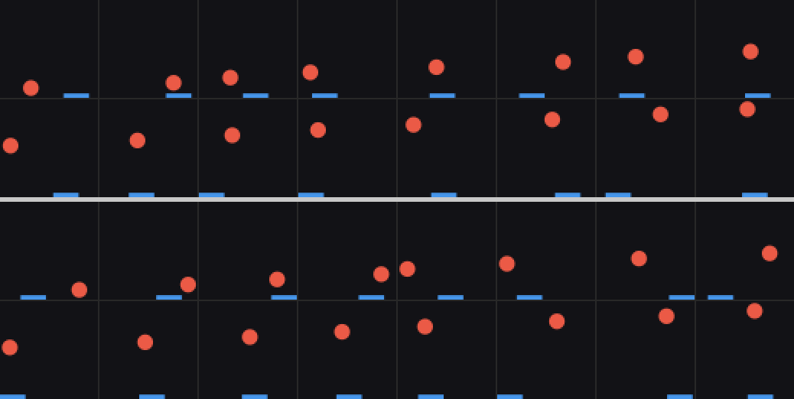

# worldsim — v1, v2, v3 and v4

A ball bouncing in a unit box with a paddle you move left/right/stay. Renders to
64×64 RGB, hands you ground-truth latent state alongside every frame.

Numpy only. Pillow for GIFs, pygame only for the interactive mode.

## Quickstart

```bash
python -m worldsim.collect --out data/v1/train --episodes 100 --steps 200
python -m worldsim.collect --out data/v1/val   --episodes 10  --steps 200 --seed 1
python -m worldsim.play          # arrow keys, needs pygame
```

100×200 is ~20k frames, 245 MB, about a minute to generate.

## Data format

| file | dtype | shape |
|---|---|---|
| `frames.npy` | uint8 | `(E, T+1, 64, 64, 3)` |
| `actions.npy` | int8 | `(E, T)` — 0 left, 1 stay, 2 right |
| `states.npy` | float32 | `(E, T+1, S)` — S = 6, +1 for v2, +1 for v3 |
| `events.npy` | uint8 | `(E, T)` — bitmask: 1 wall-x, 2 wall-y, 4 paddle, 8 hidden (v3) |
| `meta.json` | | config + conventions |

`(frames[e,t], actions[e,t]) -> frames[e,t+1]`. T+1 frames give T transitions.

State columns: `ball_x, ball_y, ball_vx, ball_vy, paddle_x, paddle_vx`, then
`mass` if v2 and `ball_visible` if v3, in that order. Read
`meta["state_names"]` rather than assuming 6. World coords are `[0,1]²` with
y=0 at the *bottom* of the image.

Load with `mmap_mode="r"` — these are separate `.npy` files rather than one
`.npz` specifically so you can train on data larger than 8 GB of RAM:

```python
frames = np.load("data/v1/train/frames.npy", mmap_mode="r")  # no RAM cost
batch = torch.from_numpy(np.array(frames[eps, ts]))          # copy just the batch
```

## Things worth knowing before you train

**States are for probing, not training.** Don't feed `states.npy` to the VAE.
It's there so that after training you can ask which of the six true variables
are linearly decodable from `z`, which need a nonlinear probe, and which just
aren't in there. That's the concrete version of "did it learn the right
variables," and it's a couple of hours of work on top of a model you already
have.

**Rendering is antialiased on purpose.** Hard pixel edges quantise position to
1/64, and a VAE trained on quantised positions gives you a latent space where
sub-pixel ball position isn't recoverable even in principle. The analytic
coverage rendering keeps that information in the image.

**Ball speed is conserved.** The paddle changes direction via sideways
"english," not energy. This keeps the data distribution stationary, so the
dynamics model isn't chasing a slow drift.

**Actions affect the ball rarely.** Measured paddle-contact rate is ~0.2% of
frames, i.e. the paddle intercepts roughly a third of floor bounces. Action →
paddle position is dense and easy; action → ball trajectory is a sparse, delayed,
contact-mediated effect. That's the interesting part, but if your dynamics model
seems to ignore actions entirely, that sparsity is the first thing to suspect.
Knobs: `paddle_w` (0.26), `english` (0.35), `ball_speed` (0.022).

**Sticky actions, not i.i.d.** Uniform random actions make the paddle
random-walk in tiny steps and never leave the middle. `mean_hold=8` gives full
sweeps across the box, so the model sees real paddle velocity.

## Suggested sequencing

1. Play it by hand once. Check the ball is trackable at 64×64.
2. Collect, then look at `sample_grid.png`-style tiles of your own data.
3. Train the conv VAE to convincing reconstructions **before** touching
   dynamics. If reconstructions are mush, every downstream result is
   uninterpretable and you'll spend days blaming the GRU.
4. Then dynamics on `(z_t, a_t) -> z_{t+1}`, trained separately from the VAE.
5. Then `render.side_by_side(true_rollout, dreamed_rollout)` → `save_gif`. This
   is the payoff: watching *where* and *how* it drifts.

---

# v2 — mass from colour

Everything above still describes the environment exactly when
`mass_from_color` is `False`, which is the default. `BoxConfig()` with no
arguments *is* v1, bit for bit — `tests/test_env_v2.py::test_v1_frames_byte_identical`
replays the collector's seeding and compares against `data/v1/val/frames.npy`
pixel for pixel, so if that ever stops being true you find out immediately.

## The idea

At `reset()` the ball is given a **mass** `m`, drawn log-uniformly from
`[0.5, 2.0]`, and painted a colour that encodes it. Mass then feeds back into
the physics in exactly two places, both the same statement — *same impulse,
different mass*:

| effect | v1 | v2 |
|---|---|---|
| speed (conserved within an episode) | `ball_speed` | `ball_speed / m` |
| english on paddle contact | `english · paddle_vx` | `english · paddle_vx / m` |

So a yellow ball is light: it moves ~0.044 world units/frame (≈2.8 px at 64²)
and the paddle flicks it hard. A purple ball is heavy: ~0.011/frame, and the
paddle barely bends its path.

**Why this is the right second world.** v1 had two kinds of variable: visible in
a frame (positions) and invisible in *any* frame (velocities). v2 adds a third:
visible in a frame, but only as *appearance*, with purely *dynamical*
consequences. That is an appearance→dynamics causal edge, and each stage of
V–M–C has a different job with it — V has to notice the colour at all, M has to
learn that this latent *multiplies* the step size (a multiplicative interaction
between latents, which a linear dynamics model cannot represent), and C can in
principle lead a fast ball more than a slow one.

## Why log-uniform mass

Mass enters as a ratio (`1/m`). Under a *linear* prior on `[0.5, 2]`, "twice as
heavy" and "half as heavy" would occur at very different rates and the median
ball would be `m = 1.25`, not `1`. Log-uniform makes the distribution symmetric
under `m → 1/m`, puts the median exactly at `m = 1` — the v1 ball — and makes
the colour ramp linear in the variable the pixels actually vary with.

## The colour ramp

`u = log(m/0.5) / log(2/0.5) ∈ [0,1]`, then a **two-segment** path in RGB:

```
u=0.0  (250,220,80)  yellow   m = 0.5   fast, easily deflected
u=0.5  (235,90,70)   v1 red   m = 1.0   exactly the v1 ball
u=1.0  (150,40,200)  purple   m = 2.0   slow, stubborn
```

A single straight lerp from yellow to purple was the first choice and it is
worse: its midpoint is `(200,130,140)`, a desaturated dusty pink, and the
midpoint is exactly where most of the probability mass sits. Routing through the
v1 red keeps every ball vivid, keeps the whole ramp ≥100 RGB units away from the
blue paddle and the near-black background (asserted in the tests), and makes the
median v2 ball literally the v1 ball.

`mass_to_color(m, cfg)` and `color_to_mass(rgb, cfg)` are exported. The inverse
projects onto the polyline using all three channels rather than inverting one —
robust to the 8-bit rounding, to antialiased edge pixels, and to VAE
reconstructions that are near the ramp but not on it. Round trip is accurate to
<0.5% in mass.

## State vector

`states.npy` gains a 7th column, `mass`, **only** when `mass_from_color` is on:

```
v1: ball_x, ball_y, ball_vx, ball_vy, paddle_x, paddle_vx          (6)
v2: ball_x, ball_y, ball_vx, ball_vy, paddle_x, paddle_vx, mass    (7)
```

Read `meta["state_names"]` rather than assuming 6. `meta["version"]` is
`"v2_mass_from_color"` for v2 splits, and `meta` also records `mass_from_color`,
`mass_holdout` and `mass_only`.

## Held-out masses: the generalisation test

Two mutually exclusive collector flags, both rejection-sampled at `reset()`:

- `--mass-holdout LO HI` — never sample a mass inside `[LO, HI]`. Used for every
  *training* split.
- `--mass-only LO HI` — sample only inside `[LO, HI]`. Used for the matching
  *test* split.

With `0.85 1.2` this gives a clean **interpolation** test: the model has seen
lighter balls and heavier balls, but never one of that colour. Fit a probe on
the seen colours, score it on the unseen band, and you learn whether the latent
code for colour is a genuine continuum or a lookup table of the colours it was
shown. (`wm/analyze.py --eval-data` does exactly this.)

## Collecting v2

```bash
COMMON="--ball-radius 0.08 --steps 200 --res 64 --mass-from-color"
HO="--mass-holdout 0.85 1.2"
python -m worldsim.collect --out data/v2/train     --episodes 150 --seed 0   --policy sticky $COMMON $HO
python -m worldsim.collect --out data/v2/train_mix --episodes 300 --seed 10  --policy mix --p-track 0.5 $COMMON $HO
python -m worldsim.collect --out data/v2/val       --episodes 15  --seed 1   --policy sticky $COMMON $HO
python -m worldsim.collect --out data/v2/val_mix   --episodes 20  --seed 11  --policy mix $COMMON $HO
python -m worldsim.collect --out data/v2/probe     --episodes 120 --seed 777 --policy sticky --steps 24 --ball-radius 0.08 --res 64 --mass-from-color $HO
python -m worldsim.collect --out data/v2/holdout   --episodes 30  --seed 21  --policy mix $COMMON --mass-only 0.85 1.2
python -m worldsim.v2_figures --data data/v2/train --gif-data data/v2/val_mix --out runs/v2_env
python -m worldsim.play --mass-from-color     # press R for a new mass
```

Whole set: ~1.3 GB, about 40 s of wall clock. The collector prints a log-binned
mass histogram per split — a correct training split is flat with an empty gap at
`[0.891, 1.122)`, and the hold-out split is the gap and nothing else.

Measured (see `runs/v2_env/collect.log`):

| split | eps | policy | paddle-contact rate | mean effective speed |
|---|---|---|---|---|
| train | 150 | sticky | 0.553% | 0.0230 |
| train_mix | 300 | mix p=0.5 | 0.843% | 0.0253 |
| val | 15 | sticky | 1.067% | 0.0252 |
| val_mix | 20 | mix | 0.675% | 0.0242 |
| probe | 120×24 | sticky | 0.521% | 0.0258 |
| holdout | 30 | mix | 1.133% | 0.0219 |

Contact rates are 2–5× the v1 figure (~0.2%), for two reasons worth separating:
the bigger ball (`--ball-radius 0.08`, also used for the v1 VAE data) and the
fact that light balls reach the floor far more often per episode.


32 episodes sorted by mass. The red band in the middle of the ramp is missing
because that is precisely the held-out mass band — the gap in the colours *is*
the generalisation test, made visible.

`runs/v2_env/light_vs_heavy.gif` plays the lightest and heaviest episode of
`val_mix` side by side (m=0.51 vs m=1.94) at the same frame rate.

## One surprise, worth knowing before you build M

Both v2 effects carry a `1/m`, and in the post-bounce *direction* they cancel
exactly:

```
tan θ = vx / vy = (english·paddle_vx / m) / (ball_speed / m) = english·paddle_vx / ball_speed
```

and the renormalisation rescales both components, preserving the ratio. So a
heavy ball leaves the paddle at the **same angle** as a light one; what differs
is that it leaves *slower*, so the absolute sideways velocity — the thing that
decides where the ball actually is fifty frames later — still scales as `1/m`.
This is asserted in `tests/test_env_v2.py::test_english_scales_as_one_over_mass`.
If you later want mass to change the bounce *geometry* as well, decouple the two
knobs (e.g. `english_mass_exponent`) rather than changing the speed law, which
would break the within-episode speed conservation v1 was built around.

## Tests

```bash
python -m tests.test_env_v2      # 11 tests, includes the v1 byte-identity check
python -m tests.test_rnn
python -m tests.test_controller
```

---

# v3 — the occlusion band

Everything above still describes the environment exactly when `occluder` is
`False`, which is the default. `BoxConfig()` is still bit-for-bit v1 and
`BoxConfig(mass_from_color=True)` is still bit-for-bit v2 —
`tests/test_env_v3.py` replays the collector's seeding for *both* and compares
against `data/v1/val/frames.npy` and `data/v2/val/frames.npy` pixel for pixel.

## The idea

With `occluder=True`, an opaque horizontal band is painted across the full
width of the frame, **after** the ball and the paddle, between world heights
`occluder_y = (0.28, 0.58)`. That is the entire change. The physics is not
touched: the ball flies straight through the band, bounces off the side walls
behind it, and is simply not drawn.

| field | default | meaning |
|---|---|---|
| `occluder` | `False` | draw the band at all |
| `occluder_y` | `(0.28, 0.58)` | bottom and top edge, world coords, y up |
| `occluder_color` | `(95, 110, 130)` | a mid grey-blue |

**Why this is the right third world.** v1 had two kinds of variable: visible in
a frame (positions) and invisible in *any* frame (velocities). v2 added a
third: visible as *appearance*, with purely dynamical consequences. v3 takes
away the first kind. For a stretch of every vertical traverse the frame
contains **no information whatsoever** about where the ball is — the image is
byte-identical for every ball position behind the band, which
`test_band_hides_the_ball_completely` asserts directly. If anything downstream
is to know where the ball is during that stretch, it has to be carrying it.
That is object permanence.

**Why those numbers.** The ball's diameter is 0.16 and the band is 0.30 tall,
so the ball is *completely* hidden for `(0.30 − 0.16)/|v_y|` frames — measured
at **9.7 frames on average**, with about 39% of all frames partially occluded
around them. The band's bottom edge at 0.28 means a descending ball reappears
only ~10 frames before it reaches the paddle, while the paddle needs ~30 frames
to cross the box. A controller that waits until it can see the ball therefore
cannot catch it from far away: it has to commit while the ball is hidden. That
is what makes the band matter for C and not only for M.

Mass-from-colour is left **off** for the v3 datasets, so the two questions are
not compounded. The switches are independent and compose — with both on the
state has 8 columns.

## The band colour

`(95, 110, 130)`, a desaturated grey-blue. It has to be distinguishable from
all three existing colours, for the same reason the v2 ramp did: if the band
were near the paddle blue, "the VAE lost the band" and "the VAE confused the
band with the paddle" would be the same picture. Distances in RGB:

| against | distance |
|---|---|
| background `(18,18,22)` | 160 |
| ball `(235,90,70)` | 153 |
| paddle `(70,150,235)` | **115** |

The paddle is the nearest neighbour and 115 is the tightest margin in the
project, but it clears the same >100 threshold the v2 ramp is held to
(`test_band_colour_is_distinguishable_from_everything_else`), and the two
differ in *saturation and brightness* as well as hue — a dim grey slab versus a
small vivid blue bar. Looking at `runs/v3_env/sample_grid.png` settles it: they
do not read as the same object. So the grey-blue stayed; no grey-green was
needed.

The band is drawn with the **same antialiased separable box coverage the paddle
uses**, so its edges are soft like everything else in the frame. This is not
cosmetic. A hard-edged band would be the only quantised object in the image,
and a VAE will happily spend capacity on the one crisp edge available to it.

## `ball_visible`

`states.npy` gains a column, **last**, only when `occluder` is on:

```
v1:    ball_x, ball_y, ball_vx, ball_vy, paddle_x, paddle_vx                        (6)
v2:    ... , mass                                                                    (7)
v3:    ... , ball_visible                                                            (7)
v2+v3: ... , mass, ball_visible                                                      (8)
```

`ball_visible` is the fraction of the ball's **disc area** not covered by the
band, computed analytically from the circular-segment formula
(`worldsim.visible_fraction`, exported):

```
A_below(c) = πr²/2 + r² asin(d/r) + d √(r² − d²),   d = clamp(c − y, −r, r)
visible    = 1 − [A_below(hi) − A_below(lo)] / πr²
```

Analytic rather than by sampling pixels, deliberately: `ball_visible` is a
*grading* variable, and grading must not move when someone renders at 128
instead of 64. It is 1 when the ball is clear of the band, 0.5 when the centre
sits exactly on an edge, 0 when the ball is entirely inside, and monotone in
between. `test_visible_fraction_matches_a_brute_force_count` checks it against
400k-point Monte Carlo on the disc to 3e-3.

It is a diagnostic only — the model never sees it. The same goes for the new
event bit.

## `EVENT_HIDDEN = 8`

A fourth bit in the per-step event mask, set when `ball_visible < 1e-3` at the
end of the step. It is redundant with the state column by construction (and
`test_event_hidden_agrees_with_ball_visible` asserts they never disagree); it
exists so analysis code can slice hidden stretches straight out of the small
`events.npy` without loading the states, and — the reason it earns its place —
so that "was the ball hidden" and "did it hit a side wall" live in the *same*
array and can be intersected in one line. `worldsim.collect.hidden_runs` does
exactly that, and it is how the wall-bounce statistic below is computed.

Why a threshold and not `== 0`: the renderer antialiases the ball, so a ball
whose analytic coverage is a few parts in ten thousand can still tint a pixel
under the band edge. `1e-3` of a disc is about 0.02 px² at 64×64 — safely below
one pixel, and comfortably above the float noise.

## Collecting v3

```bash
COMMON="--ball-radius 0.08 --steps 200 --res 64 --occluder"
python -m worldsim.collect --out data/v3/train     --episodes 150 --seed 0   --policy sticky $COMMON
python -m worldsim.collect --out data/v3/train_mix --episodes 300 --seed 10  --policy mix --p-track 0.5 $COMMON
python -m worldsim.collect --out data/v3/val       --episodes 15  --seed 1   --policy sticky $COMMON
python -m worldsim.collect --out data/v3/val_mix   --episodes 20  --seed 11  --policy mix $COMMON
python -m worldsim.collect --out data/v3/probe     --episodes 120 --seed 777 --policy sticky --steps 24 --ball-radius 0.08 --res 64 --occluder
python -m worldsim.collect --out data/v3/tall      --episodes 30  --seed 31  --policy mix $COMMON --occluder-y 0.22 0.64
python -m worldsim.collect --out data/v3/taller    --episodes 30  --seed 32  --policy mix $COMMON --occluder-y 0.16 0.70
python -m worldsim.v3_figures --data data/v3/train --gif-data data/v3/val --out runs/v3_env
python -m worldsim.play --occluder      # try catching it yourself; it is hard
```

Whole set: ~1.4 GB, **63 s** of wall clock. The collector prints an occlusion
summary per split and writes it into `meta["occlusion"]`, so every v3 result
carries the occlusion statistics it was conditioned on.

Measured (`runs/v3_env/collect.log`):

| split | eps | band | frames hidden | partial | visible | hidden runs | mean run | median | max | runs with a wall-x bounce |
|---|---|---|---|---|---|---|---|---|---|---|
| train | 150 | 0.28–0.58 | 17.6% | 38.8% | 43.7% | 560 | 9.4 | 8 | 43 | 19.1% |
| train_mix | 300 | 0.28–0.58 | 17.6% | 39.0% | 43.4% | 1093 | 9.7 | 8 | 44 | 15.5% |
| val | 15 | 0.28–0.58 | 18.1% | 38.1% | 43.8% | 57 | 9.5 | 8 | 27 | 14.0% |
| val_mix | 20 | 0.28–0.58 | 16.9% | 39.4% | 43.8% | 66 | 10.2 | 9 | 34 | 13.6% |
| probe | 120×24 | 0.28–0.58 | 17.6% | 40.3% | 42.1% | 72 | 6.9 | 7 | 22 | 15.3% |
| tall | 30 | 0.22–0.64 | **32.0%** | 39.8% | 28.2% | 120 | **16.0** | 14.5 | 47 | **31.7%** |
| taller | 30 | 0.16–0.70 | **46.6%** | 36.0% | 17.4% | 119 | **23.5** | 21 | 66 | **42.0%** |

Four things worth reading off that table.

1. **The design estimate was right.** §2 of `docs/v3/00_v3_design.md` predicted
   ~9 hidden frames and ~20 partial frames per traverse; the measurement is 9.7
   and 39% of frames partial. Nothing needed retuning.
2. **A sixth of the data is provably uninformative about ball position.** That
   is the fraction on which every memory claim in v3 will be scored.
3. **Hidden runs are short but heavy-tailed** — median 8, max 44 on the default
   band. The tail is the ball entering the band at a shallow angle and crawling
   through it, and it matters because those are the runs that need the longest
   memory. See `runs/v3_env/hidden_run_lengths.png`.
4. **15–19% of hidden runs contain a side-wall bounce**, rising to 42% on the
   `taller` band. Those are the runs where "keep extrapolating the last seen
   velocity" gives the *wrong* exit x, so they are the ones that separate an
   internal simulator from an extrapolator. There are ~170 of them in
   `train` + `train_mix`, which is enough to learn from and enough to test on.

The `probe` split's runs are shorter (6.9) only because its episodes are 24
steps long, so runs straddling the episode boundary are truncated.


32 frames stratified on `ball_visible` and sorted visible → hidden (a uniform
sample would have shown almost no partial occlusions, which are the interesting
case). The last row is fully hidden: those eight frames differ only in the
paddle.

`runs/v3_env/occlusion_episode.gif` is `data/v3/val` episode 0, frames 63–140.
The ball enters the band from below at y = 0.36, is hidden for **27 frames**,
hits the **left wall at x = 0.082 while completely out of sight** (the event
mask for that step is `9` = `EVENT_WALL_X | EVENT_HIDDEN`), and re-emerges
travelling right. The exit x depends entirely on a collision that never
appeared in a single pixel. That one clip is the whole of v3.

## Tests

```bash
python -m tests.test_env_v3      # 12 tests, includes the v1 AND v2 byte-identity checks
python -m pytest tests/ -q       # 77 total
```

The four that matter: v1 and v2 frames unchanged; the band is exactly its own
colour inside and touches nothing outside; `ball_visible` matches brute-force
Monte Carlo and `EVENT_HIDDEN` matches `ball_visible`; and **the trajectory is
bit-identical with and without the band**, for the same seed and actions. That
last one is v3's premise — if the band ever perturbed the dynamics, "the model
cannot see the ball" and "the ball does something different back there" would
be confounded and no memory result would mean anything.

---

# v4 — the gravity switch

`BoxConfig(gravity=1e-4, launch_min_angle_deg=40)`. Everything else is v1: one
ball colour, no band, paddle 0.26, launch speed 0.022. The two earlier switches
still compose with it — `gravity` is orthogonal to `mass_from_color` and
`occluder`, and the state columns stack in that order.

## The idea

v1 hid **velocity**: invisible in any one frame, inferable from two. v2 hid
**mass** behind an appearance cue: visible in one frame, but only as colour.
v3/v3.1 hid **position** for a stretch of every traverse: recoverable only from
memory, but only for ~20 frames.

In all three, the information needed to predict the next frame sat in a
*bounded window* of recent frames. v4 removes that. The ball feels a constant
vertical acceleration whose **direction** — `gravity_sign`, ±1 — is drawn at
reset and multiplied by −1 on **every paddle contact**. Nothing in any frame
shows it. It holds for the ~75–105 frames until the next contact, and it bends
every trajectory in that stretch. To predict well, a model has to notice the
event and remember its consequence.

| field | value | meaning |
|---|---|---|
| `gravity` | 0.0 (off = v1) / 1e-4 in v4 | acceleration **magnitude**, world units per frame² |
| `gravity_sign_init` | `"random"` / `"down"` / `"up"` | ±1 with probability ½ at reset; the fixed options give a constant-gravity control world |
| `launch_min_angle_deg` | 14.5 (= the v1 rule) / 40 in v4 | minimum launch angle from horizontal |
| `max_speed` | 0.05 | speed cap applied after a paddle contact |
| `EVENT_FLIP` | 16 | set on the step where the sign flipped |

## Three physics decisions, none of them inherited

**Speed is no longer conserved**, so `_renormalise_velocity` is off whenever
gravity is on. It has to be: pinning the speed would destroy exactly the
curvature the tier is about. Gravity is conservative and the walls are elastic,
so |v| is a function of height and stays bounded on its own; the one term that
adds energy from outside is the paddle's english, which is why `_clip_speed`
bounds the speed *after a contact* rather than every frame.

**The `min_vy_frac` guard goes with it**, because it lives inside
`_renormalise_velocity`. That is the right call and not merely convenient: the
guard existed to stop a ball skimming horizontally forever, and under gravity a
horizontal ball is pulled off the horizontal within a few dozen frames anyway.

**The launch angle had to be raised.** With `vy² > 2 g Δh` and Δh = 1 − 2r =
0.84, g = 1e-4 needs |vy| > 0.0130 — 36.2° at speed 0.022 — or the ball cannot
cross the box against the pull and the episode degenerates into a floor-skim.
v4 launches above 40°, with margin. `launch_min_angle_deg` raises the `|sin θ|`
bound only; the `|cos θ| > 0.25` bound that keeps launches off *vertical* stays
at its v1 value. Tying both to one constant would be worse than cosmetic: at
50° the rule would become `|sin| > 0.766 AND |cos| > 0.766`, which no angle
satisfies, and the rejection sampler would spin forever.

### The byte-identity trap in that parameter

`launch_min_angle_deg` defaults to **14.5**, which *names* the v1 rule
(`asin(0.25) = 14.4775°`) rather than reproducing it: `sin(14.5°) = 0.250380`.
The difference looks negligible and is not. The guard is a **rejection
sampler**, so a threshold 4e-4 too high does not perturb an angle — it rejects a
draw v1 accepted, shifts that episode's rng stream by one, and produces a
completely different, completely plausible episode. It happens on ~0.04% of
resets: often enough to corrupt one episode in a few hundred, rare enough to
survive a five-frame spot check. `launch_min_sin()` therefore pins the v1 value
as a literal, and `tests/test_env_v4.py` replays 400 resets against a
hand-written copy of the v1 loop.

## The flip

```python
if cfg.gravity > 0.0:
    self._clip_speed()
    if not (self._events & EVENT_PADDLE):      # once per FRAME, not per substep
        self.gravity_sign = -self.gravity_sign
        self._events |= EVENT_FLIP
else:
    self._renormalise_velocity()
```

Once per *frame* matters. `_collide_paddle` runs in every one of the four
substeps, and a contact spanning two substeps is one contact — flipping twice
would silently mean not flipping at all. `EVENT_PADDLE` is already set if an
earlier substep touched the paddle, which makes it exactly the "have we flipped
yet this frame" flag.

`EVENT_FLIP` is therefore redundant with `EVENT_PADDLE` whenever gravity is on,
in the same way `EVENT_HIDDEN` is redundant with `ball_visible`. It exists for
the same reason: analysis code can slice "frames since the latent changed"
straight out of `events.npy` without knowing which switches produced the file.

## State vector

```
[ball_x, ball_y, ball_vx, ball_vy, paddle_x, paddle_vx, (mass), (ball_visible), (gravity_sign)]
```

`gravity_sign` is appended **last**, after any v2/v3 column, so all three
switches compose and `meta["state_names"]` is always the authority. It is a
grading variable: the model never sees it.

## Collecting v4

```bash
bash runs/v4_env/collect_v4.sh        # the six calls below, ~5 min, 1.5 GB
```

```bash
python -m worldsim.collect --out data/v4/train --episodes 150 --steps 200 \
    --ball-radius 0.08 --res 64 --gravity 0.0001 --launch-min-angle 40
```

| split | episodes × steps | seed | policy | flips/ep | 0 / 1 / 2 / 3+ flips | mean frames between flips | frames sign-down | speed min/mean/max | stalled frames |
|---|---|---|---|---|---|---|---|---|---|
| `train` | 150 × 200 | 0 | sticky | 1.05 | 26 / 51 / 17 / 7% | 74.1 | 55.3% | 0.0074 / 0.0225 / 0.0498 | 1.27% |
| `train_mix` | 300 × 200 | 10 | mix 0.5 | 1.68 | 7 / 38 / 38 / 16% | 80.8 | 55.1% | 0.0053 / 0.0236 / 0.0516 | 2.40% |
| `val` | 15 × 200 | 1 | sticky | 0.60 | 47 / 47 / 7 / 0% | 71.0 | 48.6% | 0.0100 / 0.0220 / 0.0292 | 0.00% |
| `val_mix` | 20 × 200 | 11 | mix | 2.00 | 5 / 25 / 45 / 25% | 77.9 | 60.7% | 0.0154 / 0.0251 / 0.0506 | 0.00% |
| `probe` | 120 × 24 | 777 | sticky | 0.16 | 85 / 14 / 1 / 0% | — | 54.7% | 0.0168 / 0.0221 / 0.0307 | 0.00% |
| `long` | 30 × **600** | 50 | mix | 4.87 | 0 / 7 / 10 / 83% | 105.8 | 55.0% | 0.0064 / 0.0270 / 0.0516 | 1.36% |

Every number also lives in that split's `meta["flips"]`. "Stalled frames" is the
fraction whose preceding 100 frames contain no visit to either end of the box —
the one failure mode gravity introduces that a bounds check would not catch.

Four things worth reading off it.

1. **Flips are rare and well spaced** — one to two per 200-step episode, 74–106
   frames apart. That interval is the memory horizon stage two has to bridge,
   and it is 4–5× v3.1's hidden runs.
2. **A quarter of `train` episodes never flip at all.** Those are not waste:
   they are the control condition (the sign held from reset), and the "sign at
   episode start" baseline needs them.
3. **`probe` has almost no flips (0.16/episode), by construction.** Its 24-step
   episodes are far shorter than the flip interval. That is correct for what it
   is for — fitting per-frame probes, where the question is whether a *single
   frame* carries the sign, and each episode contributing one constant label is
   exactly the right design.
4. **The two signs are not 50/50 in frames (55/45).** Episodes start balanced
   and flips alternate, but gravity-down traverses take longer (see below), so
   more frames accumulate under them. Chance level for a sign classifier is
   therefore 55%, not 50% — `wm.analyze_v4` reports the majority-class baseline
   next to every accuracy for this reason.

### Speed is genuinely variable, by a factor of seven

`_clip_speed` was expected to be a formality and is not. The english does not
average out — a tracking paddle is usually moving *toward* the ball when it
hits, so successive impulses correlate — and on the tracking-heavy splits the
ball reaches the 0.05 cap (5 clips in `train_mix`, 8 in `long`; none on the
sticky splits). Combined with gravity's own contribution the observed range is
0.0053–0.0516. Do not carry a "speed is roughly constant" assumption from v1
into any v4 analysis: `wm.eval_controller.floor_visit_stats` is handed the
**per-episode maximum** speed for exactly this reason.

## Figures

```bash
python -m worldsim.v4_figures --data data/v4/train_mix \
    --gif-data data/v4/long --traj-data data/v4/long --out runs/v4_env
```



32 frames: the top panel is gravity-down, the bottom gravity-up, **matched on
ball height** (each tile pairs with the tile above it). The matching is the
point — under gravity-down the ball genuinely spends more time high in the box,
so an unmatched sample would show you the sampling rather than the world. The
two panels should be, and are, indistinguishable. That is the v4 premise as a
picture.

`runs/v4_env/gravity_episode.gif` is `data/v4/long` episode 24, frames 108–199,
with the flip at t = 154. Fitting a quadratic to `ball_y` either side gives
**−1.04e-4 before** and **+1.16e-4 after**. The ball accelerates *downward* into
the contact and *upward* away from it — which no constant-gravity world can do.


`ball_y` against time for six 600-step episodes, red where gravity pulls down,
blue where it pulls up, dashed at each flip. Red traverses arch (the ball
decelerates the whole way up and only just reaches the ceiling); blue ones are
steeper and more nearly straight.

### The cue the design document did not anticipate

That difference is measurable, and it is coarser than a curvature fit
(`runs/v4_env/traverse_stats.json`, from `data/v4/long`):

| sign in force | full traverses | median frames | mean \|vy\| |
|---|---|---|---|
| pulls DOWN | 177 | **48.0** | 0.0192 |
| pulls UP | 186 | **40.0** | 0.0224 |

A 1.20× difference in crossing time. The sign is invisible in a *frame*, as
designed — but at a 40° launch it also sets the ball's energy budget, so it is
partly re-derivable from a *single traverse* rather than only from a memory of
the flip. Stage two must therefore treat "M knows the sign" and "M remembers
the flip" as separable claims; the flip counterfactual, which holds the
trajectory-so-far fixed, is the test that separates them.

## Tests

```bash
python -m tests.test_env_v4      # 11 tests, includes the v1/v2/v3/v3.1 replays
python -m pytest tests/ -q
```

The ones that matter: all four earlier val sets replay byte-for-byte; the v1
launch rule is reproduced *exactly* over 400 resets; free flight accelerates by
exactly `gravity` per frame (checked on `ball_v` in float64, not the float32
state column); the sign flips iff `EVENT_FLIP` fires iff `EVENT_PADDLE` fires;
`gravity=0.0` is bit-identical to plain v1; and the sign-blind oracle equals the
ballistic oracle exactly where the true sign is down — which is what licenses
reading the design sweep's gap as the price of the hidden bit.

## Where the C-stage question went

`runs/v4_design/sweep.md` has the full story and it is a negative result worth
knowing before stage three: **a sign-blind oracle scores identically to the full
oracle at every gravity tested (gap 0.00, 8 cells)**. The paddle crosses the box
faster than the ball falls, and a wrong sign is a *large error far away and no
error up close*, so the tracker simply waits and corrects. Raising gravity does
not help — it only stalls episodes. v4's live questions are the M-stage ones.
