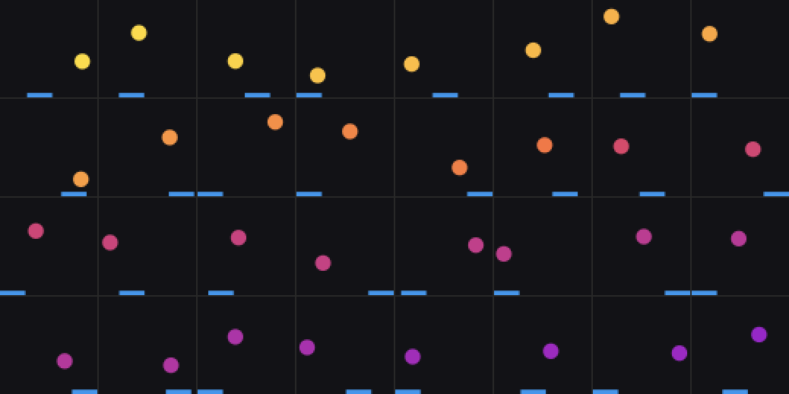

# worldsim — v1 and v2

A ball bouncing in a unit box with a paddle you move left/right/stay. Renders to
64×64 RGB, hands you ground-truth latent state alongside every frame.

Numpy only. Pillow for GIFs, pygame only for the interactive mode.

## Quickstart

```bash
python -m worldsim.collect --out data/v1/train --episodes 100 --steps 200
python -m worldsim.collect --out data/v1/val   --episodes 10  --steps 200 --seed 1
python -m worldsim.play          # arrow keys, needs pygame
```

100×200 is ~20k frames, 245 MB, about a minute to generate.

## Data format

| file | dtype | shape |
|---|---|---|
| `frames.npy` | uint8 | `(E, T+1, 64, 64, 3)` |
| `actions.npy` | int8 | `(E, T)` — 0 left, 1 stay, 2 right |
| `states.npy` | float32 | `(E, T+1, 6)` |
| `events.npy` | uint8 | `(E, T)` — bitmask: 1 wall-x, 2 wall-y, 4 paddle |
| `meta.json` | | config + conventions |

`(frames[e,t], actions[e,t]) -> frames[e,t+1]`. T+1 frames give T transitions.

State columns: `ball_x, ball_y, ball_vx, ball_vy, paddle_x, paddle_vx`. World
coords are `[0,1]²` with y=0 at the *bottom* of the image.

Load with `mmap_mode="r"` — these are separate `.npy` files rather than one
`.npz` specifically so you can train on data larger than 8 GB of RAM:

```python
frames = np.load("data/v1/train/frames.npy", mmap_mode="r")  # no RAM cost
batch = torch.from_numpy(np.array(frames[eps, ts]))          # copy just the batch
```

## Things worth knowing before you train

**States are for probing, not training.** Don't feed `states.npy` to the VAE.
It's there so that after training you can ask which of the six true variables
are linearly decodable from `z`, which need a nonlinear probe, and which just
aren't in there. That's the concrete version of "did it learn the right
variables," and it's a couple of hours of work on top of a model you already
have.

**Rendering is antialiased on purpose.** Hard pixel edges quantise position to
1/64, and a VAE trained on quantised positions gives you a latent space where
sub-pixel ball position isn't recoverable even in principle. The analytic
coverage rendering keeps that information in the image.

**Ball speed is conserved.** The paddle changes direction via sideways
"english," not energy. This keeps the data distribution stationary, so the
dynamics model isn't chasing a slow drift.

**Actions affect the ball rarely.** Measured paddle-contact rate is ~0.2% of
frames, i.e. the paddle intercepts roughly a third of floor bounces. Action →
paddle position is dense and easy; action → ball trajectory is a sparse, delayed,
contact-mediated effect. That's the interesting part, but if your dynamics model
seems to ignore actions entirely, that sparsity is the first thing to suspect.
Knobs: `paddle_w` (0.26), `english` (0.35), `ball_speed` (0.022).

**Sticky actions, not i.i.d.** Uniform random actions make the paddle
random-walk in tiny steps and never leave the middle. `mean_hold=8` gives full
sweeps across the box, so the model sees real paddle velocity.

## Suggested sequencing

1. Play it by hand once. Check the ball is trackable at 64×64.
2. Collect, then look at `sample_grid.png`-style tiles of your own data.
3. Train the conv VAE to convincing reconstructions **before** touching
   dynamics. If reconstructions are mush, every downstream result is
   uninterpretable and you'll spend days blaming the GRU.
4. Then dynamics on `(z_t, a_t) -> z_{t+1}`, trained separately from the VAE.
5. Then `render.side_by_side(true_rollout, dreamed_rollout)` → `save_gif`. This
   is the payoff: watching *where* and *how* it drifts.

---

# v2 — mass from colour

Everything above still describes the environment exactly when
`mass_from_color` is `False`, which is the default. `BoxConfig()` with no
arguments *is* v1, bit for bit — `tests/test_env_v2.py::test_v1_frames_byte_identical`
replays the collector's seeding and compares against `data/v1/val/frames.npy`
pixel for pixel, so if that ever stops being true you find out immediately.

## The idea

At `reset()` the ball is given a **mass** `m`, drawn log-uniformly from
`[0.5, 2.0]`, and painted a colour that encodes it. Mass then feeds back into
the physics in exactly two places, both the same statement — *same impulse,
different mass*:

| effect | v1 | v2 |
|---|---|---|
| speed (conserved within an episode) | `ball_speed` | `ball_speed / m` |
| english on paddle contact | `english · paddle_vx` | `english · paddle_vx / m` |

So a yellow ball is light: it moves ~0.044 world units/frame (≈2.8 px at 64²)
and the paddle flicks it hard. A purple ball is heavy: ~0.011/frame, and the
paddle barely bends its path.

**Why this is the right second world.** v1 had two kinds of variable: visible in
a frame (positions) and invisible in *any* frame (velocities). v2 adds a third:
visible in a frame, but only as *appearance*, with purely *dynamical*
consequences. That is an appearance→dynamics causal edge, and each stage of
V–M–C has a different job with it — V has to notice the colour at all, M has to
learn that this latent *multiplies* the step size (a multiplicative interaction
between latents, which a linear dynamics model cannot represent), and C can in
principle lead a fast ball more than a slow one.

## Why log-uniform mass

Mass enters as a ratio (`1/m`). Under a *linear* prior on `[0.5, 2]`, "twice as
heavy" and "half as heavy" would occur at very different rates and the median
ball would be `m = 1.25`, not `1`. Log-uniform makes the distribution symmetric
under `m → 1/m`, puts the median exactly at `m = 1` — the v1 ball — and makes
the colour ramp linear in the variable the pixels actually vary with.

## The colour ramp

`u = log(m/0.5) / log(2/0.5) ∈ [0,1]`, then a **two-segment** path in RGB:

```
u=0.0  (250,220,80)  yellow   m = 0.5   fast, easily deflected
u=0.5  (235,90,70)   v1 red   m = 1.0   exactly the v1 ball
u=1.0  (150,40,200)  purple   m = 2.0   slow, stubborn
```

A single straight lerp from yellow to purple was the first choice and it is
worse: its midpoint is `(200,130,140)`, a desaturated dusty pink, and the
midpoint is exactly where most of the probability mass sits. Routing through the
v1 red keeps every ball vivid, keeps the whole ramp ≥100 RGB units away from the
blue paddle and the near-black background (asserted in the tests), and makes the
median v2 ball literally the v1 ball.

`mass_to_color(m, cfg)` and `color_to_mass(rgb, cfg)` are exported. The inverse
projects onto the polyline using all three channels rather than inverting one —
robust to the 8-bit rounding, to antialiased edge pixels, and to VAE
reconstructions that are near the ramp but not on it. Round trip is accurate to
<0.5% in mass.

## State vector

`states.npy` gains a 7th column, `mass`, **only** when `mass_from_color` is on:

```
v1: ball_x, ball_y, ball_vx, ball_vy, paddle_x, paddle_vx          (6)
v2: ball_x, ball_y, ball_vx, ball_vy, paddle_x, paddle_vx, mass    (7)
```

Read `meta["state_names"]` rather than assuming 6. `meta["version"]` is
`"v2_mass_from_color"` for v2 splits, and `meta` also records `mass_from_color`,
`mass_holdout` and `mass_only`.

## Held-out masses: the generalisation test

Two mutually exclusive collector flags, both rejection-sampled at `reset()`:

- `--mass-holdout LO HI` — never sample a mass inside `[LO, HI]`. Used for every
  *training* split.
- `--mass-only LO HI` — sample only inside `[LO, HI]`. Used for the matching
  *test* split.

With `0.85 1.2` this gives a clean **interpolation** test: the model has seen
lighter balls and heavier balls, but never one of that colour. Fit a probe on
the seen colours, score it on the unseen band, and you learn whether the latent
code for colour is a genuine continuum or a lookup table of the colours it was
shown. (`wm/analyze.py --eval-data` does exactly this.)

## Collecting v2

```bash
COMMON="--ball-radius 0.08 --steps 200 --res 64 --mass-from-color"
HO="--mass-holdout 0.85 1.2"
python -m worldsim.collect --out data/v2/train     --episodes 150 --seed 0   --policy sticky $COMMON $HO
python -m worldsim.collect --out data/v2/train_mix --episodes 300 --seed 10  --policy mix --p-track 0.5 $COMMON $HO
python -m worldsim.collect --out data/v2/val       --episodes 15  --seed 1   --policy sticky $COMMON $HO
python -m worldsim.collect --out data/v2/val_mix   --episodes 20  --seed 11  --policy mix $COMMON $HO
python -m worldsim.collect --out data/v2/probe     --episodes 120 --seed 777 --policy sticky --steps 24 --ball-radius 0.08 --res 64 --mass-from-color $HO
python -m worldsim.collect --out data/v2/holdout   --episodes 30  --seed 21  --policy mix $COMMON --mass-only 0.85 1.2
python -m worldsim.v2_figures --data data/v2/train --gif-data data/v2/val_mix --out runs/v2_env
python -m worldsim.play --mass-from-color     # press R for a new mass
```

Whole set: ~1.3 GB, about 40 s of wall clock. The collector prints a log-binned
mass histogram per split — a correct training split is flat with an empty gap at
`[0.891, 1.122)`, and the hold-out split is the gap and nothing else.

Measured (see `runs/v2_env/collect.log`):

| split | eps | policy | paddle-contact rate | mean effective speed |
|---|---|---|---|---|
| train | 150 | sticky | 0.553% | 0.0230 |
| train_mix | 300 | mix p=0.5 | 0.843% | 0.0253 |
| val | 15 | sticky | 1.067% | 0.0252 |
| val_mix | 20 | mix | 0.675% | 0.0242 |
| probe | 120×24 | sticky | 0.521% | 0.0258 |
| holdout | 30 | mix | 1.133% | 0.0219 |

Contact rates are 2–5× the v1 figure (~0.2%), for two reasons worth separating:
the bigger ball (`--ball-radius 0.08`, also used for the v1 VAE data) and the
fact that light balls reach the floor far more often per episode.



32 episodes sorted by mass. The red band in the middle of the ramp is missing
because that is precisely the held-out mass band — the gap in the colours *is*
the generalisation test, made visible.

`runs/v2_env/light_vs_heavy.gif` plays the lightest and heaviest episode of
`val_mix` side by side (m=0.51 vs m=1.94) at the same frame rate.

## One surprise, worth knowing before you build M

Both v2 effects carry a `1/m`, and in the post-bounce *direction* they cancel
exactly:

```
tan θ = vx / vy = (english·paddle_vx / m) / (ball_speed / m) = english·paddle_vx / ball_speed
```

and the renormalisation rescales both components, preserving the ratio. So a
heavy ball leaves the paddle at the **same angle** as a light one; what differs
is that it leaves *slower*, so the absolute sideways velocity — the thing that
decides where the ball actually is fifty frames later — still scales as `1/m`.
This is asserted in `tests/test_env_v2.py::test_english_scales_as_one_over_mass`.
If you later want mass to change the bounce *geometry* as well, decouple the two
knobs (e.g. `english_mass_exponent`) rather than changing the speed law, which
would break the within-episode speed conservation v1 was built around.

## Tests

```bash
python -m tests.test_env_v2      # 11 tests, includes the v1 byte-identity check
python -m tests.test_rnn
python -m tests.test_controller
```

---

## Extending to v3–v4

`BoxConfig` / `BouncingBox` are structured so these are additive (v2 above was):

- **v3 occlusion band** — draw an opaque rect in `render` after the ball, leave
  physics untouched. Object permanence, and a real test of whether `z` carries
  state through occlusion.
- **v4 gravity switch** — add a switch sprite and a `gravity_sign` field, flip it
  on paddle contact, apply in the substep loop. A latent variable that is *not*
  visible in the current frame at all — the long-range dependency where a
  transformer dynamics model should beat a GRU, and where you can measure the
  crossover cleanly.

Keep `events.npy` in mind for v4 — you'll want a `EVENT_SWITCH` flag so you can
condition analysis on "how many frames since the switch flipped."
